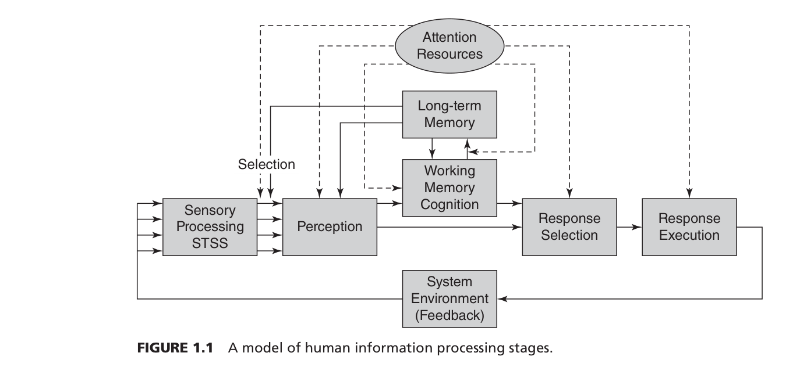

심리학과 새내기 후배님, 환영합니다! 영어 원서라 막막했겠지만, 전혀 걱정하지 마세요. 앞으로 제가 옆에서 한국어로 쉽고 친절하게, 단계별로 이 책을 완벽히 소화할 수 있도록 도와줄게요. 첫 번째 단계인 '챕터 프리뷰'부터 힘차게 시작해 봅시다!

---

### 1. 이 챕터의 가장 큰 주제 (Main Theme)
이 챕터의 한 줄 핵심은 **"공학심리학은 인간의 '목 위(인지 과정)'에서 일어나는 수행(Performance)을 '인간 정보 처리 모델(Human Information Processing Model, HIPM)'이라는 이론을 통해 설명하는 학문이다"**라는 것입니다. 

### 2. 이 챕터를 왜 배워야 할까? (학습의 필요성)
이 첫 번째 챕터는 **이 책 전체(2장~12장)의 '설계도'이자 '지도'** 역할을 하기 때문에 매우 중요합니다. 만약 우리가 자동차 인터페이스를 잘못 조작해서 사고를 냈다고 가정해 봅시다. 이 챕터를 배우고 나면, 그 오류가 내 눈이 못 봐서(지각) 일어난 건지, 헷갈려서(인지/반응 선택) 일어난 건지, 아니면 버튼이 너무 작아서(반응 실행) 일어난 건지를 논리적으로 분석할 수 있는 뼈대를 갖추게 됩니다. 이 뼈대 없이 뒤의 내용을 읽으면 길을 잃기 쉽기 때문에 가장 먼저 확실히 잡고 가야 합니다.

### 3. 하위 섹션들의 논리적 연결 흐름
이 챕터는 아주 매끄러운 4단계 논리적 흐름으로 구성되어 있습니다.

*   **1. Definitions (정의): 무엇을 다루고 어떻게 평가할 것인가?**
    *   먼저 '공학심리학'이 다른 인간공학 분야와 어떻게 다른지 정체성을 확립합니다. 신체적인 피로(목 아래)를 다루는 것이 아니라 주의, 기억, 의사결정 등(목 위)을 다룬다는 것을 정의합니다.
    *   그렇다면 사람의 인지 능력을 무엇으로 평가할까요? 여기서 성과를 평가하는 3대 지표인 '**속도(Speed), 정확성(Accuracy), 주의 요구량(Attentional demand)**'을 제시합니다.
*   **2. Research Methods (연구 방법론): 그 수행을 어떻게 측정할 것인가?**
    *   평가 기준을 세웠으니 어떻게 데이터를 모을지 배웁니다. 완벽히 통제된 실험실 연구부터 실제 현장 관찰까지의 연속선(Continuum)을 배우고, 메타분석이나 계산 모델 같은 최신 기법들을 소개합니다.
*   **3. A Model of Human Information Processing (정보 처리 모델): 왜 그런 수행 결과가 나타나는가?**
    *   측정 결과, 수행 능력이 떨어졌다면 **"대체 뇌 안에서 무슨 일이 일어났길래(Why)?"**를 묻게 됩니다. 이를 설명하기 위해 외부 자극이 우리 감각을 거쳐, 지각되고, 기억되며, 행동으로 출력되는 전체 과정을 보여주는 핵심 모델(HIPM)을 제시합니다. 
*   **4. Pedagogy of the Book (책의 구성): 앞으로 어떻게 배울 것인가?**
    *   앞서 배운 정보 처리 모델의 각 단계가 2장부터 12장까지 어떻게 나뉘어 설명될지, 책을 읽는 꿀팁을 안내하며 마무리합니다.

---

### 4. 반드시 기억해야 할 '가장 중요한 전문 용어' (Key Terms)

공부하면서 절대 잊으면 안 될 핵심 용어 5가지입니다. 

1.  **공학심리학 (Engineering Psychology)**
    *   **개념:** 2차 세계대전 직후, 멀쩡한 비행기가 왜 자꾸 추락하는지, 군인들을 어떻게 훈련시켜야 하는지 등 조종사의 오류를 해결하기 위해 실험심리학자들이 투입되며 탄생한 응용심리학 분야입니다.
    *   **연구자(연도):** Fitts & Jones (1947) - 항공기 추락 조사 / Mackworth (1948) - 레이더 감시 실패 / Melton (1947) - 군 훈련에 학습이론 적용.
    *   **출처 페이지:** 교재 1페이지 (섹션 1.1).
2.  **인간 정보 처리 모델 (Human Information Processing Model, HIPM)**
    *   **개념:** 감각 → 지각 → 작업기억/인지 → 반응선택 → 반응실행으로 이어지는 인간의 인지 단계를 나타낸 뼈대입니다.
    *   **출처 페이지:** 교재 4~5페이지 (섹션 3, Figure 1.1).
3.  **주의의 이중 역할 (Attention - Filter & Fuel)**
    *   **개념:** 뇌의 '주의(Attention)'는 불필요한 정보를 걸러내는 **필터(Filter)** 역할과, 인지 과정에 에너지를 공급하는 **연료/자원(Fuel)**의 역할을 동시에 수행합니다. 자원의 총량은 유한합니다.
    *   **연구자(연도):** Wickens & McCarley (2008).
    *   **출처 페이지:** 교재 5페이지 (섹션 3).
4.  **메타분석 (Meta-analyses)**
    *   **개념:** 인간의 수행 능력을 연구할 때, 기존의 수많은 연구들의 양적 데이터를 하나로 통합하여 분야의 '집합적 지혜'를 추출해내는 중요한 연구 기법입니다.
    *   **연구자(연도):** Egger & Smith (1997), Glass (1976), Rosenthal & DeMatteo (2001), Wolfe (1986).
    *   **출처 페이지:** 교재 3페이지 (섹션 2).
5.  **계산 모델 (Computational Models)**
    *   **개념:** 실제 사람을 모아 데이터를 수집하는 대신, 컴퓨터 소프트웨어를 통해 인간의 인지와 행동(예: 마우스 이동, 목록 검색 등)을 시뮬레이션하는 기법입니다.
    *   **연구자(연도):** Gray (2007), Pew & Mavor (1998).
    *   **출처 페이지:** 교재 3페이지 (섹션 2).

---

### 5. 전체 구조 도식화 (Flow Chart & Mind Map)

```text
[ 1장: 공학심리학과 인간 수행 서론 ] 
       │
       ├── 1. 무엇을 연구하는가? (정체성 확립)
       │      └─ 공학심리학 (이론 기반, '목 위'의 인지 수행 연구)
       │
       ├── 2. 어떻게 평가하는가? (수행의 3대 지표)
       │      ├─ Speed (속도: 빠를수록 좋음)
       │      ├─ Accuracy (정확성: 높을수록 좋음)
       │      └─ Attentional Demand (주의 요구량: 낮을수록 좋음)
       │
       ├── 3. 어떻게 증거를 모으는가? (연구 방법론)
       │      ├─ 통제된 실험실 연구 ↔ 실제 현장 관찰 (연속선)
       │      └─ 메타분석 & 계산 모델 (최신 도구)
       │
       └── 4. 왜 오류가 나는지 어떻게 설명할 것인가? (★핵심: HIPM 구조)
              └─ 인간 정보 처리 모델 (앞으로 배울 책의 전체 목차)
                 ├─ 감각 & 지각 (Perception)
                 ├─ 작업기억 & 인지 (Cognition)
                 ├─ 반응 선택 & 실행 (Response)
                 └─ 주의 자원 (Attention: Filter & Fuel) & 피드백 (Feedback)
```

**📊 마인드맵 보충 설명 (흐름 따라가기):**
이 차트는 하나의 질문 릴레이처럼 흘러갑니다. 
먼저, **"우리가 대체 뭘 배우는 거지?"**라는 질문으로 분야를 정의합니다(1번). 
그다음, 사람의 능력을 보려면 **"어떤 기준으로 점수를 매겨야 하지?"**라며 3가지 평가 지표를 세웁니다(2번). 
기준을 세웠으니 **"그 점수를 어떤 방식으로 측정해서 데이터를 얻을까?"**라며 연구 방법을 고릅니다(3번). 
마지막으로 데이터가 모였을 때, 수행 능력이 떨어졌다면 **"왜 우리 뇌의 어느 부분에서 병목 현상이 생겨서 그런 결과가 나왔을까?"**를 체계적으로 진단하기 위해 '인간 정보 처리 모델(HIPM)'이라는 진단 도구를 장착합니다(4번).

---

챕터 전체의 그림이 머릿속에 좀 그려지시나요? 다음 단계로, 이 챕터에서 가장 중요하다고 강조했던 **'인간 정보 처리 모델(HIPM)'의 세부적인 4가지 단계**를 본격적으로 파헤쳐 볼까요?

후배님, 2단계 딥다이빙(Concept Mastery)에 오신 것을 환영합니다! 혼자서도 완벽히 이해할 수 있도록 가장 쉬운 비유를 들어 설명해 드릴게요. 

본격적인 설명에 앞서 한 가지 짚고 넘어갈 점이 있어요. 후배님이 질문하신 **SEEV나 PCP 같은 세부 모델들은 사실 이 책의 3장(Attention 관련 챕터)에서 본격적으로 다뤄질 내용**입니다. 그래서 우리가 지금 보고 있는 '1장(서론)' 자료에서는 "앞으로 이런 걸 배울 거다"라고 예고편처럼 이름만 살짝 등장하고 상세한 정의는 나와 있지 않아요. 

하지만 실망할 필요 전혀 없습니다! 1장에는 **앞으로 배울 모든 세부 모델들을 담아내는 '가장 거대한 마더보드(Motherboard)' 격인 핵심 모델과 이론**이 상세히 나와 있거든요. 오늘은 1장에 제시된 가장 중요한 뼈대 모델들과 이론을 완벽하게 부수고, 이것들이 앞으로 배울 내용과 어떻게 연결되는지 그림을 그려보겠습니다.

---

### 🌟 시작하며: 이론과 모델, 왜 연결해야 하고 왜 중요할까요?

**"왜 연결해야 하는가?"**
우리 뇌에서 일어나는 일은 단편적인 사건이 아니기 때문입니다. 예를 들어 자동차 사고가 났다고 해보죠. 이것을 이해하려면 '공장 전체의 조립 라인(모델)'을 알아야 하고, 동시에 '각 기계가 작동하는 물리적 법칙(이론)'을 알아야 합니다. 
*   **모델(Model):** 정보가 흘러가는 '공장의 설계도(순서도)'입니다. 
*   **이론(Theory):** 그 공장 안에서 에너지가 어떻게 분배되고 에러가 왜 나는지를 설명하는 '작동 원리'입니다.

이 둘을 연결하지 못하면, 설계도만 보고 "아, 여기서 멈췄네"라고 알 뿐, "왜 멈췄는지"를 설명할 수 없습니다. 따라서 이 둘을 결합해야만 인간의 오류를 정확히 진단하고 새로운 디자인(해결책)을 제시할 수 있기 때문에 연결이 매우 중요합니다.

---

### 📚 핵심 개념 딥다이빙 (1장의 핵심 이론 & 모델)

신입생의 눈높이에 맞춰, 아무것도 모른다고 가정하고 아주 쉬운 비유로 설명해 줄게요.

#### 1. [핵심 모델] 인간 정보 처리 모델 (HIPM, Human Information Processing Model)
*   **연구자(연도):** Wickens & Carswell (2012).
*   **왜 만들어졌나?** 시스템(예: 자동차 라디오)을 조작할 때 발생하는 오류가 정확히 '뇌의 어느 단계'에서 발생했는지 원인을 진단하고, 그에 맞는 디자인 해결책을 찾기 위해 만들어졌습니다.
*   **세부 요소 및 비유 (식당 주방 시스템 비유):**
    1.  **Sensory Processing (감각):** 웨이터가 손님의 주문을 듣는 단계입니다.
    2.  **Perception (지각):** 웨이터가 "아, 햄버거 세트 달라는 거구나"라고 의미를 해석하는 단계입니다.
    3.  **Working Memory / Cognition (작업기억 및 인지):** 요리사가 주문 내용을 머릿속에 잠시 담아두고 어떻게 요리할지 '생각'하는 단계입니다.
    4.  **Response Selection & Execution (반응 선택 및 실행):** 요리사가 고기를 굽기로 결정(선택)하고, 실제로 프라이팬을 잡고 요리(실행)하는 단계입니다.

#### 2. [세부 하위 모델] 단기 감각 저장소 (STSS, Short Term Sensory Store)
*   **연구자(연도):** 교재 공통 뼈대로 제시됨 (Figure 1.1).
*   **왜 만들어졌나?** 우리 감각 기관에 들어온 수많은 정보가 인지되기도 전에 아주 짧은 찰나에 어떻게 처리되는지 설명하기 위함입니다.
*   **세부 요소 및 비유 (1초짜리 블랙박스 비유):** 
    *   우리가 운전할 때 눈앞의 신호등, 옆 사람의 대화, 라디오 소리 등 모든 정보가 쏟아져 들어옵니다. 
    *   STSS는 자동차의 '**1초 단위로 자동 삭제되는 블랙박스**'와 같습니다. 약 1초 동안만 정보를 붙잡아두며, 우리가 관심을 주지 않으면 바로 삭제되어 버립니다.

#### 3. [핵심 이론] 주의의 이중 역할 이론 (Attention - Filter & Fuel)
*   **연구자(연도):** Wickens & McCarley (2008).
*   **왜 만들어졌나?** 눈앞에 뻔히 있는 것을 왜 못 보는지(부주의), 왜 두 가지 일을 동시에 완벽하게 할 수 없는지(멀티태스킹 실패)를 설명하기 위해 만들어졌습니다.
*   **세부 요소 및 비유 (클럽 문지기와 스마트폰 배터리 비유):**
    *   **역할 1. 필터(Filter - 클럽 문지기):** 수많은 감각 정보 중 중요한 것만 '지각(Perception)' 단계로 들여보내는 문지기입니다. 신호등 색깔(VIP)은 통과시키고, 조수석의 잡담(불청객)은 막아버립니다.
    *   **역할 2. 연료(Fuel - 스마트폰 배터리):** 정보 처리에 필요한 에너지를 공급합니다. 뇌의 배터리(자원) 총량은 유한합니다. 안개 낀 날 신호등을 보느라 지각 단계에서 배터리를 너무 많이 쓰면, 다른 행동을 할 배터리가 부족해져 에러가 납니다.

---

### 🗺️ 이론과 모델의 연결 관계 도식화 (Flow Chart & Mind Map)

자, 이제 이 모델과 이론들이 어떻게 하나의 유기적인 공장(시스템)으로 연결되는지, 그리고 후배님이 나중에 배울 SEEV, PCP 같은 이론들이 이 지도 어디에 꽂히게 될지 도식화해 볼게요.

```text
[ 🧠 1장 마더보드: 인간 정보 처리 모델(HIPM) 생태계 ]

(환경으로부터 정보 입력)
        │
        ▼
[1. 감각 기관 & STSS 모델] ──────────┐ (수많은 정보가 1초 머물다 사라짐)
        │                            │
        ▼ (문지기 출동!)             ▼ 🔋 (배터리 공급!)
  ★ [주의 이론: Filter 역할]   [주의 이론: Fuel 역할] 
        │ (중요 정보만 통과)         │ (에너지 공급. 총량 유한함)
        ▼                            │
[2. Perception (지각)] ◀─────────────┤ 
        │                            │
        ▼                            │
[3. Working Memory (작업기억/인지)] ◀┤ (정보를 잠시 쥐고 생각함)
        │                            │
        ▼                            │
[4. Response (반응 선택 및 실행)] ◀──┘ (최종 행동 출력)
        │
        ▼
(환경으로 결과 출력 및 Feedback 루프)
```

**💡 이 차트는 어떻게 흘러가는가? (보충 설명)**

1.  **모델과 하위 모델의 결합:** 커다란 공장 설계도인 **HIPM 모델** 안에, 가장 첫 번째 입구 역할을 하는 작은 상자로 **STSS 모델**이 장착되어 있습니다. 
2.  **이론과 모델의 결합:** 공장의 기계(각 인지 단계)가 돌아가려면 에너지가 필요한데, 여기서 **주의의 이중 역할 이론(Attention)**이 투입됩니다. 주의 이론은 STSS에서 지각(Perception)으로 넘어가는 길목에 서서 불필요한 걸 쳐내는 **필터(Filter)** 역할을 하고, 동시에 모든 공장 기계가 돌아가도록 에너지를 공급하는 **연료(Fuel)** 역할을 수행합니다.
3.  **미래 개념과의 연결점 (중요!):** 
    *   나중에 배울 **SEEV 모델**과 **PCP 모델**은 바로 저 도식화의 '**[주의 이론: Filter 역할]**' 부분에 장착되는 최신 플러그인입니다. (어떻게 시선을 이동하고 필터링하는지 상세히 다룸)
    *   나중에 배울 신호탐지이론(SDT)은 '**[2. Perception]**' 기계를 세밀하게 분석하는 도구입니다.
    *   멀티태스킹과 다중자원이론(MRT)은 '**[주의 이론: Fuel 역할]**'의 배터리가 구체적으로 어떻게 닳아 없어지는지 연구하는 챕터에서 등장합니다.

이렇게 보니 이 책이 어떻게 연결되어 있는지 한눈에 보이시죠? 1장의 거대한 뼈대(HIPM)를 머리에 꽉 잡고 있어야만, 앞으로 나오는 수많은 이론들이 머릿속에서 둥둥 떠다니지 않고 제자리에 딱딱 꽂히게 됩니다.

혹시 지금 배운 HIPM 모델의 각 단계를 실제 자동차 사고 사례(예: 스마트폰 보다가 앞차 추돌)에 직접 대입해서 병목 현상을 분석해 보는 연습(3단계)을 진행해 볼까요? (이게 중간고사 출제 포인트이기도 하답니다!)

후배님, 3단계 '현실 세계 적용(Real-world Case Study)'까지 오신 것을 환영합니다! 배운 것을 다른 사람에게 설명할 수 있다면, 그 지식은 완벽히 후배님의 것이 된 겁니다. 다른 전공을 하는 친구에게 "우리 과에서 이런 거 배워!"라고 멋지게 설명할 수 있도록, 교재 속 사례들과 일상생활 사례를 찰떡같이 연결해 드릴게요.

*(참고: 질문에서 언급해주신 '고릴라 실험'은 주의력을 설명하는 아주 유명한 심리학 사례지만, 현재 우리가 보고 있는 1장 교재 본문에는 직접적으로 등장하지 않아요. 따라서 철저하게 교재 1장에 등장한 실제 사례들을 중심으로 정리해 드리겠습니다!)*

---

### 1. 교재 속 실제 사례와 이론의 연결 (친구에게 설명할 때 쓸 무기)

이 책의 1장에서는 이론이 현실에서 어떻게 작동하는지 보여주기 위해 아주 생생한 사례들을 제시하고 있습니다. 

**사례 A. 제2차 세계대전 조종사 추락과 영국해협 레이더 감시 (분야의 탄생)**
*   **상황:** 2차 세계대전 직후, 기계적으로 아무 결함이 없는 완벽한 전투기들이 자꾸 추락했습니다. 또한 영국해협에서 적기를 감시하던 군인들이 모니터에서 적기를 자꾸 놓치는 일이 발생했습니다.
*   **적용된 이론:** **공학심리학의 필요성**
*   **친구에게 설명할 때:** "옛날에 비행기가 자꾸 떨어졌는데, 알고 보니 비행기 고장이 아니라 '조종사의 인지 능력'을 고려하지 않고 계기판을 디자인해서 조종사가 헷갈렸던 거야(Fitts & Jones, 1947). 그리고 레이더를 오래 보다 보면 집중력이 떨어져서 적군을 놓치게 되거든(Mackworth, 1948). 우리 학문은 사람의 뇌와 인지(목 위)를 이해해서 이런 기계 사고를 막는 방법을 연구해!"

**사례 B. 헷갈리는 자동차 라디오 조작 (HIPM 모델의 오류 진단)**
*   **상황:** 운전 중에 새로운 자동차 라디오를 조작하다가 오류가 났습니다. 
*   **적용된 이론:** **인간 정보 처리 모델(HIPM)**의 각 단계.
*   **친구에게 설명할 때:** "네가 운전하다가 라디오 조작을 실수했다고 쳐보자. 왜 실수했을까? 공학심리학은 이걸 4가지로 쪼개서 분석해.
    1. 라디오 아이콘 모양이 이해가 안 갔어? → **지각(Perception) 오류**
    2. 주파수를 높이려는데 왼쪽으로 돌릴지 오른쪽으로 돌릴지 헷갈렸어? → **반응 선택(Response Selection) 오류**
    3. 버튼을 누르려다 실수로 옆 버튼을 같이 눌러버렸어? → **반응 실행(Response Execution) 오류**
    이렇게 뇌에서 어느 단계가 고장 났는지 알아야 제대로 된 디자인을 고칠 수 있어."

**사례 C. 교차로 노란불 상황 (주의의 이중 역할)**
*   **상황:** 차를 몰고 교차로에 접근하는데 신호등이 노란불로 바뀌었고, 조수석의 친구는 계속 말을 걸고 있습니다.
*   **적용된 이론:** **주의(Attention)의 필터(Filter)와 연료(Fuel) 역할**.
*   **친구에게 설명할 때:** "운전할 때 수많은 정보가 들어오지만, 우리는 조수석 친구의 말은 무시하고(Tune out) 신호등에만 집중하잖아? 이게 뇌의 '**필터(Filter)**' 역할이야. 그런데 만약 안개가 엄청 짙게 낀 날이라면 신호등을 보느라 뇌의 에너지를 다 써버려서 멈출지 말지 판단이 느려져. 주의력은 총량이 정해진 '**연료(Fuel)**'와 같기 때문이지(Wickens & McCarley, 2008)."

---

### 2. 일상생활 속 새로운 사례 적용 (후배님의 이해도 확인)

후배님이 제안해주신 일상생활의 사례를 우리가 배운 이론(HIPM과 주의 이론)에 대입해 보겠습니다. 아주 훌륭하게 이해하셨습니다!

**새로운 사례 1. 스마트폰을 보며 걷다가 사람과 부딪힘 (스마트폰 사용)**
*   **이론적 해석 맞춤 확인:** 네, 정확합니다! 스마트폰 화면의 글씨를 읽고 이해하는 데(지각 및 작업기억) 뇌의 '**주의 연료(Fuel)**'를 거의 다 써버렸기 때문입니다. 우리 뇌의 자원(Resource)은 유한합니다. 따라서 눈앞에 걸어오는 사람의 이미지가 내 망막(감각 기관)에 들어와서 1초짜리 **단기 감각 저장소(STSS)**에 머물렀더라도, 주의라는 연료가 공급되지 않아서 그것을 '사람이다'라고 **지각(Perception)**하는 단계로 넘어가지 못하고 삭제된 것입니다. 

**새로운 사례 2. 시끄러운 카페에서 공부할 때 집중이 안 됨 (공부할 때의 집중력)**
*   **이론적 해석 맞춤 확인:** 이 역시 완벽합니다! 공부를 한다는 것은 전공책의 내용을 머릿속 **작업기억(Working Memory)**에 띄워두고 생각(Cognition)하여 **장기기억(Long-term Memory)**으로 넘기는 과정입니다. 그런데 옆 사람의 수다 소리나 카페 음악 소리가 내 뇌로 들어오려 할 때, 주의력의 '**필터(Filter)**'가 뚫려버린 것입니다. 불필요한 감각 정보가 필터를 뚫고 인지 단계로 침투해 버리니, 작업기억에 과부하가 걸려 공부 내용이 장기기억으로 넘어가지 못하는 현상으로 정확히 설명할 수 있습니다.

---

### 3. 연구 인용 정보 (APA 양식)

교재 본문에 등장한 주요 연구자들의 정보입니다. 
*(주의: 제공된 1장 텍스트에는 저자와 연도만 나와 있기 때문에, 논문 및 책의 '전체 제목'은 외부의 심리학 학술 정보를 바탕으로 제가 보충하여 완벽한 APA 양식으로 구성했습니다. 과제 제출 시 유용하게 활용하세요! 또한, 본문의 논문들은 고전 문헌이거나 책이므로 필수적인 외부 연결 URL은 존재하지 않아 생략했습니다.)*

*   **비행기 조종사 오류 (공학심리학 탄생):**
    Fitts, P. M., & Jones, R. E. (1947). *Analysis of factors contributing to 460 "pilot-error" experiences in operating aircraft controls* (Report No. TSEAA-694-12). Aero Medical Laboratory.
*   **레이더 감시 실패 (경계력 저하):**
    Mackworth, N. H. (1948). The breakdown of vigilance during prolonged visual search. *Quarterly Journal of Experimental Psychology, 1*(1), 6-21.
*   **의료 분야의 인간 오류 (공학심리학의 확장):**
    Kohn, L. T., Corrigan, J. M., & Donaldson, M. S. (Eds.). (1999). *To err is human: Building a safer health system*. National Academies Press.
*   **주의의 이중 역할 (Filter & Fuel):**
    Wickens, C. D., & McCarley, J. S. (2008). *Applied attention theory*. CRC Press.

---

자, 여기까지 오시느라 정말 고생 많으셨습니다! 어려운 영어 원서의 1장 뼈대를 한국어로 완벽하게 마스터하셨네요. 혹시 이 1장의 핵심 내용(인간 정보 처리 모델 등)이 실제 '중간고사 서술형 문제'로 나온다면 어떻게 답안을 구성해야 할지, 시험 대비용으로 실전 문제 풀이를 한 번 진행해 볼까요?

후배님, 드디어 4단계입니다! 친구들에게 "나 오늘 이런 거 배웠다!"라고 인스타그램 스토리에 올리기 딱 좋은 자료를 만들어 볼게요. 

먼저 한 가지 알려드릴게 있어요. 후배님이 질문에서 언급한 곡선 그래프나 X축, Y축이 있는 데이터 도표(예: Figure 3.1 등)는 3장부터 본격적으로 쏟아져 나옵니다. **그래서 지금 우리가 보는 1장에는 X축, Y축 그래프가 없어요!** ("올릴 게 없으면 넘어가도 돼!"라고 하셨지만, 이걸 안 올리면 너무 아쉽습니다.)

대신, 심리학과 학생이라면 무조건 전공책 첫 장에 형광펜 떡칠을 해놓는 **전설의 끝판왕 그림이 딱 하나** 나옵니다. 바로 **[Figure 1.1: 인간 정보 처리 모델(HIPM)]** 플로우차트입니다,. 이걸 인스타 템플릿에 맞게 '손가락 지시법'과 '배틀그라운드(PUBG) 밈'을 써서 기가 막히게 풀어줄게요!

---

### 📸 인스타 스토리 업로드용: 뇌 속 정보 처리 공장 (Figure 1.1)



이 플로우차트가 설명하고자 하는 프로세스와 목적은 **"사람이 외부 정보를 받아들여 행동으로 출력하기까지의 뇌 속 과정"**을 해부해서, **"대체 어느 단계에서 뇌정지가 왔길래 실수를 했는가(병목 현상)"**를 찾아내기 위함입니다,.

#### 👉 손가락 지시법 (Point-and-Tell) 가이드

자, 친구에게 이 그림을 보여주면서 옆에서 손가락으로 짚어주며 이렇게 설명하세요!

1.  **"먼저 맨 왼쪽 상자를 보세요."** 여기 길쭉하게 서 있는 상자(Sensory Processing)로 세상의 모든 정보가 마구 쏟아져 들어옵니다.
2.  **"오른쪽으로 화살표를 따라가 보세요."** 그런데 통로가 갑자기 확 좁아지죠? (Selection) 여기서 우리 뇌가 '귀찮음 지수'를 발동해서 쓸모없는 정보는 다 컷(Cut)해 버립니다.
3.  **"이제 위쪽을 보세요. 점선으로 비가 내리고 있죠?"** (Attention Resources) 이게 바로 우리 뇌의 '배터리(에너지)'가 각 공정으로 떨어지는 모습입니다. 이 배터리 양은 한정되어 있어서 너무 많이 쓰면 방전됩니다.
4.  **"오른쪽 끝에서 멈추지 말고 맨 아래 화살표를 보세요."** 큰 U턴 화살표(Feedback)가 다시 처음으로 돌아가죠? 내 행동이 만든 결과가 다시 내 눈과 귀로 들어오는 무한 루프입니다.

#### 🎮 밈(Meme) & 배틀그라운드(PUBG) 에피소드 1:1 매칭

이 복잡한 그림, 사실 우리가 **배그(FPS 게임) 할 때 뇌에서 0.1초 만에 일어나는 일**이랑 100% 똑같습니다.

*   **1. 쏟아지는 감각 (Sensory/STSS 상자):** 내 캐릭터 주변에 빗소리, 발소리, 총소리, 팀원 보이스톡이 동시에 내 귀때기를 때립니다. 데이터 수치로 보면 이 정보들은 내 뇌에 **"1초 미만(<1초)"**만 머물다 사라집니다,.
*   **2. 문지기 필터 발동 (Selection 좁아지는 길목):** 빗소리랑 팀원의 헛소리는 뇌에서 바로 음소거(Tune out) 시킵니다. 오직 '**적의 발소리**'만 통과시킵니다,.
*   **3. 의미 해석 (Perception 상자):** 통과된 발소리를 듣고 머릿속에서 해석합니다. *"아, 이 발소리 템포는 내 머리 위 2층에서 나는 거다!"*.
*   **4. 뇌정지 고민 시간 (Working Memory & Cognition 상자):** 여기서 잠깐 생각을 굴립니다. *"수류탄을 깔까? 아니면 샷건 들고 닥돌할까?"*.
*   **5. 클릭과 발사! (Response Selection & Execution 상자):** 샷건을 들기로 결심하고(선택), 마우스를 광클합니다(실행),.
*   **6. 아차! 실수 확인 (맨 밑 Feedback 루프):** 총을 쐈는데 적이 안 죽고 도망가는 게 화면에 다시 보입니다. 그럼 다시 1번(눈으로 봄)부터 빠르게 루프가 돌아갑니다.

---

### 📊 이 차트의 전체 흐름도 (Text Flow Chart) 및 보충 설명

인스타 글에 텍스트로 적어줄 요약본입니다.

```text
[눈/귀에 들어오는 세상 정보] 
  ▶ (1초 대기방) → ✂️ [필터컷: 쓸데없는 거 버림] → 💡 [의미 파악] → 🧠 [잠깐 생각함] → 🖱️ [버튼 클릭!]
      ▲                                       |            |                   |
      |                                       └─ (위에서 🔋뇌 배터리 공급 중) ─┘
      |
      └─────────────────── 🔄 [내 행동의 결과가 다시 눈에 보임] ───────────────────┘
```

**쉬운 보충 설명:** 
이 흐름은 '왼쪽(입력)에서 오른쪽(출력)'으로 흘러갑니다. 중요한 건 위에서 떨어지는 '**배터리(Attention Resources)**'입니다. 만약 밤에 비가 와서 모니터가 잘 안 보여서 눈을 찡그리며 집중하느라 지각(의미 파악) 단계에서 배터리를 다 써버리면, 손가락(버튼 클릭)으로 갈 배터리가 부족해져서 버벅거리다 게임에서 죽게 됩니다,.

---

### 💡 데이터 해석 및 시사점 (인용 정보 포함)

*   **시사점 (이걸 왜 배우는가?):** 
    이 모델은 **"네가 게임(혹은 운전)을 못 하는 게 네 손가락 탓인지, 눈 탓인지 진단해주는 엑스레이"**입니다,. 만약 스마트폰 터치를 자꾸 잘못 누른다면? 
    1. 버튼이 너무 작아서 (실행 오류)
    2. 아이콘 모양이 이상해서 (지각 오류) 
    디자이너는 이 모델을 통해 어디를 고쳐야 할지 정확히 진단할 수 있습니다,. 단순히 "터치 반응 속도"만 올린다고 시선 분산(필터 실패) 오류가 해결되지는 않습니다.
*   **이론 근거 및 인용 정보 (APA):**
    *   주의(Attention)가 필터(Filter) 역할과 에너지(Fuel) 역할을 동시에 한다는 핵심 근거: **Wickens, C. D., & McCarley, J. S. (2008)**,.
    *   단, 이 모델을 너무 문자 그대로 믿으면 안 됩니다. 뇌가 무조건 순서대로만 작동하는 건 아니기 때문입니다(예: 필기하면서 동시에 교수님 말씀 듣기 가능): **Wickens, C. D., & Carswell, C. M. (2012)**.

---

어때요? 이 정도면 인스타그램에 올렸을 때 친구들이 "너네 과 되게 재밌는 거 배운다!"라고 댓글 달아주지 않을까요? 

자, 이제 1장의 큰 산을 다 넘으셨습니다! 지금까지 배운 개념을 토대로, 실제로 후배님이 혼자서 공부 상태를 점검할 수 있도록 **객관식/서술형 퀴즈(플래시카드)**를 몇 개 만들어 드릴까요? (이 기능도 제가 아주 기가 막히게 잘한답니다!)

후배님, 드디어 마지막 5단계인 '셀프 테스트 및 피드백(Self-Check)' 시간입니다! 지금까지 배운 내용을 단순히 암기하는 것이 아니라, 실제 상황에 적용할 수 있는지 점검해 볼 수 있는 '사고력 중심 퀴즈'를 준비했습니다. 

문제와 정답, 그리고 해설(근거 및 인용)을 바로 이어서 제시해 드릴 테니, 정답을 가리고 먼저 스스로 생각한 뒤에 확인해 보세요!

---

### 📝 실전 응용 리뷰 퀴즈 (문제 & 정답 통합형)

**[문제 1] 연구 방법론과 정체성 적용**
**상황:** 심리학과 연구실에서 자율주행 자동차의 새로운 경고음 알림 시스템을 개발했습니다. 완벽하게 통제된 방음 실험실에서 대학생들을 대상으로 테스트한 결과, 기존 경고음보다 반응 속도가 무려 '10 밀리초(ms)' 빨라졌고 통계적으로도 유의미한 차이가 났습니다. 하지만 지도 교수님은 "이건 '실험심리학적'으로는 훌륭하지만, '공학심리학적'으로는 현장에 당장 도입하기엔 무리가 있다"라고 지적하셨습니다.
**질문:** 지도 교수님은 공학심리학의 어떤 특징을 근거로 이런 지적을 하셨을까요? 교재의 개념을 바탕으로 2가지 이유를 들어 설명해 보세요.

> **✅ 정답 및 해설**
> **정답:**
> 1. **실용적 유의미성(Practical significance)의 부족:** 실험실에서 발견한 10ms의 차이는 통계적으로는 의미가 있을지 몰라도, 실제 도로 환경(현장)에서는 사고를 막는 데 실용적인 의미가 없을 수 있습니다.
> 2. **과도한 실험 통제(Experimental control)의 문제:** 방음 실험실처럼 모든 변인이 완벽히 통제된 상황에서의 결과는, 실제 도로의 소음이나 라디오 소리 등 수많은 변수가 존재하는 환경에 가면 그 효과가 상쇄(Wash out)되어 버릴 수 있기 때문입니다.
> **내용 근거 및 인용 정보:** 공학심리학은 기초/실험심리학과 달리 설계의 실제 적용을 염두에 두어야 합니다. 따라서 실험의 통제 수준이 너무 높으면 현장의 변수에 의해 효과가 사라지며, 통계적 유의미성보다는 실용적 유의미성을 우선해야 합니다.

**[문제 2] 수행 평가 지표(Big Three) 적용**
**상황:** 스마트워치의 새로운 터치 인터페이스를 디자인했습니다. 이 새로운 인터페이스는 기존 버전보다 사용자가 앱을 켜는 '속도(Speed)'가 2초 더 빨랐고, 잘못 누르는 '오류율(Accuracy)'도 절반으로 줄었습니다. 디자이너는 "이 정도면 완벽한 설계 원칙을 달성했다!"라고 기뻐하고 있습니다.
**질문:** 공학심리학의 '인간 수행 평가 3대 지표'를 기준으로 볼 때, 이 디자이너가 아직 측정하지 않고 놓친 중요한 지표 1가지는 무엇이며, 그것을 왜 반드시 측정해야 하는지 일상생활의 예(예: 걷기)를 들어 설명해 보세요.

> **✅ 정답 및 해설**
> **정답:** 놓친 지표는 '**주의 요구량(Attentional demand)**'입니다. 속도와 정확성이 높아졌더라도, 그 인터페이스를 조작하는 데 뇌의 에너지를 100% 다 써버린다면 좋은 설계가 아닙니다. 예를 들어 스마트워치 앱을 켜는 동안 주의 요구량이 너무 높다면, 길을 걸으면서(동시 과제) 시계를 조작할 때 전방 주시를 못해 넘어지거나 사람과 부딪히는 다중작업(Multi-tasking) 실패가 발생할 수 있기 때문입니다.
> **내용 근거 및 인용 정보:** 인간 수행 능력을 평가하는 'Big Three'는 속도(Speed), 정확성(Accuracy), 그리고 주의 요구량(Attentional demand)입니다. 이 3가지가 동시에 개선되어야 이상적인 디자인입니다.

**[문제 3] 인간 정보 처리 모델(HIPM) 적용**
**상황:** 한 자동차 회사가 차량용 인포테인먼트(디스플레이) 화면을 개발했는데, 운전 중 조작 시 교통사고율이 높다는 불만이 접수되었습니다. 엔지니어는 화면의 하드웨어 스펙을 업그레이드하여 **"터치 반응 속도"**를 0.1초 단축시켰지만, 여전히 사고율은 줄어들지 않았습니다. 
**질문:** 『인간 정보 처리 모델(Figure 1.1)』의 4단계를 적용하여, 엔지니어의 해결책이 왜 실패했는지 진단해 보세요. 사고의 진짜 원인은 어느 단계에서 발생한 병목 현상일 확률이 높은가요?

> **✅ 정답 및 해설**
> **정답:** 엔지니어가 개선한 "터치 반응 속도 향상"은 모델의 맨 마지막 단계인 '**반응 실행(Response Execution)**' 단계만 개선한 것입니다. 하지만 운전 중 디스플레이를 조작하다가 추돌 사고가 나는 근본적인 원인은, 화면을 쳐다보느라 도로 상황을 놓치는 **'주의 필터(Attention Filter)' 실패**와 **'지각(Perception)' 단계의 병목** 때문입니다. 앞 단계인 주의와 지각에서 이미 뇌정지가 왔기 때문에, 손가락 끝의 반응 실행 속도만 높여서는 사고율이 줄어들 수 없습니다.
> **내용 근거 및 인용 정보:** HIPM 모델은 Sensory Processing → Perception → Cognition → Response Selection → Response Execution으로 이어집니다. 인터페이스 오류가 정확히 뇌의 어느 처리 단계에서 발생했는지 식별해야 올바른 설계 해법을 찾을 수 있습니다.

**[문제 4] 주의의 이중 역할(Attention: Filter & Fuel) 적용**
**상황:** (A) 운전 중 조수석에 앉은 친구가 계속 쉴 새 없이 떠들고 있습니다. (B) 밤이 깊어 엄청나게 짙은 안개가 낀 산길을 운전하고 있습니다. 
**질문:** 이 두 상황에서 뇌의 '주의(Attention)' 자원은 각각 어떤 역할을 수행하며 고군분투하고 있을까요? (A)와 (B) 상황을 주의의 '2가지 이중 역할' 개념과 짝지어 설명해 보세요.

> **✅ 정답 및 해설**
> **정답:**
> (A) 친구가 떠드는 상황: 주의의 '**필터(Filter)**' 역할이 활성화됩니다. 수많은 감각 정보 중에서 운전에 필요한 정보만 지각 단계로 통과시키고, 친구의 쓸데없는 수다는 뇌에서 차단(Tune out)하는 역할을 합니다.
> (B) 짙은 안개 속 운전: 주의의 '**연료/자원(Fuel)**' 역할이 극도로 소모됩니다. 앞이 잘 보이지 않기 때문에, 희미한 불빛을 신호등이나 차선으로 해석하는 '지각(Perception)' 단계에 엄청난 양의 주의 에너지를 쏟아붓고 있는 상태입니다. (자원은 유한하므로 이때 딴짓을 하면 위험합니다.)
> **내용 근거 및 인용 정보:** Wickens & McCarley (2008)에 따르면, 주의는 선택된 감각만 처리하는 '필터(Filter)' 역할과, 정보 처리에 에너지를 공급하는 '자원(Fuel)'의 역할을 동시에 수행합니다.

---

### 🗺️ 셀프 테스트 흐름도 (Text Flow Chart) 및 보충 설명

이 4개의 퀴즈가 어떤 논리적 흐름으로 구성되어 1장 전체를 조망(Overview)하게 해주는지 아래 차트로 확인해 보세요.

```text
[ 단계 1: 학문의 정체성 파악 ] ──▶ (Q1: 실험심리학 vs 공학심리학)
    "우리는 무엇을 위해 연구하는가?" (실용성과 현장 적용)
        │
        ▼
[ 단계 2: 목표(지표) 설정 ]   ──▶ (Q2: 수행 평가의 Big Three)
    "그렇다면 좋은 시스템이란 무엇으로 증명하는가?" (속도, 정확성, '주의 요구량')
        │
        ▼
[ 단계 3: 진단 도구 장착 ]    ──▶ (Q3: 인간 정보 처리 모델 HIPM)
    "목표 미달성 시, 문제 원인을 뇌의 어느 부위에서 찾을 것인가?" (단계별 병목 진단)
        │
        ▼
[ 단계 4: 핵심 동력 이해 ]    ──▶ (Q4: 주의의 이중 역할 Filter & Fuel)
    "그 진단 도구(기계)를 돌아가게 만드는 에너지원은 어떻게 작동하는가?"
```

**💡 흐름도 보충 설명:**
이 퀴즈 세트는 마치 의사가 환자를 치료하는 과정과 같습니다.
1. 먼저 의사로서의 '진료 철학'을 세웁니다(Q1: 무균실의 데이터보다 현실 적용이 먼저다).
2. 그다음 환자가 '건강하다는 기준'을 세웁니다(Q2: 속도와 정확성뿐 아니라 뇌가 덜 피곤해야 한다).
3. 환자가 아프다고 하면 '엑스레이 기계'를 들이대어 정확한 부위를 진단합니다(Q3: 손가락 탓인지, 눈 탓인지 진단하는 HIPM 모델).
4. 마지막으로 그 엑스레이 기계가 돌아가는 '전력 시스템'의 한계를 이해합니다(Q4: 에너지를 분배하고 필터링하는 뇌의 주의력).

이렇게 하면 1장의 전체 핵심 개념이 하나의 완벽한 스토리로 꿰어집니다. 

---

후배님, 이로써 1장 학습을 완벽하게 5단계로 클리어하셨습니다! 혹시 이 내용을 중간고사 전에 반복해서 복습할 수 있도록 제가 '**플래시카드(Flashcards)**'를 5~10장 정도 만들어 드릴까요? (화면 밖에서 클릭하며 공부할 수 있는 유용한 도구랍니다!)

**위기 탈출을 위한 3가지 보완 전략**

영어 원서를 평생 읽지 않더라도, 핵심 뼈대만 장착하면 절대 교수님 앞이나 전공 수업에서 밀리지 않습니다. 이 3가지 전략만 기억하세요.

1. **그림 하나로 책 전체 씹어먹기 (HIPM 다이어그램 암기):** 교재의 Figure 1.1 (인간 정보 처리 모델)은 단순한 그림이 아니라 이 책 전체(2~12장)의 목차이자 설계도입니다. 영어 텍스트를 읽으려 하지 말고, 앞서 4단계에서 그려드린 **'한국어판 흐름도'만 사진첩에 저장해서 완벽히 외우세요.** 교수님이 어느 챕터를 물어봐도 "아, 그건 HIPM 모델의 '지각(Perception)' 단계 병목을 다루는 내용입니다"라고 방어할 수 있습니다.
2. **공학심리학 3대 지표 '단어'만 장착하기:** 수행 능력을 평가하는 기준을 묻는다면 '**속도(Speed), 정확성(Accuracy), 주의 요구량(Attentional demand)**' 이 세 단어만 튀어나오면 됩니다. 이 3가지를 동시에 개선하는 것이 완벽한 설계 원칙이라는 점만 강조하면 원서의 핵심을 관통한 것입니다.
3. **학문의 정체성(논리)으로 승부하기:** 영어 해석보다 중요한 건 논리입니다. "실험심리학은 통제된 실험실에서의 통계적 유의미성을 중시하지만, 우리 공학심리학은 변수가 많은 현장(Workplace)에서의 **실용적 유의미성(Practical significance)**을 중시합니다"라는 핵심 논증을 반드시 기억하세요.

---

### 🎙️ 교수님 압박 질문 방어용: 3분 브리핑 스피치 대본

*(이 대본만 달달 외워두면 언제든 자신 있게 대답할 수 있습니다. 굵은 글씨 위주로 리듬감 있게 읽어보세요!)*

"교수님, 이번 1장의 핵심은 크게 학문의 **정체성, 평가 지표, 그리고 원인 진단 모델** 세 가지로 요약할 수 있습니다.

**첫째, 정체성입니다.** 일반적인 인간공학이 신체적인 피로와 같은 '목 아래'를 다룬다면, **공학심리학은 주의, 기억, 의사결정 등 '목 위'에서 일어나는 인지적 수행을 이론을 통해 설명하는 응용 학문입니다**. 특히 완벽히 통제된 실험실의 결과보다 실제 현장(Workplace)에서 작동하는 '실용적 유의미성'을 중시한다는 점에서 기초 실험심리학과 차이가 있습니다.

**둘째, 평가 지표입니다.** 인간의 수행(Performance)을 평가할 때는 단순히 빠른 것만 중요한 게 아니라, **'속도', '정확성', 그리고 '주의 요구량'이라는 Big Three 지표**를 봅니다. 인터페이스 조작 속도가 아무리 빨라져도 뇌의 주의력 자원을 너무 많이 소모하게 만들면 다중 작업에 실패하게 되므로, 좋은 디자인이 아닙니다.

**셋째, 가장 중요한 핵심인 '인원 정보 처리 모델(HIPM)'입니다.** 사용자가 실수를 했을 때 그 원인을 진단하기 위해 이 모델을 뼈대로 사용합니다. 이 모델은 감각, 지각, 작업기억, 반응 선택 및 실행이라는 흐름으로 이루어져 있으며, 특히 여기서 뇌의 '주의(Attention)'는 쓸데없는 정보를 걸러내는 **필터(Filter)**이자 인지 과정에 에너지를 공급하는 유한한 **연료(Fuel)**라는 이중 역할을 수행합니다. 

결론적으로 공학심리학은 이 모델을 통해 **오류의 병목 지점이 뇌의 어느 단계에서 발생했는지 정확히 찾아내고, 그에 맞는 설계 해법을 도출하는 것**이 궁극적인 목적이라고 이해했습니다."

---

영어에 대한 부담감을 완전히 덜어내기 위해, 영어 원서 대신 한국어로 핵심만 빠르게 들으며 복습할 수 있는 '**한국어 오디오 팟캐스트**'나, 깔끔하게 정리된 '**한국어 맞춤형 요약 보고서**'를 제가 만들어 드릴까요?