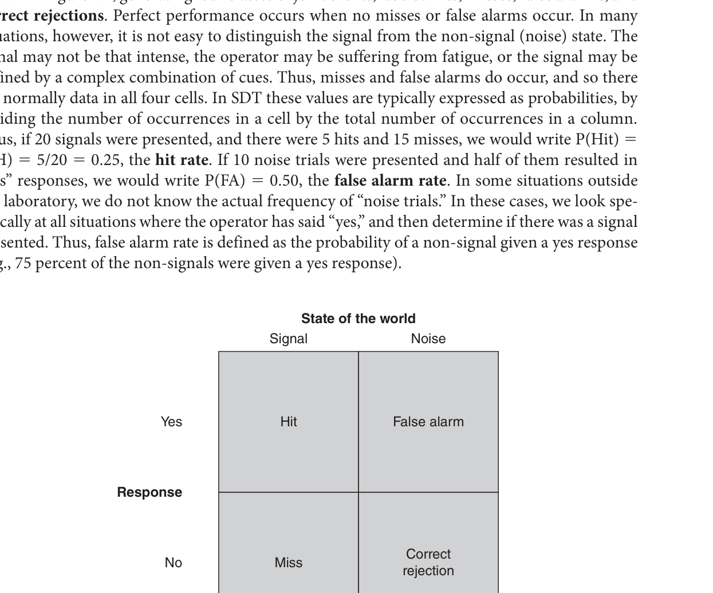
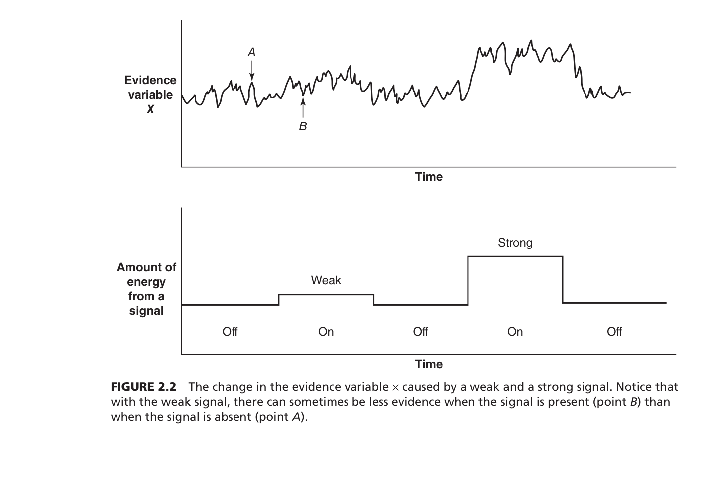
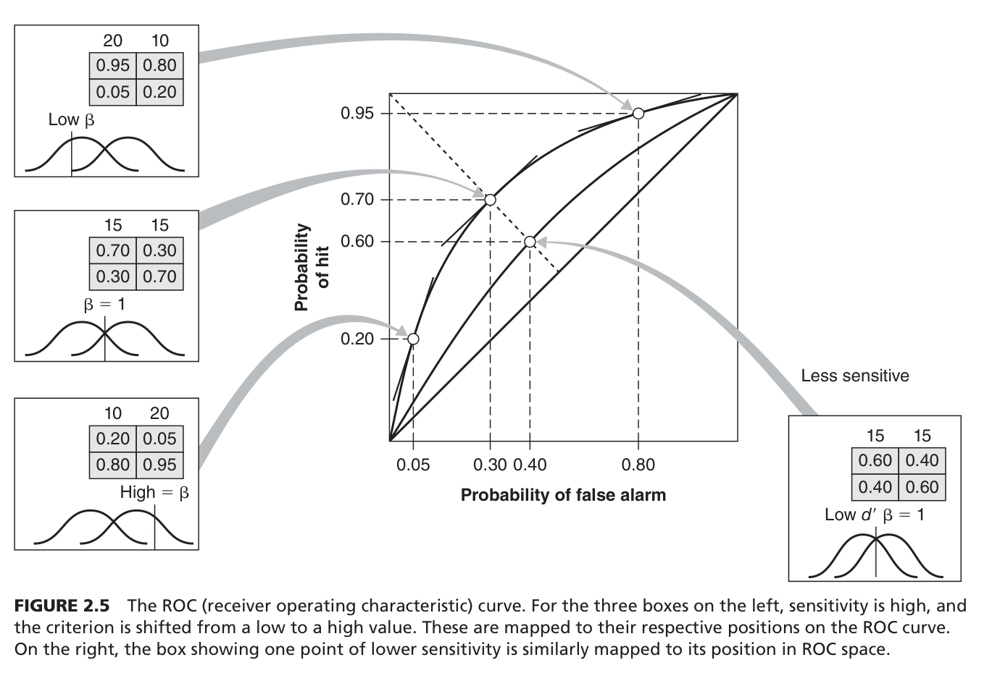
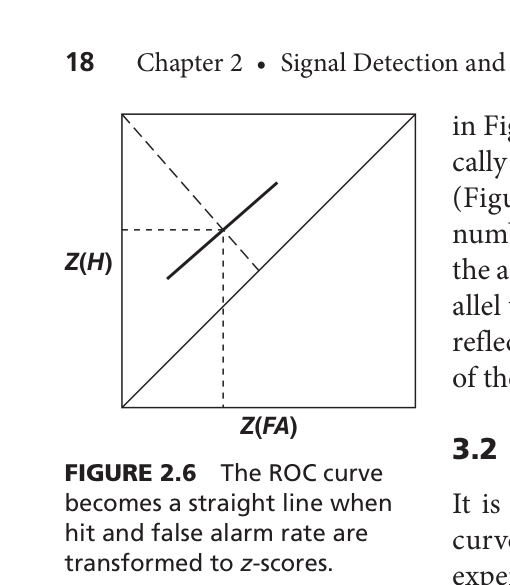
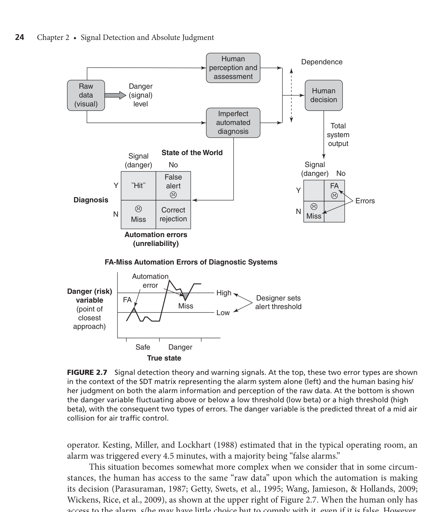
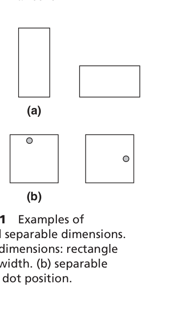
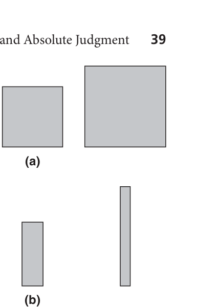

# Ch2. Signal Detection and Absolute Judgment — 학습 보고서

> **교재**: Engineering Psychology and Human Behaviour | **페이지**: pp.8–47
> **작성 기준**: weekly-textbook 지식 파일 → 6단계 학습 보고서

---

## STEP 1. 챕터 프리뷰

### 왜 이 챕터를 배워야 하는가?

우리는 매일 "탐지(detection)" 상황에 놓인다. 공항 보안 검색대 직원은 X-레이 화면에서 칼을 찾고, 의사는 X-레이 사진에서 암 덩어리를 찾고, 야간 CCTV 관제사는 화면에서 수상한 행동을 찾는다. 신기하게도, 이들은 모두 **같은 실수 패턴**을 만들어낸다.

왜 좋은 의사도 암을 놓칠까? 왜 숙련된 검사원도 불량품을 통과시킬까? 이 챕터는 그 이유를 수학적으로 풀어낸다. 핵심은 탐지 실패가 단 두 가지 원인에서 온다는 것이다: **감각 능력(민감도)의 한계** 또는 **기준(bias)의 잘못된 설정**. 이 둘을 구분하지 못하면 잘못된 처방을 내리게 된다.

후반부의 절대 판단(Absolute Judgment)은 더 실용적이다. 왜 경보 색깔을 7가지 이상 쓰면 혼란이 생기는가? 왜 스마트폰 알림은 진동+소리를 동시에 쓰는가? 이 모든 질문의 답이 **채널 용량(channel capacity)** 개념에 있다.

---

### 반드시 기억할 핵심 전문 용어

| 용어 | 한 줄 설명 | 연구자 (연도) | 페이지 |
|------|----------|-------------|--------|
| Signal Detection Theory (SDT) | 탐지를 민감도와 기준으로 분리 분석하는 이론 | Green & Swets (1966) | p.10 |
| Hit / Miss / False Alarm / Correct Rejection | 신호 있을 때 yes/no, 신호 없을 때 yes/no | — | p.9 |
| Evidence variable X | 뇌 내부 신경 활동 수준 (연속 변수) | Green & Swets (1966) | p.10 |
| Criterion (X_C) / Beta (β) | yes/no를 나누는 기준값 / 신호·잡음 분포 높이의 비율 | — | pp.12–13 |
| Optimal Beta (β_opt) | 오류를 최소화하는 이론적 최적 기준 | Green & Swets (1966) | p.13 |
| Sluggish Beta | 실제 beta가 최적보다 1.0에 더 가까운 현상 | Green & Swets (1966) | p.14 |
| Sensitivity (d') | 신호/잡음 분포 평균 차이 (표준편차 단위) | Macmillan & Creelman (2005) | p.15 |
| ROC Curve | Hit율–FA율 공간에서 기준 변화를 추적한 곡선 | Green & Swets (1966) | p.16 |
| A' | ROC 아래 면적의 비모수 추정 (분포 가정 불필요) | Kornbrot (2006) | p.18 |
| Fuzzy SDT | 신호 경계가 모호할 때 SDT를 퍼지 논리로 확장 | Parasuraman et al. (2000) | p.19 |
| Vigilance Decrement | 장시간 감시 중 탐지율이 떨어지는 현상 | Mackworth (1948) | p.26 |
| Arousal Theory | 각성 감소 → X 분포 수축 → beta 증가 | Welford (1968) | p.27 |
| Sustained Demand Theory | 경계 과제가 자원을 소진 → d' 감소 | Warm, Parasuraman & Matthews (2008) | p.27 |
| Expectancy Theory / Vicious Circle | 신호 기대 감소 → beta 상향 → 누락 → 기대 더 감소 | Baker (1961) | p.28 |
| Absolute Judgment | 연속 차원에서 자극을 여러 레이블 중 하나로 분류 | — | p.32 |
| Channel Capacity | 단일 차원 절대 판단의 정보 전달 상한 (~2–3 bits) | Miller (1956) | p.33 |
| Bit | 이진 정보의 단위 = log₂(대안 수) | Shannon & Weaver (1949) | p.32 |
| Bow Effect | 범위 중간 자극 판별이 양 극단보다 낮은 현상 | Luce et al. (1982) | p.33 |
| Orthogonal Dimensions | 독립 차원 결합 → 총 전달 정보(H_T) 증가, 채널 효율↑ | Garner (1974) | p.35 |
| Correlated Dimensions | 중복 차원 결합 → 정보 손실(H_loss) 감소, 채널 보안↑ | Eriksen & Hake (1955) | p.36 |
| Integral Dimensions | 한 차원 변화가 다른 차원 처리에 자동 간섭 | Garner (1974) | p.37 |
| Separable Dimensions | 독립 처리 가능한 차원 쌍 | Garner (1974) | p.37 |
| Garner Interference | 직교 조건에서 무관한 차원 변화가 판단을 방해 | Garner & Felfoldy (1970) | p.37 |
| Configural Dimensions | 두 차원 조합이 출현 특징(emergent feature)을 생성 | Wickens & Carswell (1995) | p.38 |

---

### 전체 섹션 연결 흐름 (Mind Map)

```
[Ch2 핵심 질문: "인간은 왜 탐지에 실패하는가?"]
        │
        ├─── [신호 탐지 이론 (SDT)]
        │         │
        │         ├── 2.1 패러다임: 2×2 행렬 (Hit/Miss/FA/CR)
        │         │       └── 증거 변수 X + 기준 X_C → 4개 결과 확률
        │         │
        │         ├── 2.2 반응 기준 (Beta)
        │         │       ├── 확률(P(S)) → 최적 beta
        │         │       ├── 비용·보상 → 최적 beta
        │         │       └── Sluggish Beta: 인간은 최적에 못 미침
        │         │
        │         ├── 2.3 민감도 (d'): 기준과 독립적 능력 측정
        │         │
        │         └── 3. ROC Curve: d' 고정 시 기준에 따른 Hit-FA 궤적
        │
        ├─── [SDT 확장]
        │         ├── 4. Fuzzy SDT: 신호 경계가 모호할 때
        │         └── 5. 응용: 의료진단 / 목격자 증언 / 경보 설계
        │
        ├─── [Vigilance: 시간에 따른 성능 저하]
        │         ├── 6.1 성능 측정: vigilance decrement
        │         ├── 6.2 이론: 각성 이론 / 지속 수요 이론 / 기대 이론
        │         └── 6.3 대처: 민감도 향상 + 기준 최적화 기법
        │
        └─── [절대 판단: 다수준 분류의 한계]
                  ├── 7.1 정보 정량화: bit, H_S, H_T
                  ├── 7.2 단일 차원: 채널 용량 2–3 bits (Miller 7±2)
                  └── 7.3 다차원: 직교/상관/적분/분리/형태 차원
```

**흐름 설명**: SDT는 "있다/없다" 이진 탐지의 이론이다. 이를 확장하면 "모호한 신호"(Fuzzy SDT)와 "실제 현장 응용"으로 이어진다. 시간 차원을 더하면 Vigilance의 문제가 된다. 마지막으로 "있다/없다"를 넘어 "몇 단계 중 어느 단계인가"를 판단하는 절대 판단으로 자연스럽게 확장된다. 채널 용량이라는 근본 한계가 디스플레이 설계의 핵심 제약이 된다.

---

## STEP 2. 핵심 개념 딥다이빙

### 왜 이 이론들을 연결해서 봐야 하는가?

같은 공항 검색대 직원도 **어떤 날은 더 많이 탐지하고, 어떤 날은 덜 탐지한다**. 그 원인이 피로인지, 부주의인지, 기준의 변화인지를 구분하지 않으면 올바른 해결책을 찾을 수 없다. SDT는 이 구분을 가능하게 하는 언어다. 아래 이론들은 모두 이 "왜 실패했는가"라는 질문에 각도를 달리해 대답한다.

---

### 이론 1: Signal Detection Theory (SDT)

#### 왜 만들어졌는가?

2차 대전 당시 레이더 병이 적기를 놓치는 일이 많았다. 그런데 "더 열심히 봐라"고 해도 해결이 안 됐다. 이유는 두 가지가 섞여 있었기 때문이다: 레이더 화면이 너무 어두워서(민감도 문제), 혹은 병사가 "이건 새인가, 적기인가" 판단을 너무 신중하게 했기 때문(기준 문제). SDT는 이 두 가지를 수학적으로 분리하기 위해 만들어졌다.

#### 구성 요소

뇌 안에는 **증거 변수 X**가 있다. X는 신호가 없을 때도, 있을 때도 계속 요동친다(노이즈). 신호가 오면 X가 평균적으로 높아지지만, 완전히 확실하지는 않다. 관찰자는 "X가 X_C보다 크면 yes, 작으면 no"로 반응한다.

이렇게 되면 4가지 결과가 나온다:

| | 신호 있음 | 신호 없음 |
|--|---------|---------|
| "Yes" 반응 | **Hit** ✓ | **False Alarm** ✗ |
| "No" 반응 | **Miss** ✗ | **Correct Rejection** ✓ |

**핵심**: P(H) + P(M) = 1, P(FA) + P(CR) = 1.
Hit을 높이면 FA도 높아진다. 이 둘은 트레이드오프 관계다.

> **K-앵커**: 드라마 *시그널*에서 형사 이재한이 무전기로 "이게 범인이다"를 외치는 순간이 "Hit"이다. 하지만 노이즈(배경 소음, 불완전한 단서) 때문에 정확한 판단이 어렵다. 기준을 너무 낮게 잡으면(리버럴하게) 많은 것을 범인으로 지목하지만(FA 증가), 너무 높게 잡으면 진짜 범인을 놓친다(Miss 증가).

---

### 이론 2: 반응 기준 설정과 Beta

#### 왜 만들어졌는가?

같은 민감도를 가진 두 의사가 다른 탐지율을 보일 수 있다. 한 명은 "뭐든 의심스러우면 검사"(낮은 beta, liberal), 다른 한 명은 "확실한 것만"(높은 beta, conservative). SDT는 이 차이를 beta로 측정한다.

#### 구성 요소

β = P(X|S) / P(X|N) (X_C에서 신호/잡음 분포 높이의 비율)

**최적 beta**:
- 확률만 고려: β_opt = P(Noise) / P(Signal)
- 비용·보상도 고려: β_opt = P(N)/P(S) × [V(CR)+C(FA)] / [V(H)+C(M)]

이 공식이 말하는 것: 신호가 드물수록(P(S) 낮음) beta를 높여라(보수적으로). 누락 비용이 크면(C(M) 큼) beta를 낮춰라(리스키하게).

#### Sluggish Beta: 인간은 최적에 못 미친다

실제 인간은 최적보다 beta=1.0에 더 가깝게 유지한다(Green & Swets, 1966). 왜?
1. 작업기억 한계: 2~3 시행 이전만 기억
2. 확률 매칭: P(FA) ≈ P(Miss)가 되도록 조정
3. 드문 사건 과대추정 경향

> **K-앵커**: 드라마 *이상한 변호사 우영우*에서 매우 드문 케이스(신호 발생률 극히 낮음)를 담당할 때, 일반 변호사는 이를 과소평가(beta 너무 높게 유지)하는 경향이 있다 — 이것이 "sluggish beta"다. 최적으로는 신호 확률이 낮을수록 beta를 더 높여야 하지만, 현실 인간은 충분히 조정하지 못한다.

---

### 이론 3: 민감도 d'

d'는 신호 분포와 잡음 분포의 **분리 정도**를 표준편차 단위로 표현한다.

d' = z(H) − z(FA)

d'가 낮은 이유: 신호 강도 약함(물리적), 관찰자 훈련 부족, 피로, 청각·시각 손실.
beta와 달리, d'는 기준 설정과 무관하다. 따라서 "이 탐지기의 순수 능력이 좋은가 나쁜가"를 측정할 때는 d'를 써야 한다.

---

### 이론 4: ROC Curve (수신자 조작 특성 곡선)

기준을 움직이면 Hit율과 FA율이 동시에 변한다. 이 궤적이 ROC 곡선이다.

- 좌상 코너에 볼록할수록 d'가 높다 (민감도 우수)
- 정적 대각선(positive diagonal)에 가까울수록 우연 수준
- 단 하나의 데이터 포인트만 있을 때: **A'** 사용 (비모수적)
- 편향 대안 척도: **C** (교차점 기준 z-단위 거리, d'와 독립성 높음)

> **K-앵커**: 배달앱 쿠팡이츠에서 "이 집 배달이 도착했나요?" 팝업을 언제 띄울지 설정하는 것이 기준 설정이다. 너무 일찍 띄우면 오경보(FA), 너무 늦게 띄우면 사용자가 알아차리지 못함(Miss). ROC 곡선은 "어느 기준이 최선인가"를 시각화한다.

---

### 이론 5: Fuzzy SDT

현실에서는 신호의 정의가 흐릿할 때가 많다. ATC에서 "충돌 위험"은 두 비행기가 5해리+1,000피트 이내로 접근할 때가 기준이지만, 실제 관제사는 이 거리보다 더 먼 거리도 경계한다. 이럴 때 Parasuraman et al.(2000)의 **Fuzzy SDT**를 쓴다.

신호 여부(s)와 반응(r)을 0~1 사이 값(멤버십)으로 표현:
- Hit = min(s, r)
- Miss = max(s-r, 0)
- FA = max(r-s, 0)
- CR = min(1-s, 1-r)

> 예: s=0.8(강한 신호), r=0.9(확신 반응) → H=0.8, M=0, FA=0.1, CR=0.1

---

### 이론 6: Vigilance (경계)

오랫동안 드문 신호를 감시하면, 처음 30분 이내에 탐지율이 급격히 떨어진다 — 이것이 **vigilance decrement** (Mackworth, 1948).

세 가지 설명 이론:

| 이론 | 핵심 주장 | SDT 예측 |
|------|----------|----------|
| 각성 이론 (Welford, 1968) | 각성 감소 → X 분포 전체 수축 | d' 일정, beta 증가 (Hit↓ FA↓ 동시) |
| 지속 수요 이론 (Warm et al., 2008) | 과제가 자원 소진 → 스트레스 | **d' 감소** (뇌영상 지지) |
| 기대 이론 (Baker, 1961) | 주관적 신호 확률 감소 → beta 상향 → 악순환(vicious circle) | beta 증가 (miss↑ → 기대↓ → beta↑) |

> **K-앵커**: 드라마 *스위트홈*에서 아파트 단지를 지키는 주민들이 밤새 CCTV를 지켜보다가 새벽 3시쯤 경계가 흐려지는 장면 — 이것이 vigilance decrement다. 첫 30분이 가장 위험하다(처음 집중이 급격히 떨어지는 구간).

---

### 이론 7: 절대 판단과 채널 용량

인간이 여러 수준을 절대적으로 구분하는 능력에는 **채널 용량**이라는 한계가 있다. Miller(1956)는 다양한 감각 차원을 분석해 **"마법의 숫자 7±2"**를 발견했다: 단일 차원에서 절대 판단으로 구분할 수 있는 수준은 약 7개(2~3 bits).

이는 감각 discrimination 능력의 한계가 아니다. 인간은 수천 개의 음 높이를 "이게 더 높다/낮다"로는 구분할 수 있다. 하지만 "이게 몇 번 음인가"를 레이블로 기억하는 **작업기억의 한계**다.

> **K-앵커**: BTS가 7명인 것처럼, 인간이 한 번에 절대적으로 판단할 수 있는 카테고리 수는 자연스럽게 7 근방이다. 경보 시스템의 위험 수준을 10가지로 나누면 오히려 혼란만 생긴다.

---

### 이론 8: 다차원 판단과 차원 관계

다차원 자극을 사용하면 전달 정보량을 늘릴 수 있다. 하지만 차원들의 관계에 따라 결과가 달라진다:

**직교 차원 (Orthogonal)**: 각 차원이 독립. 차원 추가 시 총 H_T 증가하지만, 차원당 H_T는 감소. → **채널 효율 극대화**

**상관 차원 (Correlated/Redundant)**: 차원들이 서로 예측. H_loss 감소. → **채널 보안 극대화**

**적분 차원 (Integral)**: 한 차원이 변하면 다른 차원 판단에 간섭(Garner interference). 예: 직사각형 높이+너비. 상관 시 촉진, 직교 시 방해.

**분리 차원 (Separable)**: 독립 처리. 예: 점의 수직+수평 위치. 직교해도 간섭 없음.

**형태 차원 (Configural)**: 두 차원의 특정 조합이 새로운 출현 특징(emergent feature)을 만든다. 예: 직사각형 높이/너비의 비율 = 모양.

> **K-앵커**: 카카오 T 앱에서 목적지까지의 경로를 색상(혼잡도)과 굵기(도로 크기)로 동시에 표현하는 것이 **적분 차원** 사용 사례다. 두 차원이 함께 패턴을 만들어 전체 도로 상황을 직관적으로 전달한다. 반면, 색상과 아이콘을 독립적으로 읽어야 하면 **분리 차원**이다.

---

### 이론 연결 관계

```
[탐지의 근본 이분법]
    │
    ├── 민감도(d') ─────────────────────── 분포 분리 정도 (물리적·인지적 능력)
    │       └── 낮아지면: d' 향상 전략 필요 (신호 현출성↑, 훈련)
    │
    └── 기준(beta) ─────────────────────── 의사결정 기준 (동기·환경·확률)
            ├── 최적 beta: 확률 + 비용·보상
            ├── Sluggish beta: 인간의 조정 한계
            └── ROC 곡선: d' 일정할 때 beta 변화의 시각화

[민감도와 기준이 모두 시간에 따라 변하는 것: Vigilance]
    ├── 각성 이론 → beta 증가
    ├── 지속 수요 이론 → d' 감소
    └── 기대 이론 → beta 증가 (악순환)

[이진 탐지 → 다수준 분류로 확장: Absolute Judgment]
    ├── 채널 용량 (2–3 bits) → 디스플레이 코딩 제약
    └── 차원 관계 → 직교(효율) vs 상관(보안) vs 적분/분리 → UI/UX 설계 원리
```

---

## STEP 3. 현실 세계 적용

### 응용 1: 의료 진단 — 방사선과 의사의 암 탐지

환자가 암 검진을 받으러 왔다. 방사선과 의사는 X-레이를 보고 "종양이 있다(Yes)/없다(No)"를 판단한다. 이것이 완전한 SDT 탐지 상황이다.

신호 강도(d')는 종양의 크기·모양·훈련 수준에 따라 달라진다. 기준(beta)은 환자가 일반 검진으로 왔는가, 증상이 있어서 왔는가에 따라 달라야 한다.

**Swets(1998)** 연구: 방사선과 경험자에게 "reading aid"(체크리스트+자신감 척도)를 제공하자, 다양한 beta 수준에서 민감도가 향상됐다. 결과: 100명 암 환자 중 **13명 추가 탐지**, 불필요한 생검 **12건 감소**.

**Lusted(1976)**와 **Parasuraman(1985)**: 실제 의사들은 일반 검진(P(S) 낮음)과 의뢰 환자(P(S) 높음)에서 beta를 충분히 다르게 설정하지 못한다(sluggish beta).

**미국 vs 영국 생검 비율**: 미국에서 생검이 종양 확인으로 이어지는 비율(yield)이 20~30%인 반면 영국은 50%. 미국의 낮은 기준(더 liberal한 beta)을 반영한다(Swets, 1998).

> **K-앵커**: 드라마 *낭만닥터 김사부*에서 응급실 의사가 "이건 외상, 저건 뇌졸중"을 빠르게 분류하는 것 — 빠른 환경(P(S) 높음, 위기 상황)에서는 liberal beta가 최적이다. 반면 정기 건강검진 캠프에서는 conservative beta가 더 적절하다.

---

### 응용 2: 목격자 증언 — 라인업 절차

목격자가 범인을 찾는 것도 탐지 과제다. 신호 = 진짜 용의자, 잡음 = 무고한 사람(foil).

**동시 라인업(Simultaneous)**: 모두를 한 번에 보여줌. 상대 판단 전략(relative judgment) 유발 → 가장 비슷한 사람 선택 → 용의자 없을 때 FA 증가.

**순차 라인업(Sequential)**: 한 명씩 순서대로 보여줌. 각자를 기억과 비교 → conservative criterion(높은 beta) 유도 → FA 감소, 단 Hit도 약간 감소.

**Steblay(1997) 메타분석**: "용의자가 없을 수도 있다"고 지침 제공 시:
- 용의자 부재 라인업: FA **42% 감소**
- 용의자 존재 라인업: 정확 식별 **2% 감소**만
→ 현재 미 법무부 공식 지침에 포함됨.

**사후 확인(Post-Identification Suggestion)**: "맞아요, 당신이 지목한 사람이 용의자예요"라는 말 한마디가 목격자의 beta를 낮추고 "허위 확신"을 만들어냄(Wells & Bradfield, 1998).

> **K-앵커**: 영화 *살인의 추억*에서 경찰이 용의자를 줄 세워 놓고 목격자가 지목하는 장면 — 동시 라인업의 고전적 FA 문제다. 압박을 받은 목격자는 "가장 비슷한 사람"을 고르는 상대 판단 전략을 쓴다.

---

### 응용 3: 경보·알람 시스템 설계

자동 경보 시스템(예: 공항 충돌 방지, 의료 알람, 핵발전소 경고)은 누락(Miss)의 비용이 매우 크기 때문에 낮은 beta(낮은 임계값)로 설계된다. 그 결과 FA율이 매우 높아진다.

**Cry Wolf 효과(Breznitz, 1983)**: 지나친 FA가 쌓이면 운영자가 beta를 극단적으로 높게 조정해 경보 자체를 무시하게 된다.

**2001년 괌 사례**: ATC 최저 안전고도 경보 시스템(MSAW)이 너무 많은 거짓 경보를 발령. 관제사들이 경보를 무시하게 됨 → 실제 저고도 항공기를 탐지 못함 → **100명 이상 사망**.

**해결책 4가지** (pp.24-25):
1. **다단계 경보**: 확률을 여러 수준으로 표시 (Fuzzy SDT 적용)
2. **자동 beta 소폭 상향**: FA 감소, 단 원시 데이터 동시 모니터링 필요
3. **Human-in-the-loop 유지**: 원시 데이터 병행 확인
4. **교육**: FA의 통계적 필연성을 운영자에게 교육

> **K-앵커**: 아파트 주차장 차단기가 너무 자주 오작동해서 결국 상시 개방으로 두는 것 — 과도한 FA에 대한 인간의 전형적 대응이다. Cry wolf 효과.

---

### 응용 4: 절대 판단과 색상 코딩

소프트웨어 개발자는 "컴퓨터가 1,677만 가지 색을 표현하니 색 코딩도 그만큼 가능하다"고 생각할 수 있다. 하지만 절대 판단 연구는 인간이 **7개 이하**의 색 범주만 오류 없이 식별할 수 있음을 보여준다(Miller, 1956).

에너지 관리 시스템에서 전압 위반을 숫자 코드 대신 색 등고선으로 표시했을 때 탐지가 더 빨랐다(Overbye et al., 2002) — 절대 판단 한계 내에서 상관 차원(색+위치 중복 코딩)을 활용한 사례.

> **K-앵커**: 네이버 지도의 교통정보가 초록·노랑·빨강 3단계만 쓰는 이유 — 절대 판단 한계 내에서 가장 안전하고 직관적인 코딩이다.

---

### APA 참고문헌

Baker, C. H. (1961). Maintaining the level of vigilance by means of knowledge of results about a secondary vigilance task. *Ergonomics, 4*(4), 311–316.

Breznitz, S. (1983). *Cry wolf: The psychology of false alarms*. Lawrence Erlbaum.

Garner, W. R., & Felfoldy, G. L. (1970). Integrality of stimulus dimensions in various types of information processing. *Cognitive Psychology, 1*(3), 225–241.

Green, D. M., & Swets, J. A. (1966). *Signal detection theory and psychophysics*. Wiley.

Kornbrot, D. E. (2006). Signal detection theory, the approach of choice: Model-based and distribution-free measures and evaluation. *Perception & Psychophysics, 68*(3), 393–414.

Mackworth, N. H. (1948). The breakdown of vigilance during prolonged visual search. *Quarterly Journal of Experimental Psychology, 1*(1), 6–21.

Macmillan, N. A., & Creelman, C. D. (2005). *Detection theory: A user's guide* (2nd ed.). Lawrence Erlbaum.

Miller, G. A. (1956). The magical number seven, plus or minus two: Some limits on our capacity for processing information. *Psychological Review, 63*(2), 81–97.

Parasuraman, R., Masalonis, A. J., & Hancock, P. A. (2000). Fuzzy signal detection theory: Basic postulates and formulas for analyzing human and machine performance. *Human Factors, 42*(4), 636–659.

Steblay, N. M. (1997). Social influence in eyewitness recall: A meta-analytic review of lineup instruction effects. *Law and Human Behavior, 21*(3), 283–297.

Swets, J. A. (1998). Separating discrimination and decision in detection, recognition, and matters of life and death. In D. Scarborough & S. Sternberg (Eds.), *Methods, models, and conceptual issues* (pp. 635–702). MIT Press.

Warm, J. S., Parasuraman, R., & Matthews, G. (2008). Vigilance requires hard mental work and is stressful. *Human Factors, 50*(3), 433–441.

Welford, A. T. (1968). *Fundamentals of skill*. Methuen.

Wells, G. L., & Bradfield, A. L. (1998). "Good, you identified the suspect": Feedback to eyewitnesses distorts their reports of the witnessing experience. *Journal of Applied Psychology, 83*(3), 360–376.

---

## STEP 4. 데이터 및 시각 자료 해석

### Figure 2.1: SDT 2×2 결과 행렬



**목적**: SDT의 4가지 결과를 시각화.

이 표는 "세계의 상태(signal/noise)" × "관찰자의 반응(Yes/No)"으로 만들어진다. 각 열이 합쳐서 1.0이 된다: P(Hit) + P(Miss) = 1.0, P(FA) + P(CR) = 1.0. 두 열이 완전히 독립적이다.

**시험 포인트**: Hit rate는 "신호 시행 중 yes 비율"이다. FA rate는 "잡음 시행 중 yes 비율"이지, "yes 반응 중 잡음 비율"이 아니다.

---

### Figure 2.2: 증거 변수 X의 시간 변동



**목적**: 왜 완벽한 탐지가 불가능한지를 직관적으로 보여줌.

그래프 설명:
- **위 그래프**: X의 시간 변동 (꾸불꾸불한 파형). A점 = 신호 없는데 X가 높아 false alarm. B점 = 약한 신호인데 X가 낮아 miss.
- **아래 그래프**: 실제 신호 on/off 타임라인. 약한 신호(Weak), 강한 신호(Strong).

**의미**: 신호가 있다고 X가 항상 높은 게 아니다. 노이즈의 무작위 변동 때문에, 신호 있을 때도 B 같은 miss가 생기고, 신호 없을 때도 A 같은 FA가 생긴다.

**시험 포인트**: 약한 신호 → X의 평균 상승폭이 작음 → 노이즈 분포와 더 많이 겹침 → d' 낮아짐.

---

### Figure 2.3: SDT 분포 — 고/저 민감도


**목적**: 민감도(d')와 기준(beta)의 시각적 표현.

- **X축**: 증거 변수 X 값
- **Y축**: X가 신호/잡음 조건에서 나타날 확률 P(X|N or S)
- **(a) 고민감도**: 두 분포가 멀리 떨어져 있음. 어디에 X_C를 놓아도 오류가 적음.
- **(b) 저민감도**: 두 분포가 많이 겹침. 어디에 X_C를 놓아도 오류가 많음.

X_C 오른쪽 = "Yes" 반응. Signal 분포의 X_C 오른쪽 면적 = P(H). Noise 분포의 X_C 오른쪽 면적 = P(FA).

**시험 포인트**: beta = X_C에서 Signal 분포 높이 / Noise 분포 높이. X_C를 왼쪽으로 → beta↓ (liberal), Hit↑ FA↑. 오른쪽으로 → beta↑ (conservative), Hit↓ FA↓.

---

### Figure 2.4: Sluggish Beta


**목적**: 인간의 beta 조정이 최적에 얼마나 못 미치는지 보여줌.

- **X축**: 최적 beta (이론적으로 설정해야 하는 값)
- **Y축**: 실제 측정된 beta
- **점선 (O)**: Payoff 조작 실험
- **실선 (X)**: 확률 조작 실험
- **이상적 대각선**: 기울기 1.0 (완벽한 최적 조정)

실제 선은 모두 기울기 ~0.5: 최적 beta가 10으로 올라가야 할 때 실제로는 2~3밖에 안 오름. 확률 조작에 더 sluggish(기울기 더 낮음).

**시험 포인트**: 기울기 <1이라는 것은 "너무 보수적이어야 할 때 충분히 보수적이지 않고, 너무 리스키해야 할 때 충분히 리스키하지 않다"는 뜻이다.

---

### Figure 2.5: ROC 곡선



**목적**: 동일 민감도에서 기준 변화의 궤적 시각화.

- **X축**: P(FA) (False Alarm 확률)
- **Y축**: P(H) (Hit 확률)
- 왼쪽 3개 박스: 같은 높은 d'에서 beta 변화 (낮은 beta → 높은 beta)
- 오른쪽 박스: 낮은 d' 예시

**핵심 해석**:
- 곡선이 좌상 코너에 가까울수록 고민감도
- 정적 대각선(좌하~우상): 우연 수준 (d'=0)
- 부적 대각선(좌상~우하): beta=1인 점들의 연결선 = P(H)=1-P(FA) 조건

**시험 포인트**: 동일 ROC 곡선 위의 모든 점은 같은 d'를 가진다(isosensitivity curve). 곡선 위치가 바뀌면 d'가 변한 것, 같은 곡선 위에서 점이 이동하면 beta가 변한 것.

---

### Figure 2.6: z-score ROC



**목적**: ROC 곡선의 수학적 표현.

P(H)와 P(FA)를 z-점수로 변환하면 곡선이 직선이 된다. 이때 직선의 기울기가 1.0이면 신호와 잡음의 분산이 같음. 실제 경험 데이터에서는 기울기가 1보다 약간 낮은 경우가 많다(신호 분포의 분산이 더 큼을 시사).

d' = z(H) − z(FA) = 이 직선과 기회 대각선 사이의 거리.

---

### Figure 2.7: 경보 시스템의 SDT



**목적**: 자동 경보 시스템과 인간 반응의 이중 레이어 문제 시각화.

- **위 부분**: 원시 데이터 → (A) 자동 진단 + 인간 지각 → 인간 결정
- **아래 부분**: 위험 변수(예: 항공기 최근접거리)가 시간에 따라 변동. 저 임계값(낮은 beta)에서 FA·Miss 발생 패턴.

**핵심 메시지**: 자동 시스템의 낮은 beta는 높은 FA를 낳는다 → 인간이 보상적으로 beta를 높임 → 진짜 위기를 누락. 이 악순환이 2001년 괌 참사를 만들었다.

---

### Figure 2.8: 각성 이론과 경계 감소


**목적**: 각성 감소에 따른 SDT 분포 변화 시각화.

- **세로축**: 시간 경과 (위에서 아래로)
- **위 분포쌍**: 초기 각성 상태 — 두 분포가 정상 크기, X_C 위치.
- **아래 분포쌍**: 각성 감소 후 — 두 분포가 같이 수축(signal도 작아지고 noise도 작아짐). P(H)↓ P(FA)↓ 동시 감소 = beta 증가.

**이론적 예측**: 각성 이론에서는 d'가 변하지 않고 beta만 증가한다. 지속 수요 이론에서는 d'가 감소한다(두 분포의 간격 자체가 줄어듦).

---

### Figure 2.9: 절대 판단 성능 곡선


**목적**: 채널 용량의 존재를 시각화.

- **X축**: H_S (자극 정보량 = 자극 수준 수를 log로 표현)
- **Y축**: H_T (실제 전달된 정보량)
- **점선**: 완벽 성능 (H_T = H_S)
- **실선**: 실제 인간 성능 — 5~6 수준까지는 완벽, 그 이후 포화

**포화 지점**: H_T ≈ 2~3 bits. 자극 수준을 아무리 늘려도 이 이상 전달 불가.

**시험 포인트**: 포화는 감각 한계가 아닌 작업기억 한계다. 실제 경험이 많은 차원(눈금자 위치: 3.4 bits)에서는 더 높은 용량 달성 가능.

---

### Figure 2.10: 다차원 절대 판단


**목적**: 직교 vs 상관 차원 결합의 차이.

- **(a) 직교 차원**: x축 = 결합 차원 수. 총 H_T(위쪽 곡선)는 증가. 차원당 H_T(아래쪽)는 감소. 상한 = ~7 bits.
- **(b) 상관 차원**: 차원 수 증가 → H_loss 감소 → H_T가 H_S로 수렴. H_S가 상한.

**설계 함의**: 정보를 많이 전달하려면 직교(independent channels). 정보를 안전하게 전달하려면 상관(redundant channels).

---

### Figure 2.11: 적분 vs 분리 차원



**목적**: 적분·분리 차원의 대표 사례 시각화.

- **(a) 직사각형 높이+너비** — 적분 차원. 두 가지 크기의 직사각형이 "하나의 전체 모양"으로 지각됨.
- **(b) 정사각형 안 점의 위치** — 분리 차원. 수직 위치는 수직 위치로만, 수평은 수평으로만 처리.

**Garner interference**: 직사각형 실험에서, 너비가 무관하게 변할 때(직교 조건) 높이 판단 성능이 **떨어진다**. 점 위치 실험에서는 이런 간섭이 없다.

---

### Figure 2.12: 형태 차원 (Configural)



**목적**: 두 차원의 조합이 출현 특징을 만드는 방식 시각화.

- **(a) 양의 상관**: 높고 넓은 vs 낮고 좁은 → 크기만 변함 (emergent feature = size)
- **(b) 음의 상관**: 높고 좁은 vs 낮고 넓은 → 모양이 변함 (emergent feature = shape)

음의 상관이 모양 변화를 만들어, 단일 정보(높이 또는 너비)보다 더 쉽게 분류 가능.

**설계 함의**: 두 차원을 음적으로 상관시키면 새로운 출현 특징이 생겨 분류 성능 향상.

---

### Figure 전체 흐름

```
Figure 2.1 (2×2 행렬)
    │ "4가지 결과가 어떻게 정의되는가"
    ↓
Figure 2.2 (X 변동)
    │ "왜 완벽 탐지가 불가능한가 — 노이즈의 실체"
    ↓
Figure 2.3 (분포 그래프)
    │ "민감도(d')와 기준(beta)을 어떻게 시각화하는가"
    ↓
Figure 2.4 (Sluggish Beta)
    │ "인간이 최적 기준 설정에 얼마나 못 미치는가"
    ↓
Figure 2.5 (ROC Curve)
    │ "기준 변화가 Hit-FA 트레이드오프에 미치는 영향"
    ↓
Figure 2.6 (z-score ROC)
    │ "d'의 정확한 계산과 분포 비교"
    ↓
Figure 2.7 (경보 시스템)
    │ "SDT가 자동 경보 설계에 어떻게 적용되는가"
    ↓
Figure 2.8 (Vigilance + 각성)
    │ "시간에 따른 SDT 분포 변화 — vigilance decrement"
    ↓
Figure 2.9 (절대 판단 성능)
    │ "채널 용량 한계의 시각화"
    ↓
Figure 2.10 (다차원)
    │ "직교 vs 상관 — 효율 vs 보안"
    ↓
Figure 2.11 (적분/분리)
    │ "차원의 물리적 관계가 판단에 미치는 영향"
    ↓
Figure 2.12 (형태 차원)
        "출현 특징: 두 차원의 조합이 새로운 정보를 만드는 방식"
```

---

## STEP 5. 셀프 테스트 + 퀴즈

> 단순 암기가 아닌, 상황 적용과 이론 연결 중심의 문제들이다.

---

**Q1.** 병원 방사선과에서 일반 건강검진 환자의 X-레이를 읽는 의사와, 암 증상이 있어 의뢰된 환자의 X-레이를 읽는 의사가 있다. SDT 관점에서 두 의사의 최적 beta는 어떻게 달라야 하는가? 실제 의사들은 이를 얼마나 잘 조정하는가?

**Q1-K.** 배달앱에서 VIP 고객의 주문과 일반 고객의 주문에 의심스러운 결제가 발생했을 때, 사기 탐지 알고리즘의 최적 기준은 어떻게 달라야 하는가?

**A1.** 일반 검진 환자는 P(Signal) = 암 유병률 ≈ 낮음. 따라서 β_opt = P(N)/P(S)가 높아야 한다(conservative). 의뢰 환자는 P(S)가 더 높으므로 β_opt가 낮아야 한다(liberal). 그러나 실제 의사들은 두 상황에서 beta를 충분히 다르게 조정하지 못한다(Lusted, 1976; Parasuraman, 1985) — sluggish beta의 전형적 사례. 배달앱 응용: VIP 고객 이탈 비용(Miss cost)이 크면 더 liberal한 기준이 최적.

---

**Q2.** 경찰이 목격자에게 라인업을 진행하면서 "혹시 용의자가 여기 없을 수도 있어요"라고 미리 말했다. SDT 관점에서 이 한마디가 탐지 성능에 어떤 영향을 미치는가? 그 효과는 얼마나 컸는가?

**Q2-K.** 드라마 *악의 마음을 읽는 자들*에서 범죄 프로파일러가 수사관에게 "이 중에 범인이 없을 수도 있습니다"라고 말했다. 수사관의 탐지 반응은 어떻게 달라질까?

**A2.** 이 지침은 기준(beta)을 높이는(더 conservative하게) 효과를 낸다. Steblay(1997) 메타분석에 따르면 용의자 부재 라인업에서 FA가 42% 감소, 용의자 존재 라인업에서 정확 식별은 2%만 감소. 즉, 무고한 사람을 범인으로 지목하는 오류를 크게 줄이면서 실제 범인을 찾는 능력은 거의 손상시키지 않는다. 미 법무부 공식 지침에 포함됨.

---

**Q3.** Figure 2.4(Sluggish Beta)에서 확률 조작 선(X)이 payoff 조작 선(O)보다 더 기울기가 낮다. 이것이 의미하는 바는? 경보 시스템 설계에 어떤 함의가 있는가?

**Q3-K.** 공장 품질검사 시스템에서 불량 발생 확률이 5%에서 0.5%로 낮아졌다는 정보를 받은 검사원과, 불량 발견 보너스를 2배로 받는 검사원 — 누가 더 적절하게 beta를 조정하는가?

**A3.** 확률 조작에 대해 인간이 더 둔하게 반응한다는 의미다. 경보 설계 함의: 운영자에게 신호 확률이 낮아졌음을 알리는 것만으로는 beta를 충분히 높이기 어렵다. 대신 실제 비용·보상(payoff)을 명시하거나, 결과 피드백(KR)을 직접 제공하는 것이 더 효과적이다(Botzer et al., 2010).

---

**Q4.** 공장에서 자동화된 경보 시스템이 있는데, 오경보(FA) 비율이 80%에 달한다. 이 상황에서 운영자가 보이는 전형적인 행동 반응을 SDT로 설명하고, 그 결과로 생길 수 있는 최악의 시나리오는 무엇인가?

**Q4-K.** 방재 앱이 "대피하세요!" 알림을 하루에 20번씩 보내는데, 사용자들이 어느 날 진짜 태풍 경보를 무시했다면? SDT로 설명하라.

**A4.** 높은 FA율에 노출된 운영자는 보상적으로 beta를 극단적으로 높인다(cry wolf 효과, Breznitz, 1983). 이는 자동 시스템의 낮은 beta를 운영자의 높은 beta로 상쇄하게 된다. 진짜 위협이 올 때 자동 경보가 울려도 운영자는 "또 오경보겠지"라고 무시한다. 2001년 괌 사례: MSAW 시스템의 반복 FA로 ATC가 경보를 무시 → 실제 저고도 접근 탐지 실패 → 100명 이상 사망.

---

**Q5.** 디스플레이 설계자가 에너지 수준 표시기를 색상으로 코딩하려 한다. 10가지 색상을 사용할 계획인데, 인지공학적으로 왜 이 계획이 문제가 되는가? 어떻게 수정해야 하는가?

**Q5-K.** 카카오맵에서 교통 혼잡도를 10단계 색상으로 표시한다면 어떤 문제가 생길까? 실제로는 몇 단계를 쓰는 게 최적인가?

**A5.** 단일 색상 차원의 채널 용량은 약 3~4 bits = 8~16 수준이 이론적 최대이지만, 오류 없이 절대 판단 가능한 수준은 **7개 이하**다(Miller, 1956). 10가지 색상은 오류율이 높아진다. 수정: 3~5단계 색상(초록/노랑/주황/빨강 정도)으로 제한하거나, 색상+모양+위치 등 **상관 차원(redundant coding)**으로 보안 강화. 단, 차원 수를 늘리면서 독립 정보량을 늘리려면 분리 차원을 사용해야 하고, 안전 정보 전달에는 중복 차원이 적합하다.

---

**Q6.** 조용한 사무실에서 주의를 기울여 일하다가, 비가 내리면서 빗소리가 쏟아지기 시작했다. SDT 관점에서 빗소리가 생기기 전과 후의 신호 탐지 상황을 설명하라.

**Q6-K.** BTS 콘서트 대기 중 조용한 로비에서 안내 방송 듣기 vs 공연 시작 직전 함성이 터지는 상황에서 안내 방송 듣기 — SDT로 무엇이 바뀌었는가?

**A6.** 빗소리 전: noise 분포의 분산이 작음 → 신호(말소리 등)와 noise 분포의 overlap이 작음 → d' 높음. 빗소리 후: noise 수준 자체가 높아지고 분산도 커짐 → 신호 분포와 noise 분포의 overlap 증가 → **d' 감소**. 이것은 순수 민감도의 하락이다(기준 변화 아님). 해결: 신호 현출성 증대(볼륨 높이기, 시각 보조 추가)가 필요.

---

**Q7.** vigilance decrement에 대해 "각성 이론"과 "지속 수요 이론"은 서로 다른 SDT 예측을 한다. 실험에서 이 두 이론을 어떻게 구분할 수 있는가?

**Q7-K.** 새벽 3시에 편의점 CCTV를 모니터링하는 아르바이트생의 탐지 성능이 떨어졌다. 이것이 각성 이론의 예측인지 지속 수요 이론의 예측인지 어떻게 알 수 있는가?

**A7.** 각성 이론: Hit↓, FA↓ **동시** (beta 증가, d' 일정). 지속 수요 이론: Hit↓, FA는 유지 또는 불균형하게 변화 (d' 감소). 구분법: FA율 변화를 측정한다. FA율도 비례해서 낮아지면 각성 이론(beta 증가), FA율은 유지되는데 Hit만 낮아지면 지속 수요 이론(d' 감소). 뇌영상(fMRI) 연구들이 지속 수요 이론을 더 강하게 지지한다(Warm et al., 2008).

---

### 전체 퀴즈 흐름

```
Q1: SDT 기본 — 최적 beta 설정 (의료)
    ↓ 응용: 목격자 증언 맥락으로 확장
Q2: beta 조작 — 지침이 FA를 줄이는 메커니즘
    ↓ 응용: 설계 함의로 확장
Q3: Sluggish Beta — 확률 vs payoff 반응성
    ↓ 응용: 경보 설계 + 교육 방향
Q4: Cry Wolf — 과도한 FA의 연쇄 결과
    ↓ 심화: 탐지 vs 절대 판단 연결
Q5: 채널 용량 — 디스플레이 코딩 제약
    ↓ 연결: 노이즈 증가 = d' 감소
Q6: 환경 노이즈와 d' — 설계 해결책
    ↓ 비교: Vigilance 이론 적용
Q7: 각성 이론 vs 지속 수요 이론 — 실험 구분법
```

---

## STEP 6. 보완 전략 및 위기 탈출법

### 이 문서만으로 커버되는 범위

이 보고서 하나로 다음을 커버할 수 있다:

- ✅ SDT 패러다임 완전 이해 (2×2 행렬, X 변수, 기준)
- ✅ beta, d', 최적 beta, sluggish beta 개념 + 계산 공식
- ✅ ROC 곡선 해석 (A', C 지표 포함)
- ✅ Fuzzy SDT 개념 및 응용
- ✅ 3가지 SDT 응용 분야 (의료, 목격자, 경보)
- ✅ Vigilance 정의, decrement, 3가지 이론, 대처 기법
- ✅ 절대 판단: 채널 용량, 채널 용량의 원인, bow effect
- ✅ 다차원: 직교/상관/적분/분리/형태 차원 + Garner interference

커버되지 않는 것:
- ❌ Appendix의 상세한 d' 및 beta 수식 계산 (보충자료)
- ❌ Information Theory 보충자료의 수식 유도 과정

---

### 추가 학습 보완 전략 3가지

**전략 1: 개념 짝 만들기 (Paired Opposites)**
이 챕터는 대립쌍이 많다. 각 쌍을 "A ↔ B, 왜 다른가?"로 정리하면 이해가 빠르다:
- d' ↔ beta
- liberal ↔ conservative
- Hit ↔ False Alarm (둘 다 "yes 반응"이지만 신호 유무가 다름)
- Vigilance decrement: 각성 이론(beta↑) ↔ 지속 수요 이론(d'↓)
- 직교(효율) ↔ 상관(보안)
- 적분(Garner 간섭) ↔ 분리(독립 처리)

**전략 2: K-앵커 복습법**
각 이론마다 K-콘텐츠 앵커를 하나씩 붙여두고, 앵커만 보고 이론을 소환하는 연습:
- 시그널(드라마) → SDT 기본 + Hit/FA 개념
- BTS 7명 → 채널 용량 7±2
- 괌 사고 → Cry Wolf + 경보 설계
- 스위트홈 CCTV → Vigilance decrement
- 카카오맵 교통 → 채널 용량 + 절대 판단 코딩

**전략 3: Figure를 손으로 다시 그리기**
Figure 2.3 (SDT 분포)과 Figure 2.5 (ROC 곡선)은 손으로 그리면서 "d'를 높이면 어떻게 되는가?", "beta를 높이면 어떻게 되는가?"를 직접 조작해보는 것이 가장 효과적인 학습법이다. 이 두 Figure만 완전히 이해하면 챕터의 70%가 해결된다.

---

### 3분 스피치: 교수님 질문에 대한 답변

"이 챕터 핵심이 뭔가요?"

---

"이 챕터의 핵심은 **'인간이 왜 탐지에 실패하는가'를 두 가지 독립적 원인으로 분리하는 것**입니다.

첫 번째 원인은 민감도, 즉 d'의 한계입니다. 신호가 약하거나, 배경 노이즈가 크거나, 관찰자가 훈련이 부족하면 d'가 낮아집니다. 이건 순수한 탐지 능력의 문제입니다.

두 번째 원인은 반응 기준, 즉 beta의 문제입니다. 의사가 경미한 증상도 검사하는 쪽(낮은 beta)인지, 확실한 것만 검사하는 쪽(높은 beta)인지가 탐지율에 영향을 줍니다. 이건 능력이 아니라 의사결정 기준의 문제입니다.

SDT의 진짜 기여는 이 두 가지를 분리할 수 있게 해준 것입니다. Hit율이 높은 의사가 꼭 더 뛰어난 게 아닐 수 있습니다 — FA율이 함께 높다면 그냥 기준이 낮은 것(liberal bias)일 수 있으니까요. ROC 곡선이 이 관계를 시각화합니다.

이 이론은 세 군데 응용됩니다. 의료에서는 의사의 beta 설정과 민감도 향상 도구 설계. 목격자 증언에서는 라인업 절차 개선으로 무고한 사람의 false alarm을 42% 줄였습니다. 경보 설계에서는 너무 많은 false alarm이 cry wolf 효과를 일으킨다는 것을 보여줍니다.

챕터 후반부는 이걸 확장합니다. 시간이 지나면 탐지 능력이 떨어지는 vigilance decrement를 설명하는 세 가지 이론이 있고, 마지막으로 절대 판단에서 인간은 단일 차원에서 7±2개 수준만 오류 없이 구분할 수 있다는 채널 용량 한계가 디스플레이 설계의 핵심 제약이 됩니다."

---

*저장 경로: `~/Downloads/ch02-signal-detection-absolute-judgment-report.md`*
*분량: STEP 1~6 포함 / 과제 제출용*
