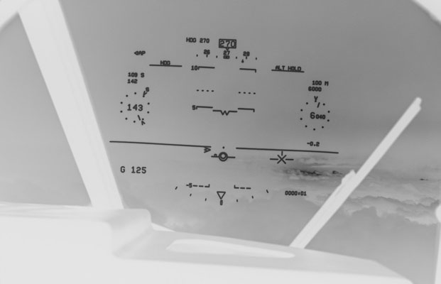
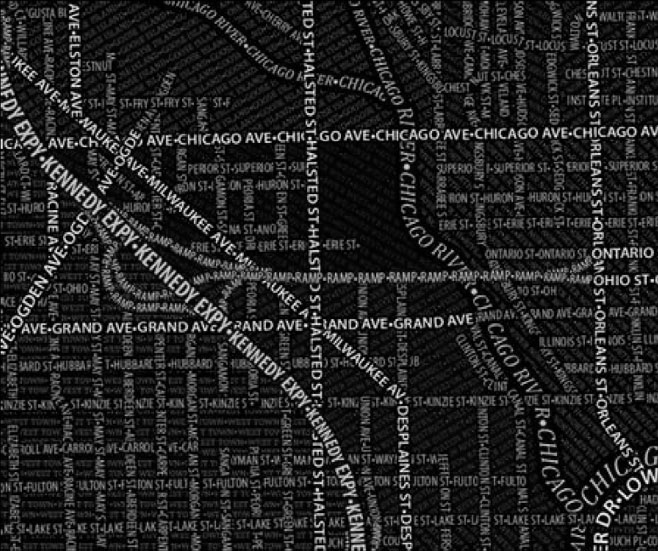

심리학과 신입생 여러분, 환영합니다! 영어 원문을 몰라도 이 챕터의 핵심을 완벽하게 마스터할 수 있도록 쉽고 친절하게, 하지만 심리학적인 깊이를 놓치지 않게 단계별로 안내해 드리겠습니다. 혼자서도 뼈대를 탄탄히 잡을 수 있는 **STEP 1: 챕터 프리뷰**를 시작합니다.

---

### 1. 이 챕터의 가장 큰 주제와 논리적 흐름

이 챕터의 가장 큰 주제는 **"인간의 주의(Attention)는 어떻게 지각과 디스플레이 공간에서 작동하는가?"**입니다.

주의를 **손전등(flashlight)**에 비유하면 이해가 쉽습니다:
- **선택적 주의(Selective Attention):** 손전등 빔을 이리저리 비추며 중요한 곳을 골라 보는 것
- **초점 주의(Focused Attention):** 빔의 폭을 좁혀서 방해 요소를 차단하는 것
- **분할 주의(Divided Attention):** 빔의 폭을 넓혀서 두 가지 이상을 동시에 보는 것
- **지속 주의(Sustained Attention):** 손전등 배터리가 오래 가도록 유지하는 것

**왜 이 챕터를 배워야 할까요?**
미국에서만 매년 약 4만 명이 교통사고로 사망하며, 그 중 절반 이상이 **주의 분산(distraction)**에 의한 것입니다 (Lee et al., 2009). 운전, 항공, 의료, 산업 현장 등 거의 모든 분야에서 인간의 주의력 한계를 이해하는 것이 사고를 막는 핵심입니다.

**하위 섹션들의 논리적 연결성:**
1. **선택적 시각 주의 (섹션 2):** 우리 눈이 어디를 보고, 무엇을 놓치는지 — SEEV 모델, 변화 눈먼 현상, 시각 탐색의 원리를 배웁니다.
2. **병렬 처리와 분할 주의 (섹션 3):** 여러 정보를 동시에 처리할 때 디스플레이를 어떻게 설계하면 좋은지 — 근접성 호환 원칙(PCP)을 배웁니다.
3. **청각적 주의 (섹션 4):** 시각을 넘어 소리로 전달되는 정보에서의 주의 — 칵테일 파티 효과, 청각 스트리밍을 배웁니다.
4. **전환 (섹션 5):** 이 챕터에서 배운 주의의 필터가 다음 챕터들과 어떻게 연결되는지 정리합니다.

---

### 2. 반드시 기억해야 할 '가장 중요한 전문 용어'

| 전문 용어 | 페이지 | 학술적 정보 및 연구자(연도) |
| :--- | :--- | :--- |
| **SEEV 모델** (Salience, Effort, Expectancy, Value) | p.52 | Wickens, 2012; Wickens Hooey et al., 2009; Steelman-Allen, McCarley, & Wickens, 2011. 시각 주의 배분을 예측하는 4요인 가산 모델 |
| **SSTS 모델** (Serial Self-Terminating Search) | p.57 | Sternberg, 1966; Neisser, 1963. 시각 탐색 시간을 예측하는 직렬 자기종료 탐색 모델 |
| **변화 눈먼 현상** (Change Blindness) | p.53 | O'Regan, Deubel et al., 2000; Rensink, 2002. 환경의 변화를 알아차리지 못하는 현상 |
| **부주의 눈먼 현상** (Inattentional Blindness) | p.55 | Mack & Rock, 1998; Simons & Chabris, 1999. 눈앞에 있어도 주의하지 않으면 못 보는 현상 |
| **근접성 호환 원칙** (PCP: Proximity Compatibility Principle) | p.71 | Wickens & Carswell, 1995, 2012. 디스플레이 근접성과 과제 근접성의 호환 원칙 |
| **유효 시야** (UFOV: Useful Field of View) | p.56 | Kraiss & Knäeuper, 1982. 시각 탐색 시 한 번에 볼 수 있는 범위 |
| **칵테일 파티 효과** (Cocktail Party Effect) | p.79 | Bregman, 1990. 시끄러운 환경에서 특정 목소리에 집중하는 능력 |
| **스트룹 효과** (Stroop Effect) | p.68 | Stroop, 1935; MacLeod, 1992. 글자 의미와 색상이 충돌할 때 간섭이 생기는 현상 |
| **관심 영역** (AOI: Area of Interest) | p.50 | Wickens & Horrey, 2009. 과제 관련 정보가 있는 물리적 위치 |
| **N-SEEV 모델** (Noticing-SEEV) | p.54 | Steelman-Allen McCarley & Wickens, 2011; Wickens, 2012. 변화 감지 실패를 예측하는 모델 |

---

### 3. 전체 Flow Chart (Mind Map)

이 챕터는 다음과 같은 흐름으로 머릿속에 그리시면 됩니다.

**[중심 개념: 주의(Attention)라는 손전등]**

*   **A. 선택적 주의: 어디를 볼 것인가?**
    *   감독 통제 → SEEV 모델 (현저성, 노력, 기대, 가치)
    *   알아차리기 → 변화 눈먼 현상, 부주의 눈먼 현상, N-SEEV
    *   시각 탐색 → SSTS 모델 (직렬 탐색, 병렬 탐색)
    *   복잡함 → 시각적 혼잡(Clutter)의 4가지 유형
    *   유도 → 중심 단서 vs 주변 단서, 단서 신뢰도

*   **B. 분할 주의: 여러 개를 동시에 어떻게?**
    *   전주의 처리 → 게슈탈트 원리 (근접, 유사, 공동운명)
    *   공간 근접성 → HUD, 가까이 둘수록 병렬 처리 촉진
    *   객체 기반 주의 → 스트룹 효과, 객체 디스플레이
    *   **근접성 호환 원칙 (PCP)** → 디스플레이와 과제의 최적 매칭

*   **C. 청각적 주의: 귀로도 주의한다**
    *   청각 분할 → 이분청취(dichotic), 단음청취(monaural)
    *   청각 집중 → 칵테일 파티 효과, 청각 스트리밍
    *   교차 감각 → 시청각 통합, 무관련 소리 효과

---

**[Flow Chart 보충 설명]**
이 차트는 **'선택 → 탐색 → 분할 → 청각 확장'**의 흐름을 따릅니다.
1. 먼저 인간은 한정된 주의 자원으로 **어디를 볼지 선택**합니다 (SEEV).
2. 선택 과정에서 놓치는 것들이 생깁니다 (변화/부주의 눈먼 현상).
3. 특정 대상을 찾을 때는 **시각 탐색** 전략이 작동합니다 (SSTS).
4. 여러 정보를 **동시에** 봐야 할 때는 디스플레이 배치가 중요해집니다 (PCP).
5. 마지막으로 시각을 넘어 **소리**를 통한 주의까지 확장합니다.

---

## STEP 2: 핵심 개념 딥다이빙 (Concept Mastery)

### 0. 왜 이론과 모델을 연결해서 배워야 할까요?

이 챕터에는 SEEV, N-SEEV, SSTS, PCP라는 4개의 핵심 모델이 등장합니다. 이것들은 따로 노는 퍼즐 조각이 아니라, 모두 **"인간의 주의라는 한정된 자원을 어떻게 효율적으로 배분할 것인가?"**라는 하나의 큰 질문에 답하는 도구들입니다. 연결해서 배워야 실제 현장에서 종합적인 판단이 가능합니다.

---

### 1. 핵심 모델 딥다이빙

#### ① SEEV 모델 (감독 통제의 시각 주사 모델)

*   **연구자(연도):** Wickens, 2012; Wickens, Hooey et al., 2009; Steelman-Allen, McCarley, & Wickens, 2011
*   **왜 만들어졌나?** 조종사, 운전자, 마취과 의사 등이 여러 계기를 볼 때, **어디를 얼마나 자주 볼지** 예측하기 위해 만들어졌습니다.
*   **세부 요소와 상호작용 (비유):**
    쇼핑몰에서 여러 가게를 구경하는 상황을 상상해보세요.
    *   **현저성(Salience):** 네온사인이 번쩍이는 가게 → 자연스레 눈이 간다 (밝기, 크기, 색상, 대비)
    *   **노력(Effort):** 바로 옆 가게 vs 3층 끝 가게 → 가까운 데를 더 자주 본다 (시각 각도, 고개 돌림)
    *   **기대(Expectancy):** "저 가게는 세일을 자주 해" → 변화가 잦은 곳을 더 본다 (대역폭)
    *   **가치(Value):** "나는 신발이 필요해" → 내 목표에 중요한 곳을 본다 (과제 관련성)
    *   **상호작용:** 이 4가지가 **합산**되어 최종 주시 확률을 결정합니다. 현저성과 노력은 **상향식(bottom-up)**, 기대와 가치는 **하향식(top-down)** 영향입니다.
*   **핵심 예측:** SEEV는 주의의 분포뿐 아니라 **무시 기간(periods of neglect)**도 예측합니다 — 가치가 높지만 기대가 낮은 AOI는 오래 무시됩니다.

#### ② N-SEEV 모델 (알아차림 모델)

*   **연구자(연도):** Steelman-Allen McCarley & Wickens, 2011; Wickens, 2012
*   **왜 만들어졌나?** SEEV가 "어디를 보는가"를 예측한다면, N-SEEV는 **"예상치 못한 변화를 알아차리는가"**를 예측합니다.
*   **세부 요소:**
    *   SEEV가 예측한 주사 경로 위에서, 변화가 발생한 위치의 **이심률(eccentricity)** — 시선 중심에서 얼마나 떨어져 있는가
    *   변화의 **기대도** — 예상치 못한 "블랙 스완" 이벤트는 놓칠 확률 40%
    *   변화의 **현저성** — 깜빡임, 색 변화처럼 눈에 띄는 정도
*   **실제 적용:** 항공기 조종석에서 계기 변화를 놓치는 시간을 정확히 예측하는 데 성공 (Wickens Hooey et al., 2009)

#### ③ SSTS 모델 (직렬 자기종료 탐색)

*   **연구자(연도):** Sternberg, 1966; Neisser, 1963
*   **왜 만들어졌나?** "글자 K를 찾아라" 같은 시각 탐색에서 **탐색 시간이 항목 수에 따라 어떻게 증가하는지** 예측하기 위해 만들어졌습니다.
*   **핵심 공식:** ST = a + bN/2 (타겟 있을 때), ST = a + bN (타겟 없을 때)
    *   ST = 탐색 시간, N = 항목 수, b = 항목당 처리 시간, a = 비탐색 시간
*   **비유:** 도서관에서 특정 책을 찾는 상황
    *   책이 **있다면**: 평균적으로 절반 정도 찾아보면 발견 → N/2
    *   책이 **없다면**: 끝까지 다 봐야 확인 가능 → N
*   **중요한 예외들:**
    *   **병렬 탐색(Parallel Search):** 빨간 글자가 검은 글자들 사이에서 "튀어나오는(pop out)" 경우 → 기울기 b ≈ 0 (Treisman & Gelade, 1980)
    *   **결합 탐색(Conjunction Search):** 색상+모양 두 가지를 동시에 봐야 하면 느려짐
    *   **전수 탐색(Exhaustive Search):** X-ray에서 모든 이상을 찾아야 할 때 → 전부 탐색

#### ④ 근접성 호환 원칙 (PCP)

*   **연구자(연도):** Wickens & Carswell, 1995, 2012
*   **왜 만들어졌나?** 디스플레이 요소를 **가까이 둘지 멀리 둘지** 결정하는 원칙이 필요했습니다.
*   **핵심 원리 (비유):**
    *   **과제 근접성이 높을 때** (두 정보를 통합해야 하는 경우): 교과서와 노트를 나란히 놓으면 공부가 편하다 → **디스플레이도 가까이** 배치
    *   **과제 근접성이 낮을 때** (하나만 집중해야 하는 경우): 시험 볼 때 옆 사람 답안이 보이면 방해된다 → **디스플레이를 떨어뜨려** 배치
*   **디스플레이 근접성을 높이는 9가지 방법:**
    1. 공간적 가까움 (Space)
    2. 색상 유사성 (Color)
    3. 연결선 (Connections)
    4. 인접/맞닿음 (Abutment)
    5. 이질적 피처 (Heterogeneous features)
    6-7. 동질적 피처 (Homogeneous features)
    8. 동질적 피처의 창발 특성 (Emergent features)
    9. 다각형/폴리곤 디스플레이 (Polygon display)

---

### 2. 이론과 모델의 연결 관계 (Mind Map)

이 모델들은 다음과 같이 연결됩니다:

1. **SEEV** → "어디를 볼지" 결정 (감독 통제 단계)
2. **N-SEEV** → SEEV가 예측한 경로에서 "놓치는 것" 예측 (알아차림 단계)
3. **SSTS** → 특정 대상을 "찾는 속도" 예측 (탐색 단계)
4. **PCP** → 찾은 정보들을 "통합하거나 분리"할 때 최적 배치 (디스플레이 설계 단계)

**흐름:** 감독 통제(SEEV) → 놓침 예측(N-SEEV) → 탐색(SSTS) → 디스플레이 설계(PCP)

---

### 3. 전체 학습 흐름 (Flow Chart)

```
[주의의 배분] ──SEEV──→ [무엇을 놓치나?] ──N-SEEV──→ [어떻게 찾나?] ──SSTS──→ [어떻게 배치하나?] ──PCP──→ [최적 디스플레이]
     │                        │                         │                          │
  현저성/노력/           변화 눈먼 현상            직렬/병렬 탐색              공간/색상/객체
  기대/가치             부주의 눈먼 현상           UFOV/혼잡도              근접성 조절
```

**[도식 보충 설명]**
1. 먼저 SEEV가 주의 자원의 전체 배분을 결정합니다.
2. 그 배분에서 빠진 곳에서 N-SEEV가 놓침을 예측합니다.
3. 특정 대상을 적극 탐색할 때는 SSTS의 속도/정확도 트레이드오프가 작동합니다.
4. 최종적으로 PCP가 이 모든 것을 고려한 디스플레이 배치 가이드라인을 제공합니다.

---

## STEP 3: 현실 세계 적용 (Real-world Case Study)

### 1. 책에 나온 실제 사례와 이론의 연결

*   **사례 1: 운전 중 주의 분산 (SEEV 모델)**
    *   **설명:** 운전자는 도로(높은 가치), 내비게이션(높은 기대), 경고등(높은 현저성)을 번갈아 봅니다. 속도계는 가치가 높지만 변화가 적어(낮은 기대) 자주 무시됩니다.
    *   **연결 이론:** **SEEV 모델 (Wickens, 2012)** — 4가지 요인의 합산으로 주시 패턴 예측
    *   **일상 적용:** 고속도로에서 속도계를 덜 보는 이유 = 직선 도로에서는 속도 변화(bandwidth)가 낮아 기대가 떨어지기 때문

*   **사례 2: 고릴라 실험 (부주의 눈먼 현상)**
    *   **설명:** 농구 패스 횟수를 세는 동안 고릴라 복장의 사람이 지나가도 **참가자의 절반 이상이 못 봤습니다** (Simons & Chabris, 1999).
    *   **연결 이론:** **부주의 눈먼 현상 (Mack & Rock, 1998)** — 주의를 기울이지 않으면 눈앞에 있어도 의식하지 못함
    *   **핵심 발견:** 작업 기억 용량이 큰 사람(67%)이 적은 사람(36%)보다 고릴라를 더 잘 봤습니다 (Seegmiller, Watson, & Strayer, 2011)

*   **사례 3: 나무 문 실험 (변화 눈먼 현상)**
    *   **설명:** 길에서 인터뷰어와 대화 중 나무 문을 든 인부들이 지나가면서 인터뷰어가 **다른 사람으로 바뀌었는데**, 절반이 눈치 못 챘습니다 (Simons & Levin, 1998).
    *   **연결 이론:** **변화 눈먼 현상 (Rensink, 2002)** — 시각적 전환이 방해되면 큰 변화도 감지 못함
    *   **안전 시사점:** 운전 중 도로 표지판 변화, 비행 중 계기 변화를 놓칠 수 있음

*   **사례 4: HUD 디스플레이 (공간 근접성)**

    

    *   **설명:** 전투기의 헤드업 디스플레이(HUD)는 계기 정보를 유리창 위에 겹쳐서 보여줍니다. 조종사가 고개를 숙이지 않고도 비행 정보와 외부 상황을 동시에 볼 수 있습니다.
    *   **연결 이론:** **PCP (Wickens & Carswell, 1995)** — 높은 과제 근접성 → 디스플레이도 가까이
    *   **주의사항:** HUD 정보가 외부 장면을 가리면(clutter) 오히려 예상치 못한 장애물을 놓칠 수 있음 (Wickens & Long, 1995)

---

### 2. 신입생을 위한 일상생활 적용 (이해 확인용)

*   **스마트폰 알림과 SEEV:**
    카톡 알림 소리(높은 현저성) + 중요한 메시지일 수 있다는 기대(높은 기대) + 대화 확인이 내 목표(높은 가치) → SEEV의 3가지가 동시에 높아져 공부 중에도 손이 갑니다. 반면 화면 밝기 조절 알림은 가치가 낮아 무시됩니다.

*   **도서관 공부와 부주의 눈먼 현상:**
    교과서에 깊이 집중하면 옆 사람이 자리를 바꿔도 모릅니다. 이것이 부주의 눈먼 현상이며, 주 과제(공부)에 주의 자원을 모두 쏟고 있기 때문입니다.

*   **카페에서 내 이름 듣기 (칵테일 파티 효과):**
    시끄러운 카페에서 친구와 대화 중인데, 멀리서 누가 내 이름을 부르면 즉시 알아챕니다. 이는 자기 이름에 대한 주의 문턱(threshold)이 매우 낮기 때문입니다 (Moray, 1959).

---

### 3. 참고 문헌 (APA 양식)

*   Lee, J. D., et al. (2009). Distraction in everyday driving. *Human Factors*.
*   Mack, A., & Rock, I. (1998). *Inattentional Blindness*. MIT Press.
*   Rensink, R. A. (2002). Change detection. *Annual Review of Psychology, 53*, 245–277.
*   Simons, D. J., & Chabris, C. F. (1999). Gorillas in our midst. *Perception, 28*, 1059–1074.
*   Simons, D. J., & Levin, D. T. (1998). Failure to detect changes to people during a real-world interaction. *Psychonomic Bulletin & Review, 5*, 644–649.
*   Sternberg, S. (1966). High-speed scanning in human memory. *Science, 153*, 652–654.
*   Treisman, A. M., & Gelade, G. (1980). A feature-integration theory of attention. *Cognitive Psychology, 12*, 97–136.
*   Wickens, C. D. (2012). *Engineering Psychology and Human Performance* (4th ed.).
*   Wickens, C. D., & Carswell, C. M. (1995). The proximity compatibility principle. *Human Factors, 37*, 473–494.

---

## STEP 4: 데이터 및 시각 자료 해석 (Data & Visual Literacy)

### 1. 주요 도표 및 시각 자료 분석

#### ① Figure 3.1: 정보 접근 노력(IAE) 함수

*   **X축:** 두 AOI 사이의 시각 각도(degrees of visual angle)
*   **Y축:** 정보 접근 노력(Information Access Effort)
*   **그래프의 의미:** 3구간으로 나뉩니다:
    *   **0~4도 (중심와):** 눈만 움직여도 됨 → 노력 최소
    *   **4~20도 (안구 영역):** 안구 운동 필요 → 노력 약간 증가
    *   **20~90도 (두부 영역):** 고개를 돌려야 함 → 노력 급증
    *   **90도 이상:** 몸 전체 회전 필요
*   **시사점:** SEEV 모델의 "노력(Effort)" 요인을 수학적으로 보여줍니다. 디스플레이 요소 간 거리가 멀수록 주사 빈도가 줄어듭니다. 이것이 HUD가 발명된 이유입니다 (Sanders & Houtmans, 1985).

#### ② Figure 3.2: SSTS 모델의 탐색 시간 예측

*   **X축:** 탐색 세트 크기(N = 4, 8, 12)
*   **Y축:** 탐색 시간(Search Time)
*   **두 개의 선:**
    *   **실선(타겟 있음):** 기울기 = b/2 → 평균 절반만 탐색하면 발견
    *   **점선(타겟 없음):** 기울기 = b → 전부 탐색해야 확인
*   **시사점:** 타겟이 없을 때의 기울기가 있을 때의 **정확히 2배**라는 것이 SSTS 모델의 핵심 예측입니다. 이것은 공항 보안 검색, 의료 영상 판독 등 "반드시 찾아야 하는" 과제에서 시간 압박의 원인을 설명합니다.

#### ③ Figure 3.3: 구조화 vs 비구조화 탐색 필드

*   **(a) 구조화된 배치:** 게슈탈트 원리(근접, 유사)에 따라 정돈된 계기판
*   **(b) 비구조화된 배치:** 무질서하게 흩어진 계기판
*   **시사점:** 구조화된 배치에서는 전주의 처리(preattentive processing)가 가능해져 탐색 시간이 크게 줄어듭니다. 게슈탈트 원리가 "무료 점심"(free lunch)처럼 주의 자원을 절약해줍니다.

#### ④ Figure 3.4: 항공기 엔진 다이얼 (로컬 vs 글로벌 처리)

*   **(a) 로컬 처리:** 각 다이얼의 정상 위치가 제각각 → 하나씩 읽어야 함
*   **(b) 글로벌 처리:** 모든 다이얼을 12시 방향으로 정렬 → 이탈한 다이얼이 즉시 눈에 띔
*   **시사점:** 정렬된 배치에서는 **창발 특성(emergent feature)**이 생겨, 수직선 열(column of pointers)이라는 새로운 패턴이 형성됩니다. 이 패턴에서 벗어난 다이얼을 전주의적으로(preattentively) 발견할 수 있습니다.

#### ⑤ Figure 3.5: HUD(Head-Up Display)


*   **(a):** 실제 항공기 HUD — 비행 정보가 유리창에 투영됨
*   **(b):** 등각 심볼(conformal symbology) — HUD 활주로 심볼이 실제 활주로와 겹침
*   **(c):** 등각 오버레이 — 착륙 시 HUD와 실제 장면이 하나의 객체로 통합
*   **시사점:** 등각 디스플레이에서는 실제 장면과 HUD가 게슈탈트의 **공동 운명(common fate)** 원칙에 따라 하나의 객체로 인식됩니다. 이것이 PCP의 실전 적용입니다.

#### ⑥ Figure 3.8: 시카고 타이포그래피 지도



*   **의미:** 도로 이름이 도로 자체의 모양이 됨 — 글자가 거리를 표현
*   **시사점:** 디스플레이 표현(지도)과 과제 표현(거리 찾기)이 하나의 객체로 통합된 극단적 사례입니다. **과제 호환성(task compatibility)**의 궁극적 형태입니다.

#### ⑦ Figure 3.10: 근접성 호환 원칙(PCP) 도식

*   **X축:** 디스플레이 근접성 (낮음 ↔ 높음)
*   **Y축:** 수행(Performance) (나쁨 ↔ 좋음)
*   **두 개의 선:**
    *   **점선(높은 과제 근접성):** 디스플레이가 가까울수록 수행 향상 (통합 과제)
    *   **실선(낮은 과제 근접성):** 디스플레이가 가까울수록 수행 저하 (초점 과제)
*   **시사점:** 이것이 PCP의 핵심입니다. 무조건 가까이 두는 것이 좋은 게 아니라, **과제의 성격**에 맞춰야 합니다.

---

### 2. 전체 시각 자료의 흐름 (Flow Chart)

```
Figure 3.1 (IAE)     → SEEV의 "노력" 요인을 수학적으로 증명
        ↓
Figure 3.2 (SSTS)    → 탐색 시간 = 항목 수의 선형 함수
        ↓
Figure 3.3 (Clutter) → 혼잡한 배치 vs 정돈된 배치의 탐색 효율 차이
        ↓
Figure 3.4 (Dials)   → 글로벌 처리와 창발 특성의 힘
        ↓
Figure 3.5 (HUD)     → 공간 근접성의 극대화 = HUD
        ↓
Figure 3.10 (PCP)    → 모든 것을 종합하는 설계 원칙
```

**[보충 설명]**
이 흐름은 **"주의의 비용(노력) → 탐색의 속도 → 혼잡의 문제 → 해결책(정돈+근접) → 종합 원칙(PCP)"**이라는 완전한 논리 구조를 갖고 있습니다. 각 그래프는 이전 그래프의 문제를 해결하는 방향으로 이어집니다.

---

## STEP 5: 셀프 테스트 및 피드백 (Self-Check)

### 1. 사고력 중심 리뷰 퀴즈

**[문제 1: SEEV 모델 적용]**
당신은 자동차 대시보드 디자인 담당 심리학 자문가입니다. 내비게이션을 대시보드 중앙(기존 위치)에서 운전대 뒤 계기판 옆으로 옮기자는 제안이 들어왔습니다. SEEV 모델의 4가지 요인(현저성, 노력, 기대, 가치)을 근거로 이 제안의 장단점을 분석해 보세요.

**[문제 2: 변화 눈먼 현상과 N-SEEV]**
병원 수술실에서 환자 모니터의 산소포화도 수치가 서서히 떨어지고 있습니다. 마취과 의사는 수술 부위에 집중하고 있습니다. 이 상황에서 **변화 눈먼 현상**이 발생할 수 있는 이유를 N-SEEV 모델의 관점에서 설명하고, 이를 방지하기 위한 디자인 제안을 해보세요.

**[문제 3: PCP와 디스플레이 설계]**
공장 관제실에서 4개의 탱크 온도를 동시에 감시하는 과제가 있습니다. 감독자는 (A) 4개 온도가 모두 정상 범위인지 한눈에 판단해야 하고, (B) 이상이 발견되면 어느 탱크인지 정확히 식별해야 합니다. PCP를 근거로 (A)와 (B) 과제 각각에 최적인 디스플레이 배치를 설계해 보세요.

---

### 2. 전체 학습 Flow Chart (Overview)

**[주의의 인지적 흐름도]**

1. **감각 입력:** 세상의 수많은 시각/청각 정보가 동시에 들어옴
2. **전주의 처리:** 게슈탈트 원리에 따라 자동으로 그룹화 (병렬, 빠름)
3. **선택적 주의:** SEEV 요인에 따라 어디를 볼지 결정 (제한된 자원 배분)
4. **탐색/확인:** SSTS 모델에 따라 타겟을 찾고 확인 (직렬, 느림)
5. **놓침 가능성:** N-SEEV가 예측하는 변화 눈먼/부주의 눈먼 현상
6. **디스플레이 설계:** PCP에 따라 과제에 맞는 최적 배치 → 주의 효율 극대화

---

### 3. 정답 및 해설 (피드백)

*   **[문제 1 해설]**
    *   **장점 (노력 감소):** 계기판 옆으로 옮기면 도로 → 내비 시선 이동 각도가 줄어들어 SEEV의 "노력" 요인이 감소합니다. Figure 3.1에 따르면 시각 각도가 줄면 주사 빈도가 증가하여 내비를 더 자주 확인할 수 있습니다.
    *   **단점 (현저성 감소):** 중앙 위치는 주변 시야에서도 잘 보이지만, 계기판 옆은 운전대에 가려질 수 있어 현저성이 떨어질 수 있습니다.
    *   **근거:** SEEV 모델은 4요인의 합산이므로, 노력 감소가 현저성 감소를 상쇄하는지 계산적으로 비교해야 합니다 (Wickens, 2012).

*   **[문제 2 해설]**
    *   **답안 포인트:** 마취과 의사의 주요 AOI는 수술 부위(높은 가치, 높은 기대)이므로 SEEV가 예측하는 주시 시간의 대부분이 수술 부위에 집중됩니다. 산소포화도 모니터는 정상 시 변화가 적어(낮은 기대) 무시 기간이 길어집니다. N-SEEV 관점에서 서서히 변하는 수치는 현저성이 낮고, 모니터가 주변부에 있으면 이심률이 커서 감지 확률이 더 떨어집니다.
    *   **설계 제안:** ① 임계치 도달 시 청각 알람 추가 (칵테일 파티 효과 활용 — 조용한 개인화 알림), ② 모니터를 수술 시야 근처로 이동 (노력 감소), ③ 급격한 변화 시 깜빡임 효과 추가 (현저성 증가)
    *   **근거:** Koh, Park, et al. (2011)은 수술실에서 SEEV 모델의 예측 타당성을 확인했습니다.

*   **[문제 3 해설]**
    *   **과제 (A) — 통합 과제 (높은 과제 근접성):** Figure 3.4(b)처럼 4개 다이얼을 정렬하여 정상 시 대칭 패턴(창발 특성)이 나타나도록 설계. 하나라도 이상이면 패턴이 깨져 전주의적으로 감지 가능. 또는 Figure 3.7a처럼 폴리곤 디스플레이 사용.
    *   **과제 (B) — 초점 과제 (낮은 과제 근접성):** 이상 탱크를 식별하려면 각 탱크의 개별 수치를 독립적으로 읽어야 하므로, 적당한 간격과 명확한 라벨링이 필요. 너무 가까우면 근접 혼잡(readout clutter)으로 인해 지각 경쟁이 발생.
    *   **근거:** PCP (Wickens & Carswell, 1995)의 Figure 3.10 — 통합 과제는 높은 디스플레이 근접성, 초점 과제는 낮은 디스플레이 근접성이 최적.

---

## STEP 6: 보완 전략 및 위기 탈출법

### 1. 영어를 못해도 완벽해지는 추가 학습 보완전략

1. **모델의 약어를 외우세요:** SEEV(현저성-노력-기대-가치), SSTS(직렬 자기종료 탐색), PCP(근접성 호환 원칙) — 이 약어만 기억하면 교수님 질문에 즉시 답할 수 있습니다.
2. **일상에서 사례를 모으세요:** 스마트폰 UI, 자동차 대시보드, 카페 소음 등에서 이 이론들이 적용된 예를 3개만 찾으면 영어 원서보다 더 깊이 있는 이해가 됩니다.
3. **Figure 3.10(PCP 도식)을 반드시 그릴 수 있게 하세요:** 이 하나의 그래프가 챕터 전체를 요약합니다. X자 형태의 두 선만 그리면 됩니다.

---

### 2. [위기 탈출] 교수님 브리핑용 3분 스피치 대본

> "이 챕터는 인간의 주의를 **손전등**에 비유하며, 그 빔이 어떻게 작동하는지 4가지 관점에서 설명합니다.
>
> 첫째, **SEEV 모델**은 현저성, 노력, 기대, 가치라는 4가지 요인이 합산되어 '어디를 볼지'를 결정한다고 설명합니다. 조종사가 계기판보다 앞유리를 더 자주 보는 이유를 이 모델로 예측할 수 있습니다.
>
> 둘째, 이 선택 과정에서 중요한 변화를 놓치는 **변화 눈먼 현상**과 **부주의 눈먼 현상**이 발생합니다. Simons와 Chabris(1999)의 고릴라 실험이 대표적입니다.
>
> 셋째, 특정 대상을 찾는 **시각 탐색**은 SSTS 모델로 예측되며, 탐색 시간은 항목 수에 비례합니다. 단, 색상이 튀는 대상은 병렬 탐색으로 즉시 발견됩니다.
>
> 넷째, 여러 정보를 동시에 봐야 할 때는 **근접성 호환 원칙(PCP)**이 디스플레이 설계를 안내합니다. 통합 과제에는 가까이, 초점 과제에는 멀리 배치하는 것이 핵심입니다. HUD가 이 원칙의 대표적 적용 사례입니다.
>
> 마지막으로, 시각을 넘어 **청각적 주의**까지 확장하여 칵테일 파티 효과와 무관련 소리 효과를 다루며, 교차 감각 통합의 중요성을 강조합니다."

---

## 개념 정리 보고서

### Chapter 3 핵심 개념 요약표

| 대분류 | 핵심 개념 | 정의 | 핵심 연구자 | 실제 적용 |
| :--- | :--- | :--- | :--- | :--- |
| 선택적 주의 | SEEV 모델 | 현저성+노력+기대+가치로 시각 주사 예측 | Wickens (2012) | 조종석, 자동차 대시보드 설계 |
| 선택적 주의 | N-SEEV | 예상치 못한 변화의 알아차림 예측 | Steelman-Allen et al. (2011) | 항공기 계기 경고 시스템 |
| 선택적 주의 | 변화 눈먼 현상 | 시각적 방해 시 변화를 감지 못함 | Rensink (2002) | 도로 표지판 변경 감지 |
| 선택적 주의 | 부주의 눈먼 현상 | 주의하지 않으면 눈앞도 못 봄 | Mack & Rock (1998) | 보행자 안전, 산업 안전 |
| 시각 탐색 | SSTS 모델 | 탐색 시간 = a + bN/2 | Sternberg (1966) | 공항 보안 검색, 의료 영상 |
| 시각 탐색 | 병렬 탐색 | 단일 피처로 정의된 타겟은 즉시 발견 | Treisman & Gelade (1980) | 컬러 하이라이팅 설계 |
| 시각 탐색 | UFOV | 한 번에 탐색 가능한 시야 범위 | Kraiss & Knäeuper (1982) | 고령 운전자 검사 |
| 혼잡 | 4가지 혼잡 | 수량/근접/비구조/이질적 혼잡 | Kaber et al. (2011) | 지도 설계, 대시보드 정리 |
| 주의 유도 | 중심 단서 | 응시점 근처 화살표 (인지적, 느림) | Posner (1986) | 군사 디스플레이 |
| 주의 유도 | 주변 단서 | 타겟 위치의 섬광 (지각적, 빠름) | Posner (1986) | 충돌 경고 시스템 |
| 분할 주의 | PCP | 과제 근접성과 디스플레이 근접성 매칭 | Wickens & Carswell (1995) | 모든 디스플레이 설계 |
| 분할 주의 | 스트룹 효과 | 같은 객체 내 정보 간섭 | Stroop (1935) | 객체 기반 주의 연구 |
| 분할 주의 | 객체 디스플레이 | 다차원 정보를 단일 도형으로 표현 | Barnett & Wickens (1988) | 원자로, 의료 모니터 |
| 청각 주의 | 칵테일 파티 효과 | 시끄러운 곳에서 특정 소리 선택 | Bregman (1990) | 조종석 음성 경고 설계 |
| 청각 주의 | 청각 스트리밍 | 소리가 개별 흐름으로 분리됨 | Jones et al. (1999) | 3D 오디오 활용 |
| 청각 주의 | 무관련 소리 효과 | 배경 소음이 작업 기억을 방해 | Jones (1999) | 사무실/교실 방음 설계 |
| 교차 감각 | 교차 감각 주의 | 시청각 입력이 공간적으로 연결됨 | Driver & Spence (2004) | 멀티모달 경고 시스템 |

### 핵심 키워드 (Key Terms)

선택적 주의, 초점 주의, 분할 주의, 지속 주의, AOI(관심 영역), SEEV 모델, N-SEEV 모델, 현저성, 노력, 기대, 가치, 변화 눈먼 현상, 변화 눈먼 눈먼 현상(change blindness blindness), 부주의 눈먼 현상, 시각 탐색, SSTS 모델, 병렬 탐색, 결합 탐색, 전수 탐색, 목표 튀어나옴(target popout), UFOV, 혼잡(clutter), 수량 혼잡, 근접 혼잡, 비구조 혼잡, 이질적 혼잡, 중심 단서, 주변 단서, 주의 유도, 단서 신뢰도, 주의 좁힘(attentional narrowing), 자동화 안주(automation complacency), 무기 효과(weapons effect), 전주의 처리, 게슈탈트 원리, HUD, FFOV, 공간 근접성, 객체 기반 주의, 스트룹 효과, 지각 경쟁, 반응 갈등, 중복 이득(redundancy gain), PCP(근접성 호환 원칙), 과제 근접성, 디스플레이 근접성, 등각 심볼(conformal symbology), 객체 디스플레이, 창발 특성(emergent features), 폴리곤 디스플레이, 칵테일 파티 효과, 청각 스트리밍, 이분청취(dichotic), 단음청취(monaural), 3D 오디오, 무관련 소리 효과, 교차 감각 주의
