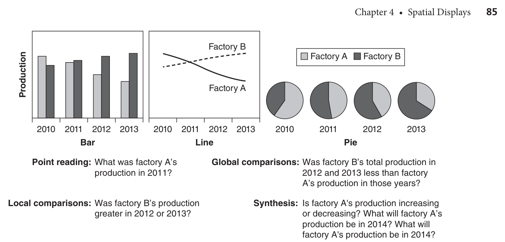
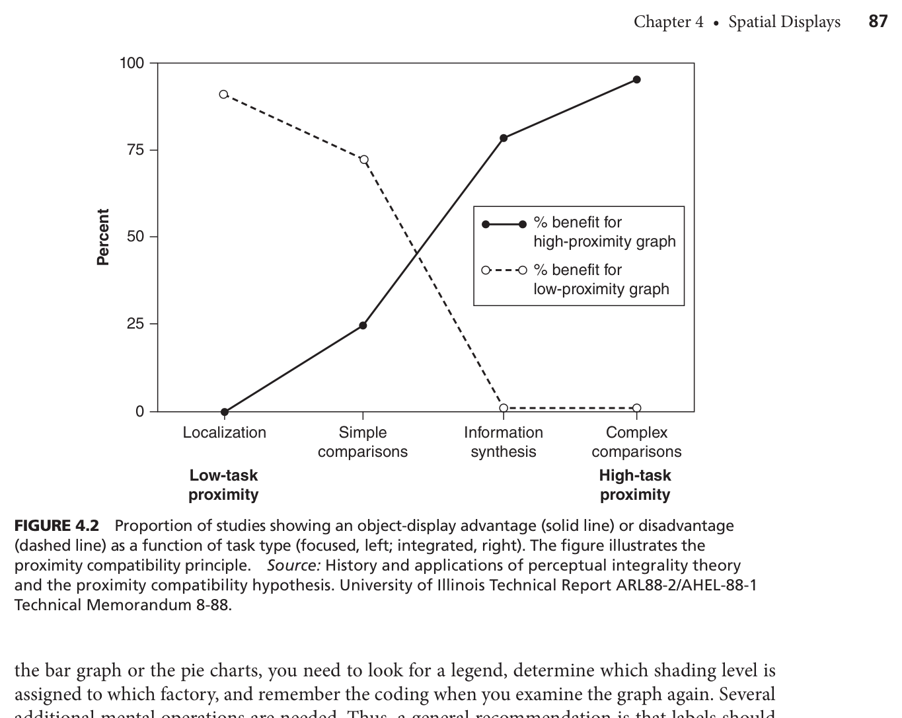
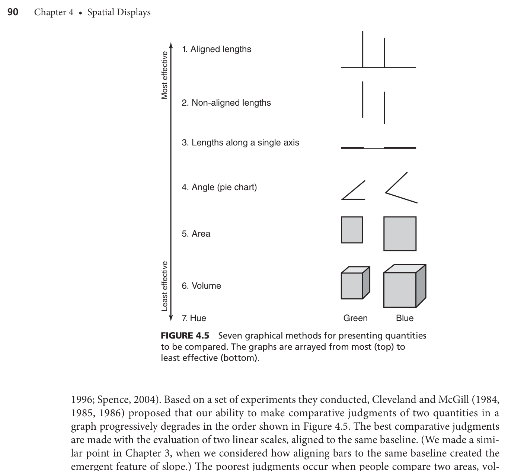
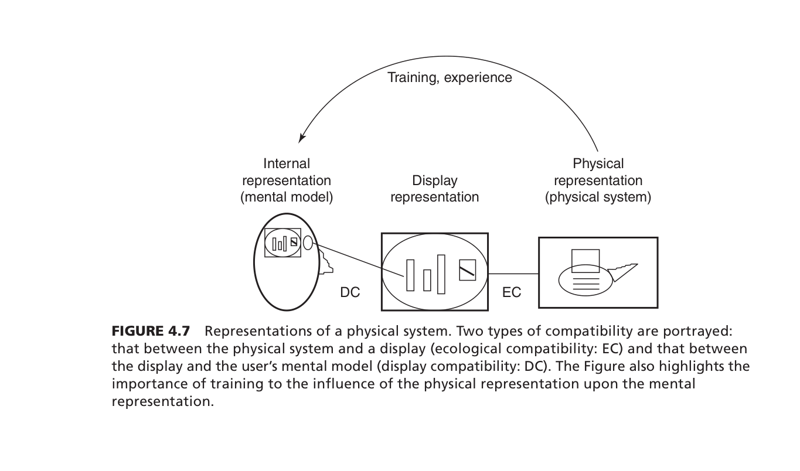
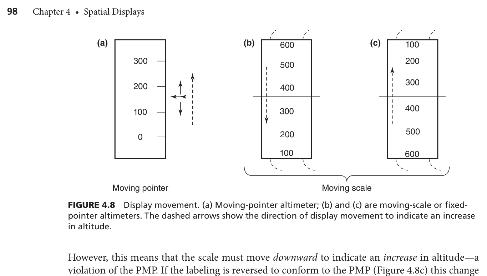
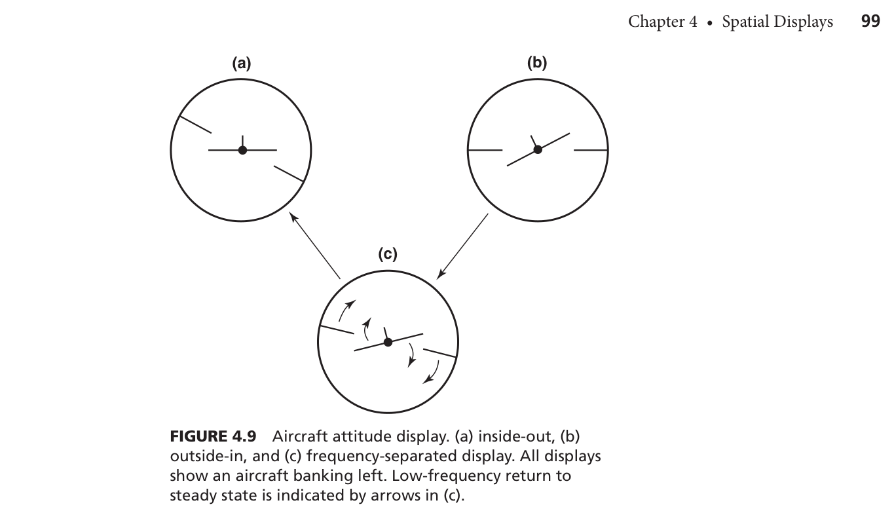
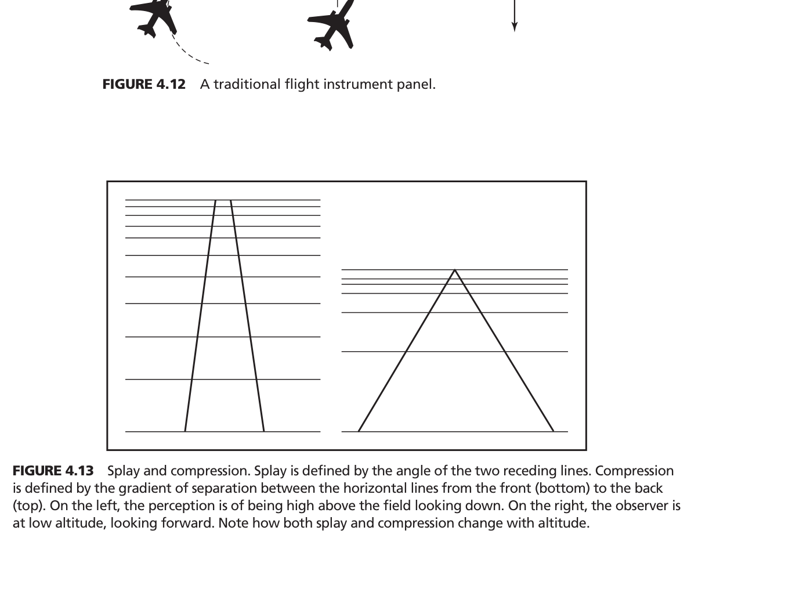
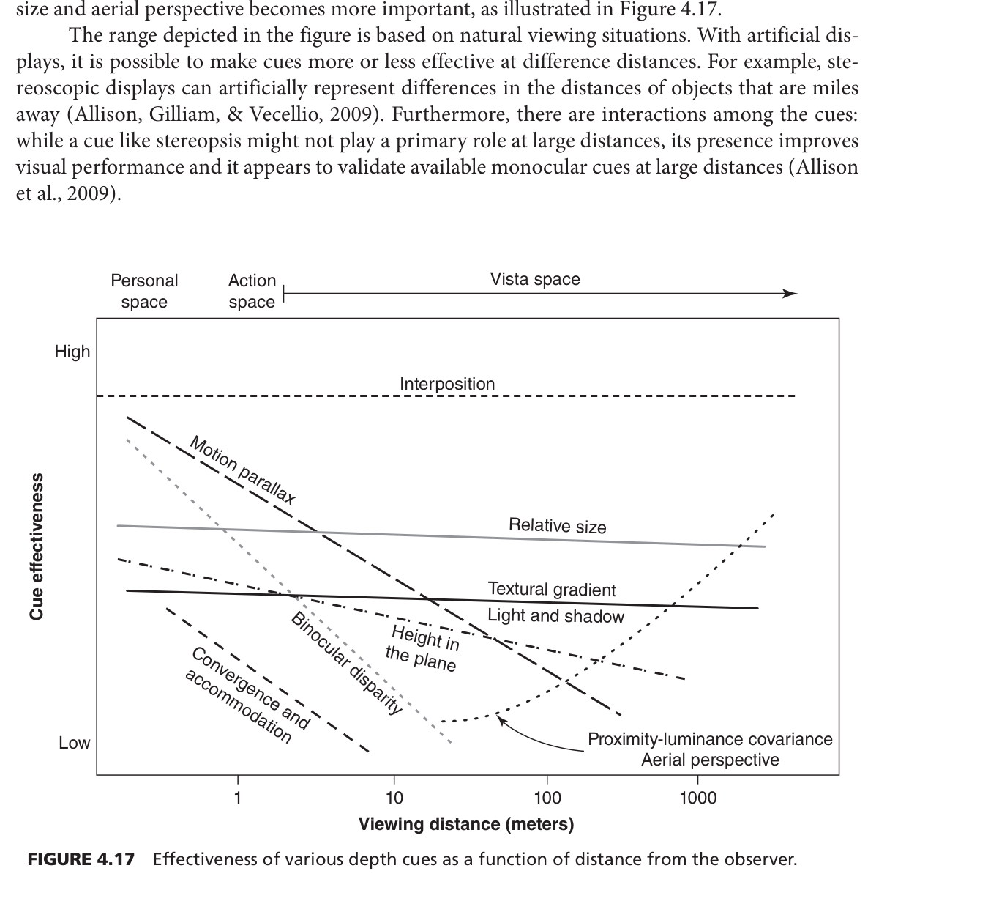
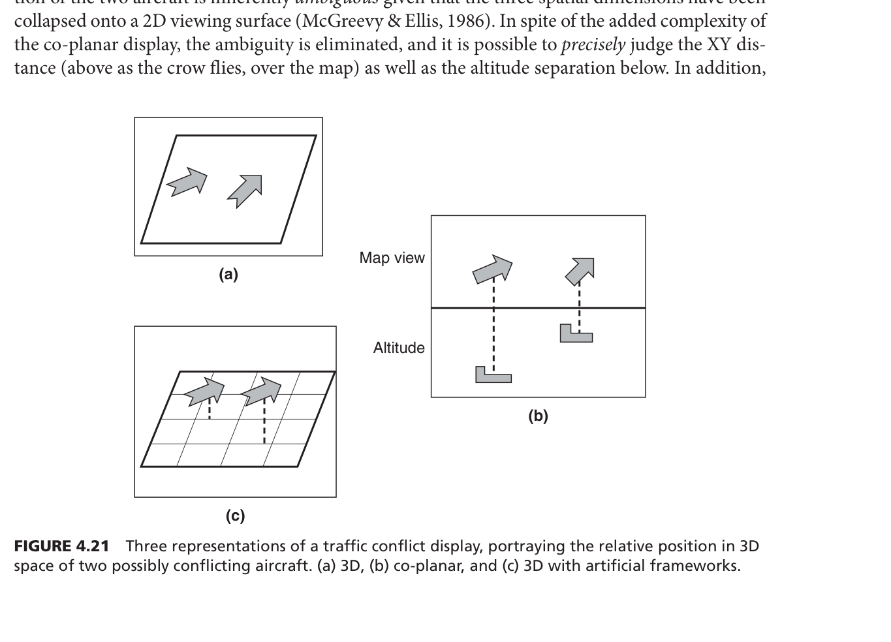

# Ch4. Spatial Displays — 인지공학심리학 W5 보고서

---

## STEP 1: 지식의 지도 그리기

### 핵심 메시지

> 화면이 예쁘거나 사실적인 게 중요한 게 아니다. **내가 하려는 작업에 맞는 화면인지**가 성능을 결정한다.

---

### 섹션별 흐름 요약

**섹션 1. 그래프 — 어떤 형식을 써야 할까?**

막대, 선형, 파이 — 어떤 그래프가 좋은지는 **무슨 질문에 답하려는가**에 달려 있다. "두 공장 중 어디가 더 빠르게 성장했어?"처럼 두 값을 통합해서 봐야 한다면 선형 그래프가 유리하다. "2013년 A공장의 정확한 수치는?"처럼 하나만 읽으면 되면 막대그래프나 표가 낫다. 이 원리를 **근접 호환성 원리(Proximity Compatibility Principle, PCP; Wickens & Carswell, 1995)**라 한다. (p.86)

그래프를 읽을 때 뇌는 항상 세 단계를 밟는다 — 찾고(Search), 기억에 넣고(Encode), 비교한다(Compare). 단계가 많을수록 시간도 길어지고 틀릴 확률도 높아진다. (p.87)

면적이나 부피로 양을 표현하면 실제보다 작게 느껴진다 — **반응 압축(response compression)**이다. 스티브즈 법칙(Stevens' Law, 1957)이 이를 설명한다. 3D 막대그래프가 예쁘지만 정확한 비교를 방해하는 이유가 여기 있다. (p.90)

데이터를 표현하지 않는 잉크는 줄여야 한다 — **데이터-잉크 비율(data-ink ratio; Tufte, 2001)**. 배경 그림, 불필요한 격자선이 오히려 그래프 읽기를 느리게 만든다. (p.92)

---

**섹션 2. 계기판·다이얼 — 어떻게 배치해야 할까?**

계기판 설계의 핵심은 세 가지가 서로 맞아야 한다는 것이다: 물리 시스템이 실제로 어떻게 동작하는가, 사용자가 머릿속에 어떻게 이해하고 있는가, 화면이 어떻게 보여주는가. 이 세 가지가 맞는 것을 **호환성(compatibility)**이라 한다.

물리적으로 연속적인 변수(고도, 온도, 속도)는 아날로그 방식으로 보여줘야 한다 — **그림적 사실 원리(Principle of Pictorial Realism, PPR; Roscoe, 1968)**. 고도는 높을수록 위에 표시해야 하는 식이다. (p.95)

표시가 움직일 때, 움직임의 방향도 머릿속 모델과 맞아야 한다 — **움직이는 부분의 원리(Principle of Moving Part, PMP; Roscoe, 1968)**. PPR과 PMP가 충돌하면 **주파수 분리 디스플레이(frequency-separated display)**로 해결한다. (p.98)

"더 사실적일수록 좋다"는 생각은 틀렸다 — **순진한 사실주의(naïve realism)**. Smallman & Cook(2010)은 사실적 3D 지형 모델이 오히려 수행을 낮춘다는 걸 보였다. (p.96)

디스플레이가 물리 시스템의 기능적 구조를 그대로 반영할 때 **생태 인터페이스(ecological interface)**라 한다. Burns et al.(2008)의 핵 발전소 제어 디스플레이가 대표 사례다. (p.100)

---

**섹션 3. 3D 공간 — 어떻게 지각하고 어떻게 보여줄까?**

3D 공간을 지각하는 방식은 두 가지다. 하나는 자동으로 일어나는 **직접 지각(direct perception)** — 운전할 때 주변 시야로 속도를 느끼는 것. 다른 하나는 추론이 필요한 **간접 지각(indirect perception)** — 멀리 있는 두 비행기 중 어느 쪽이 더 가까운지 판단하는 것. (p.103)

내가 움직일 때 주변 환경이 어떻게 흘러가는지를 보고 방향·속도·고도를 파악한다 — 이를 **자기운동(egomotion)**이라 한다. Gibson(1979)은 이때 쓰이는 6가지 단서를 **광학적 불변량(optical invariants)**으로 정리했다: 텍스처 압축(거리), 스플레이(고도), 광학 흐름(방향), 전체 광학 흐름(속도), 엣지율(속도), 타우(접촉까지 남은 시간). (p.106–108)

야간에 텍스처가 없는 해수면 위를 날면 조종사가 실제보다 높이 있다고 착각한다 — **블랙홀 착시(black hole illusion; Gibb, 2007)**. (p.107)

깊이를 판단하는 단서는 13가지다. 물체 중심 단서 10개 + 관찰자 중심 단서 3개(양안 시차, 수렴, 조절). 뇌는 단서들을 신뢰도에 따라 가중해서 통합한다 — **가중 선형 단서 모델(WLCM)**. (p.112)

3D 디스플레이의 두 가지 한계: ① **시선 방향 모호성(LOS ambiguity)** ② **압축(compression)**. 정밀 수치 판단이 필요하면 2D가 낫다. (p.116–117)

---

**섹션 4. 청각·촉각 디스플레이**

**HRTF(머리 관련 전달 함수)**를 이용하면 특정 방향에서 소리가 나는 것처럼 헤드폰으로 구현할 수 있다. 3D 오디오 경보는 시각 탐색 시간을 25% 단축했다(Simpson Brungart et al., 2004). (p.120–121)

---

### Mind Map — 섹션 간 연결 관계

```
Ch4. Spatial Displays
│
├── 핵심 원리: 호환성(Compatibility)
│   └── PCP / PPR + PMP / Data-ink ratio — 모든 섹션을 관통
│
├── 섹션1. 그래프
│   ├── 과제 유형 → PCP 적용
│   ├── 정신 조작 최소화 (Search→Encode→Compare)
│   └── 편향 제거 (Stevens' law, data-ink ratio)
│
├── 섹션2. 계기판·다이얼
│   ├── PPR (정적 호환성)
│   ├── PMP (동적 호환성)
│   ├── PPR↔PMP 충돌 → Frequency-separated display
│   └── 생태 인터페이스(EID)
│
├── 섹션3. 3D 공간
│   ├── 직접 지각 → egomotion → 광학 불변량 6가지
│   ├── 간접 지각 → 깊이 단서 13가지 → WLCM
│   └── 3D 디스플레이 한계 → 2D co-planar / stereopsis
│
└── 섹션4. 청각·촉각
    └── 시각 보완 → orientation reflex → HRTF
```

### 핵심 용어 정리

| 용어 | 한 줄 설명 | 연구자(연도) | 페이지 |
|------|-----------|------------|--------|
| PCP | 통합 과제엔 통합 그래프, 집중 과제엔 분리 형식 | Wickens & Carswell (1995) | p.86 |
| Data-ink ratio | 데이터를 표현하지 않는 잉크는 최소화 | Tufte (2001) | p.92 |
| Stevens' law | 면적·부피는 실제보다 작게 지각됨 | Stevens (1957) | p.90 |
| PPR | 아날로그 변수는 아날로그로, 방향도 멘탈 모델과 일치 | Roscoe (1968) | p.95 |
| PMP | 표시 움직임 방향 = 멘탈 모델 방향 | Roscoe (1968) | p.97 |
| Naïve realism | 사실적일수록 좋다는 착각 | Smallman & Cook (2010) | p.96 |
| EID | 물리 시스템 구조를 그대로 반영한 디스플레이 | Vicente & Rasmussen (1992) | p.100 |
| Egomotion | 내가 움직일 때 광학 흐름으로 자기운동을 지각 | Gibson (1979) | p.103 |
| Optical invariants | egomotion 지각에 쓰이는 6가지 불변 광학 단서 | Gibson (1979) | p.104 |
| Black hole illusion | 야간 텍스처 부재 → 고도 과대 추정 → 급강하 위험 | Gibb (2007) | p.107 |
| WLCM | 뇌가 신뢰도에 따라 깊이 단서를 가중 통합하는 모델 | Bruno & Cutting (1988) | p.112 |
| LOS ambiguity | 3D→2D 투영 시 깊이 축이 모호해지는 문제 | McGreevy & Ellis (1986) | p.116 |
| HRTF | 귀 형태로 3D 방향 소리를 구현하는 함수 | — | p.120 |

---

## STEP 2: 이론과 모델 상세 정리

### (1) 이론 간 연결 관계

**Stevens' Law → Data-ink ratio 원칙**

물리량과 지각량이 다르다는 Stevens' Law(1957)가 기반이다. 면적·부피는 실제보다 작게 느껴지기 때문에(지수 <1), 그래프에서 쓰지 말아야 한다. 이 논리가 "데이터를 표현하지 않는 잉크는 줄여라"는 **data-ink ratio 원칙(Tufte, 2001)**으로 이어진다.

> **K-앵커**: 멜론 차트 막대그래프에서 순위 차이를 3D 효과로 표현하면 실제 스트리밍 수 차이가 왜곡되어 보인다 — Stevens' law의 반응 압축 때문이다.

---

**Naïve Realism ← PPR의 오해**

PPR은 "아날로그 변수는 아날로그로 표현하라"는 원리인데, 이를 "더 사실적으로 만들수록 좋다"로 잘못 확장한 것이 **naïve realism**이다. PPR의 핵심은 과제 관련 정보만 아날로그로 표현하는 것이지, 모든 것을 사실적으로 만드는 게 아니다.

> **K-앵커**: 배틀그라운드에서 지형을 극사실적으로 렌더링하면 오히려 적 위치 파악이 어려워진다 — 과제(적 탐지)와 무관한 정보가 인지 부담을 늘리기 때문이다.

---

**PPR ↔ PMP 충돌 → Frequency-separated display**

PPR(정적 호환성)과 PMP(동적 호환성)는 같은 디스플레이에서 동시에 만족하기 어려울 때가 있다. 이 충돌을 해결한 것이 **주파수 분리 디스플레이** — 빠른 움직임엔 PMP, 느린 복귀엔 PPR을 적용한다.

> **K-앵커**: 리그 오브 레전드 미니맵에서 캐릭터가 빠르게 이동할 때는 실제 방향으로 움직이고(PMP), 화면 중심 복귀는 자연스러운 위치 기준(PPR)을 따른다.

---

### (2) 모델 간 연결 관계

```
[ 어디를 볼 것인가? ] ──→ PCP
        │
        ▼
[ 어떻게 표현할 것인가? ] ──→ PPR + PMP
        │
        ▼
[ 3D를 어떻게 지각하는가? ] ──→ WLCM
        │
        ▼
[ 전체 시스템을 어떻게 반영할 것인가? ] ──→ EID
```

**PCP** — 과제 유형이 디스플레이 형식을 결정한다.
> **K-앵커**: 네이버지도에서 "경로 전체 흐름 파악"은 선형 지도(통합), "특정 지하철역 몇 번 출구"는 텍스트 안내(분리).

**PPR + PMP** — 정적 배치와 동적 움직임 모두 멘탈 모델과 일치해야 한다.
> **K-앵커**: 카카오T 앱에서 내 차량 아이콘이 실제 방향으로 회전하는 것(PMP) + 지도 북쪽이 항상 위(PPR).

**WLCM** — 뇌는 단서 신뢰도에 따라 가중치를 부여해 깊이를 통합한다.
> **K-앵커**: 넷플릭스 한국 드라마를 3D TV로 볼 때 배우가 화면 밖으로 튀어나오는 느낌 — binocular disparity를 인위적으로 만들어 WLCM을 자극한 것이다.

**EID** — 물리 시스템의 기능·구조가 디스플레이에 그대로 드러나야 한다.
> **K-앵커**: 한국 지하철 노선도 — 각 노선의 색상과 환승역 표시가 전체 시스템 구조를 한눈에 보여준다.

---

### (3) 전체 연결 Mind Map

```
                    Stevens' Law
                         │
                         ▼
         Data-ink ratio ◄─── 그래프 설계 원칙 ───► PCP
                                                    │
                                          ┌─────────┴─────────┐
                                     집중 과제           통합 과제
                                    (분리 형식)          (통합 형식)

                    PPR ◄─── 계기판 설계 ───► PMP
                     │            │              │
                     └──► Frequency-separated ◄──┘
                          display
                          
              Naïve Realism ✗ (PPR의 오해 — 경계)

                    WLCM ◄─── 3D 지각 ───► 광학 불변량
                     │
              LOS ambiguity 발생
                     │
          해결: 2D co-planar / tick marks / stereopsis

                    EID ◄─── 전체 시스템 표현
```

---

## STEP 3: 현실 세계 적용

### 교재 속 실제 사례

**사례 1. 보잉 747 택싱 과속 (Owen & Warren, 1987)**

보잉 747 조종석은 다른 항공기보다 2배 높다. 높이가 높아지면 **전체 광학 흐름(global optical flow)**이 절반으로 줄어든다. 조종사는 느리게 가고 있다고 느껴서 가속했고, 실제 속도는 위험 수준이 됐다.

> **K-앵커**: SUV나 대형 버스를 처음 운전할 때 같은 속도에서 세단보다 느리게 달리는 것처럼 느껴진다 — 차체가 높아서 global optical flow가 줄어들기 때문이다.

---

**사례 2. 스코틀랜드 로터리 마커 간격 조정 (Denton, 1980)**

로터리 진입 도로에서 마커 간격을 점점 좁게 배치했더니 운전자들이 자연스럽게 속도를 줄였다. 마커가 좁아질수록 **엣지율(edge rate)**이 늘어난다. 평균 진입 속도와 사망 사고 모두 감소했다.

> **K-앵커**: 제주도 올레길 표지판이 정상 근처에서 더 촘촘하게 배치되면 등산객이 자연스럽게 페이스를 조절할 수 있다 — edge rate 원리 응용.

---

**사례 3. 소형차 추돌 사고 (Eberts & MacMillan, 1985)**

고속도로에서 소형차가 대형차보다 뒤에서 추돌당하는 비율이 높았다. **상대적 크기(relative size)** 단서의 오적용 때문이다. 소형차의 망막 상이 작으면 "저 차는 원래 작은 차니까 멀리 있는 것"으로 해석한다.

> **K-앵커**: 한국 고속도로에서 경차(모닝, 스파크) 뒤를 따라갈 때 같은 거리에서 더 멀어 보인다 — 뒤차 운전자가 안전 거리를 과소평가하는 이유다.

---

**사례 4. 핵 발전소 생태 디스플레이 (Burns et al., 2008)**

생태 디스플레이는 두 유체의 질량을 막대로 표현하고 그 사이에 버블을 배치했다. 불균형이 생기면 버블이 즉시 한쪽으로 이동한다 — **emergent feature**로 이상을 즉각 지각할 수 있다.

> **K-앵커**: 한국 스마트홈 앱에서 전기 사용량을 숫자 대신 "이번 달 평균 대비 +30%" 게이지로 보여주면 이상 소비를 즉각 알아챌 수 있다 — EID 원리 응용.

---

**사례 5. 블랙홀 착시 항공 사고 (Gibb, 2007; Kraft, 1978)**

야간에 텍스처가 없어서 optical flow 단서가 사라진다. 조종사는 실제보다 높이 있다고 착각하고 과도하게 강하한다. HUD로 가상 텍스처를 제공하면 해결된다.

> **K-앵커**: 인천공항 야간 착륙 시 활주로 조명이 반드시 필요한 이유 — 텍스처를 인공적으로 만들어 블랙홀 착시를 방지한다.

---

### APA 참고문헌

Burns, C. M., Skraaning, G., Jamieson, G. A., Lau, N., Kwok, J., Welch, R., & Andresen, G. (2008). Evaluation of ecological interface design for nuclear process control. *Human Factors, 50*(4), 663–679.

Denton, G. G. (1980). The influence of visual pattern on perceived speed. *Ergonomics, 23*(9), 893–904.

Eberts, R. E., & MacMillan, A. G. (1985). Misperception of small cars. In R. E. Eberts & C. G. Eberts (Eds.), *Trends in Ergonomics/Human Factors II* (pp. 33–39). Elsevier.

Gibb, R. (2007). Black hole: Human factors in night visual approaches. *International Journal of Aviation Psychology, 17*(4), 293–305.

Owen, G. A., & Warren, R. (1987). Perceived heading in the presence of moving objects. *Perception & Psychophysics, 41*(4), 321–329.

---

## STEP 4: 데이터 및 시각 자료 해석

**Figure 4.1 — 막대·선형·파이 차트 비교**



같은 데이터(공장 A·B의 4년 생산량)를 세 형식으로 표현. 과제 유형: 포인트 읽기 → 지역 비교 → 전체 비교 → 합성 판단 순으로 통합도가 높아진다. 선형 그래프의 기울기는 추세를 직접 지각하게 해주는 emergent feature다(Cleveland & McGill, 1984).

---

**Figure 4.2 — PCP 메타분석 결과**



- X축: 과제 통합도 (낮음 → 높음)
- Y축: 특정 그래프 형식이 더 좋은 연구 비율(%)
- 실선(통합 그래프): 우상향 / 점선(분리 그래프): 우하향

정보 합성 과제에서는 약 95% 연구가 통합 그래프 우위(Carswell, 1992a).

---

**Figure 4.5 — 7가지 그래픽 표현 효과성 순위**



```
① 정렬된 길이 ← 가장 정확
② 비정렬 길이
③ 단일 축 길이
④ 각도 (파이 차트)
⑤ 면적
⑥ 부피
⑦ 색조(hue) ← 가장 부정확
```

면적·부피는 Stevens' law 지수 <1 → response compression. 색조는 순서 정보 없음(Cleveland & McGill, 1984~1986).

---

**Figure 4.7 — 세 표현 간 호환성 모델**



```
내부 표현(멘탈 모델) ←─훈련·경험─→ 물리 표현(물리 시스템)
         ↕ DC                              ↕ EC
              디스플레이 표현
```

DC(Display Compatibility): 디스플레이 ↔ 멘탈 모델 일치
EC(Ecological Compatibility): 디스플레이 ↔ 물리 시스템 일치

---

**Figure 4.8 — Moving-pointer vs Moving-scale 고도계**



```
(a) Moving-pointer: PPR ✅ PMP ✅ / 범위 제한 문제
(b) Moving-scale: PPR ✅ PMP ❌
(c) Moving-scale: PPR ❌ PMP ✅
```

해결책 = Hybrid display.

---

**Figure 4.9 — 항공기 자세 표시기 세 유형**



- (a) Inside-out: PPR ✅ PMP ❌
- (b) Outside-in: PPR ❌ PMP ✅
- (c) Frequency-separated: 빠른 뱅크=PMP, 느린 복귀=PPR → 숙련 조종사 실험에서 (a)(b)보다 우수(Beringer et al., 1975)

---

**Figure 4.13 — Splay와 Compression**



- Splay: 두 후퇴하는 평행선 각도. 고고도일수록 각도 큼 → 고도 정보
- Compression: 수평선 간격 밀도. 고고도일수록 촘촘 → 거리 정보

조종사가 착륙 최종 단계에서 splay로 활주로까지의 고도를 판단한다(Palmisano et al., 2008).

---

**Figure 4.17 — 거리별 깊이 단서 효과성**



- X축: 시거리 (1m~1000m, 로그 스케일)
- Y축: 단서 효과성
- Personal(<2m): accommodation·convergence·binocular disparity 강함
- Action(2~30m): motion parallax
- Vista(>30m): relative size·textural gradient·aerial perspective
- Interposition(가림): 모든 거리에서 일정하게 강함(Cutting & Vishton, 1995)

---

**Figure 4.21 — 항공 교통 충돌 위험 표시 세 방식**



```
(a) 3D 단일 뷰: LOS ambiguity → 깊이 판단 불가
(b) 2D co-planar: 지도+고도 분리 → 정밀 판단 가능 ✅
(c) 3D + framework: 중간 수준
```

(b)가 충돌 위험 판단에서 (a)보다 유의미하게 우수(Wickens et al., 2000).

---

### 전체 Figure Flow Chart

```
그래프 설계 원칙
Fig 4.1 (과제 유형별 그래프) → Fig 4.2 (PCP 메타분석)
→ Fig 4.5 (표현 방식 순위) → Stevens' Law 연결

계기판 호환성
Fig 4.7 (3가지 표현 호환성) → Fig 4.8 (PPR·PMP 충돌)
→ Fig 4.9 (해결: frequency-separated)

3D 공간 지각
Fig 4.13 (splay·compression) → egomotion 단서
→ Fig 4.17 (거리별 단서 효과성) → WLCM 연결
→ Fig 4.21 (3D 디스플레이 한계 → 2D co-planar 해결)
```

---

## STEP 5: 셀프 테스트 + 퀴즈 콘텐츠

**Q1.**
회사의 두 부서 간 매출 성장률 추세를 비교해야 한다. 막대그래프와 선형 그래프 중 어느 것이 적합한가? 이유를 PCP로 설명하라.

**Q1-K.**
멜론 차트에서 두 아이돌 그룹의 월별 스트리밍 수 변화를 비교하려 한다. 어떤 그래프 형식이 적합한가?

**A1.**
선형 그래프. 추세 비교는 통합 과제이므로 PCP에 따라 통합 형식이 유리하다. 기울기가 emergent feature로 직접 지각된다. 막대그래프는 각 시점 값을 따로 읽어야 해서 정신 조작이 더 많다.
(Carswell, 1992a; Wickens & Carswell, 1995, p.86)

---

**Q2.**
항공기 고도계를 Moving-scale 방식으로 설계할 때 PPR과 PMP 중 반드시 하나를 위반해야 하는 이유는?

**Q2-K.**
카카오T 앱 헤딩업 모드(내 이동 방향으로 지도 회전)에서 어떤 호환성 원칙이 충족되고 위반되는가?

**A2.**
Moving-scale에서 스케일을 위로 올리면 PPR 만족하나 PMP 위반. 아래로 내리면 PMP 만족하나 PPR 위반. 두 원칙이 구조적으로 충돌한다. 해결: Hybrid display.
(Roscoe, 1968; p.97–98)

---

**Q3.**
야간에 텍스처가 없는 해수면 위를 비행하다 착륙을 시도한 조종사가 실제보다 높이 있다고 착각하여 과도하게 강하했다. 어떤 현상이며, 왜 발생하는가?

**Q3-K.**
인천국제공항이 야간 착륙 시 활주로 주변 조명을 반드시 켜야 하는 인지심리학적 이유는?

**A3.**
블랙홀 착시(Gibb, 2007). 텍스처 없음 → splay·compression·optical flow 단서 소실 → 고도 과대추정 → 과도 강하. HUD 가상 텍스처로 해결.
(p.107)

---

**Q4.**
항공 교통 관제사가 두 항공기의 충돌 위험 판단 시 3D보다 2D co-planar가 더 정확한 이유를 두 가지 개념으로 설명하라.

**Q4-K.**
배틀그라운드에서 3D 미니맵보다 2D 상공 뷰가 적 위치 판단에 더 유리한 이유는?

**A4.**
① LOS ambiguity: 3D→2D 투영 시 깊이 축 모호.
② PCP: 관제사 과제는 XY 거리·고도를 각각 독립 판단하는 집중 과제 → 분리 형식 유리.
(Wickens et al., 2000; p.115–116)

---

**Q5.**
파이 차트가 막대그래프보다 비교 판단에 불리한 이유를 Stevens' law와 연결하여 설명하라.

**Q5-K.**
K-팝 음원 차트를 파이 차트로 표현했을 때 팬들이 점유율 차이를 실제보다 작게 느끼는 이유는?

**A5.**
각도·면적 판단은 Stevens' law 지수 <1 → response compression → 실제보다 차이가 작게 지각. 정렬된 길이는 Stevens 지수 ≈1로 편향 적다.
(Cleveland & McGill, 1984; Stevens, 1957; p.90)

---

**Q6.**
생태 인터페이스(EID)가 전통 디스플레이보다 시스템 이상 탐지에서 우수한 이유를 emergent feature로 설명하라.

**Q6-K.**
한국 스마트홈 앱에서 전기 사용량을 숫자 대신 게이지 바로 표현할 때 어떤 인지적 이점이 있는가?

**A6.**
전통 디스플레이: 각 변수를 숫자로 따로 표시 → 사용자가 직접 통합 필요. EID: 여러 변수 관계가 형태로 드러남(emergent feature) → 이상을 즉각 지각. Burns et al.(2008) 검증.
(p.100)

---

**Q7.**
Naïve realism을 피해야 하는 이유를 PPR과 연결하여 설명하고, 구체적 사례를 들어라.

**Q7-K.**
리그 오브 레전드 맵을 극사실적 3D 지형으로 바꾸면 게임 플레이에 어떤 문제가 생기는가?

**A7.**
PPR은 과제 관련 아날로그 변수만 아날로그로 표현. Naïve realism은 이를 "모든 것을 사실적으로"로 오해. Smallman & Cook(2010): 사실적 3D 지형이 오히려 수행 저하 — 과제 무관 정보가 인지 자원 소모.
(p.96)

---

### 전체 Flow Chart

```
그래프 이해
Q1(PCP·그래프 선택) → Q5(Stevens' law·파이 차트)

계기판 설계
Q2(PPR·PMP 충돌) → Frequency-separated display

3D 지각
Q3(Black hole·egomotion 단서) → Q4(LOS ambiguity·PCP)

디스플레이 원칙
Q6(EID·emergent feature) → Q7(Naïve realism·PPR 오해)
```
