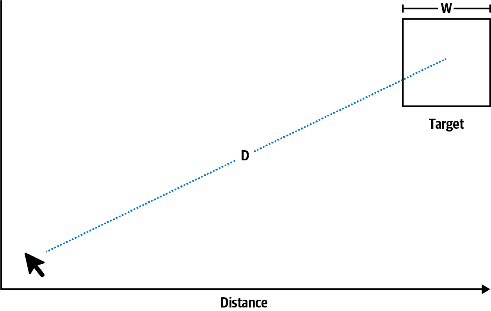
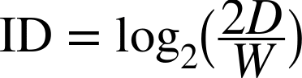
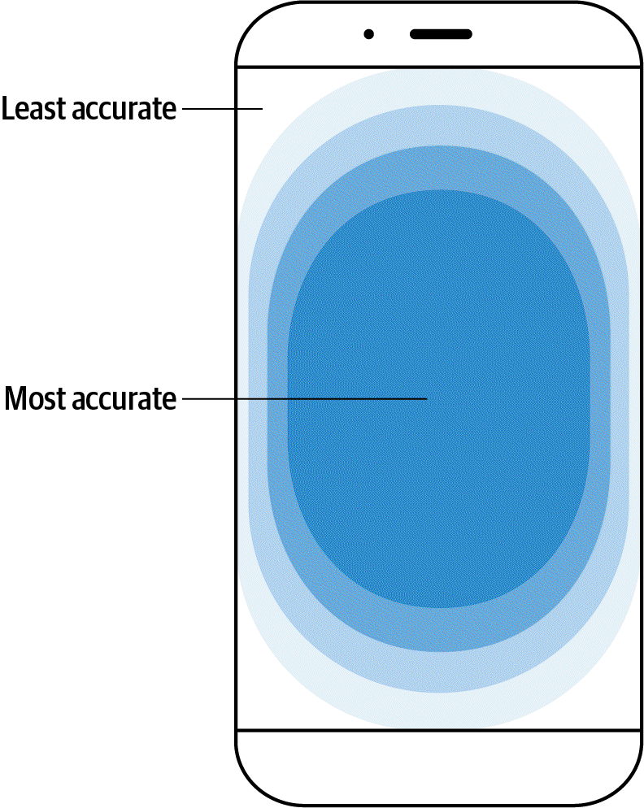
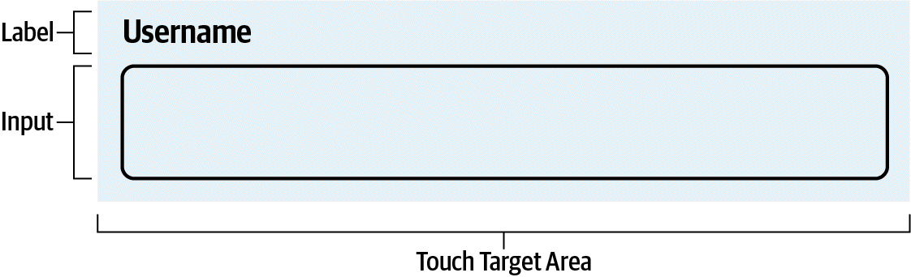
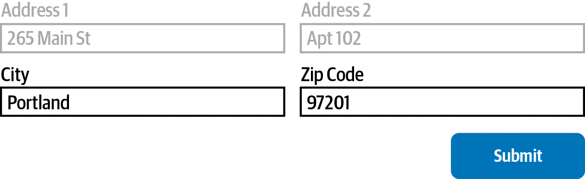
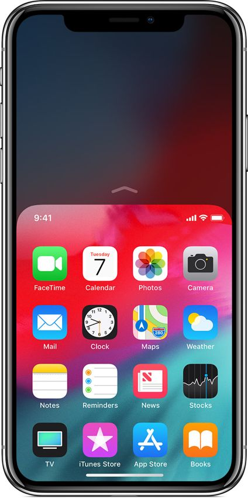

# Ch2. Fitts's Law — 6단계 학습 보고서
**출처**: Laws of UX, Chapter 2 | **작성일**: 2026-04-06

---

## STEP 1: 챕터 프리뷰

### 이 챕터, 왜 배워야 할까?

화면에서 버튼을 클릭하다가 엉뚱한 버튼을 눌러본 적 있는가? 배달앱에서 "주문 취소" 대신 "재주문"을 눌렀다면, 그건 네 실수가 아니다 — 설계가 나쁜 거다. 이 챕터의 Fitts's Law는 "사람이 버튼을 클릭하는 데 걸리는 시간"을 수학으로 예측하는 법칙이다. 버튼이 크면 빨리 클릭할 수 있고, 멀리 있으면 더 오래 걸린다. 당연해 보이는 이 원리가 실제로는 Apple, Google, Tesla가 설계 기준을 만드는 데 쓰인다.

### 섹션 논리 흐름

```
[배경: 왜 이 문제가 중요한가?]
        |
        v
[Origins: Fitts가 1954년에 수학 공식으로 증명]
        |
        v
[Key Consideration: 공식에서 도출한 3가지 설계 원칙]
    (1) 크기  →  (2) 간격  →  (3) 위치
        |
        v
[Examples: 실제 제품에서 잘된 사례 / 잘못된 사례]
        |
        v
[Conclusion: 디자이너의 책임 요약]
```

**흐름 설명**: 이론(법칙) → 원칙 도출 → 실제 적용의 3단 구조다. Origin이 없으면 "왜 44px이어야 하는가?"를 설명할 수 없고, 사례가 없으면 원칙이 공허하다. 이 챕터는 세 층위를 모두 연결해야 진짜로 이해된 것이다.

### 핵심 전문 용어 테이블

| 용어 | 한 줄 설명 | 연구자(연도) | 페이지 |
|------|-----------|------------|--------|
| Fitts's Law | 타깃까지의 거리와 크기로 클릭 시간을 예측하는 법칙 | Paul Fitts (1954) | p.4 |
| Index of Difficulty (ID) | 타깃 선택 과제의 수치화된 난이도 | Fitts (1954) | p.4 |
| Movement Time (MT) | 포인팅 이동에 실제로 걸리는 시간 | Fitts (1954) | p.4 |
| Touch Target | 사용자가 탭/클릭으로 상호작용하는 UI 요소 | — | p.6 |
| Thumb Zone | 스마트폰 한 손 사용 시 엄지로 쉽게 닿는 화면 영역 | Hoober (2017) | p.7 |
| Reachability | 화면 상단을 하단으로 이동시키는 Apple 제스처 기능 | Apple (2019) | p.12 |

---

## STEP 2: 핵심 개념 딥다이빙

### 왜 이 이론들을 연결해서 봐야 하는가?

Fitts's Law는 혼자 서 있는 이론이 아니다. "얼마나 걸리나(MT)"를 알기 위해서는 "얼마나 어려운가(ID)"를 먼저 계산해야 하고, ID는 "얼마나 멀고 좁은가(D, W)"에서 나온다. 이 세 요소가 연결된 하나의 예측 시스템이다.

---

### (1) Fitts's Law 공식 — "멀고 좁을수록 어렵다"

**왜 만들어졌나?**
1950년대 Paul Fitts는 조종사 훈련 중 "버튼을 빨리 누를 수 있는 조건이 뭔가?"를 연구했다. 당시에는 컴퓨터가 없었고 물리적 제어판 설계가 핵심 문제였다. 그는 수백 명의 피험자로 실험해 이동 시간을 수학 모델로 만들었다.

**수식 분해:**
```
MT = a + b × log₂(2D/W)
ID = log₂(2D/W)
```
- **MT** (Movement Time): 실제 클릭까지 걸린 시간
- **D** (Distance): 현재 커서 위치에서 버튼 중심까지의 거리
- **W** (Width): 버튼의 너비 (오차 허용 범위)
- **a, b**: 기기·상황에 따라 달라지는 경험 상수 (실험으로 측정)
- **ID**: 숫자가 클수록 어려운 과제

**핵심 포인트**: MT는 W의 **로그 함수**다. 버튼을 2배로 키워도 클릭 시간이 절반으로 줄지 않는다. log₂(2D/W)에서 W가 2배가 되면 ID는 1만 줄어든다. 즉, 이미 충분히 큰 버튼을 더 키우는 것은 효과가 작다. 중요한 건 "너무 작지 않도록" 최솟값을 지키는 것이다.

**🎯 K-앵커 — 카카오톡 하단 탭바**
카카오톡의 하단 탭바(홈·채팅·오픈채팅·뷰·더보기) 아이콘은 모두 충분한 크기와 간격을 가진다. 화면 하단(thumb zone 최적 위치)에 배치되어 있고, 아이콘 간 간격도 넓다. Fitts's Law의 세 원칙(크기·간격·위치) 모두 충족한 사례.

---

### (2) Index of Difficulty — "난이도를 숫자로"

**왜 만들어졌나?**
"이 버튼이 저 버튼보다 클릭하기 어렵다"는 말은 주관적이다. Fitts는 D(거리)와 W(너비)로 난이도를 객관적 숫자로 만들었다. D가 신호, W가 노이즈라는 정보 이론 비유를 사용했다.

**직관적 이해:**
- 작은 닫기 버튼(X) + 창 반대편에 위치 = 높은 ID = 오래 걸림
- 큰 확인 버튼 + 바로 옆에 위치 = 낮은 ID = 빠름

**🎯 K-앵커 — 배달앱 '주문하기' 버튼**
배민/쿠팡이츠의 "주문하기" 버튼은 화면 하단에 전체 너비로 배치. W가 매우 크고, 직전 상호작용 위치(메뉴 선택)에서 가깝다. ID가 매우 낮아 클릭 시간이 짧다. 실수도 거의 없다.

---

### (3) Touch Target — "손가락은 마우스보다 두껍다"

**왜 만들어졌나?**
Fitts's Law는 1954년 물리적 세계를 위한 공식이었다. 디지털 인터페이스, 특히 스마트폰이 등장하면서 "손가락"이라는 새로운 입력 장치가 생겼다. 마우스 커서는 픽셀 단위로 정확하지만, 손가락은 평균 10~14mm(MIT Touch Lab, 2003)다. 이 물리적 현실을 설계에 반영한 것이 Touch Target 가이드라인이다.

**최솟값 비교:**

| 기관 | 권장 크기 | 비고 |
|------|----------|------|
| Apple HIG | 44 × 44 pt | 최솟값, 초과 권장 |
| Google Material | 48 × 48 dp | 최솟값 |
| WCAG | 44 × 44 CSS px | 접근성 기준 |
| Nielsen Norman Group | 1 × 1 cm | 물리적 크기 기준 |

**🎯 K-앵커 — 네이버 지도 '길찾기' 버튼**
네이버 지도의 길찾기/출발지/목적지 입력 버튼은 모두 충분히 크다. 작은 버튼이었다면 운전 중이나 이동 중 오작동이 잦았을 것. 이동 중 사용 시나리오를 고려한 Touch Target 설계.

---

### 이론-개념 전체 연결 Flow Chart

```
[물리적 거리 D] ──┐
                  ├──> [Index of Difficulty ID = log₂(2D/W)] ──> [Movement Time MT = a + b×ID]
[타깃 너비 W] ────┘
                                      |
                          [실제 설계 원칙으로 번역]
                                      |
                 ┌────────────────────┼────────────────────┐
                 v                    v                    v
           [크기 충분히]         [간격 충분히]          [위치 최적화]
           (44×44px 이상)       (8dp 이상)           (thumb zone 중앙)
```

**보충**: 수식에서 설계 원칙이 도출되는 것이 이 챕터의 핵심 논리. W(너비)를 크게 → ID 감소 → MT 감소. 간격은 수식에 직접 등장하지 않지만, 인접 타깃과의 오작동 확률을 줄이는 실용 원칙이다.

---

## STEP 3: 현실 세계 적용

### 사례 1: 폼 텍스트 레이블 연결 (좋은 사례)

**상황**: 회원가입 폼에서 "이메일" 글자를 클릭해도 입력창이 활성화된다.
**적용 이론**: Fitts's Law — W(너비)를 실질적으로 키우는 전략. HTML `<label for>` 속성으로 레이블 전체를 클릭 가능하게 만들면 터치 영역이 수배 확장된다.
**K-앵커**: 네이버 로그인 화면에서 "아이디" 레이블을 탭해도 입력창이 활성화되는 것이 이 원리.

---

### 사례 2: 폼 제출 버튼 위치 (좋은 사례)

**상황**: 긴 설문 폼의 마지막 질문 바로 아래 "제출하기" 버튼이 있다.
**적용 이론**: Fitts's Law — D(거리)를 최소화. 마지막 입력 후 커서/시선이 있는 바로 근처에 버튼 배치 → MT 감소.
**연구 근거**: Fitts (1954)의 기본 원리 직접 적용.

---

### 사례 3: LinkedIn 수락/거절 버튼 (나쁜 사례)

**상황**: 연결 요청 수락·거절 버튼이 화면 오른쪽에 촘촘히 붙어 있다(LinkedIn, 2019).
**문제점**: 간격이 너무 좁아 오작동 빈번. Fitts's Law의 spacing 원칙(타깃 간 충분한 간격) 위반. Google Material Design 권장 간격 8dp 미달.
**결과**: 저자 본인도 두 손을 써야 할 만큼 정확도 요구 과도 → 사용성 저하.

---

### 사례 4: Tesla Model 3 대시보드 (좋은 사례)

**상황**: 차량 운전 중 15인치 터치스크린으로 모든 기능 제어.
**적용 이론**: 운전 중에는 시선 분산이 발생 → Touch Target 크기와 간격이 더욱 중요. 하단 네비게이션 바 아이템 간 충분한 간격 확보(Tesla, 2019).
**함의**: 사용 맥락(운전 중 = 주의 분산 상황)이 Touch Target 기준을 더 엄격하게 만든다.

---

### 사례 5: iPhone Reachability (위치 문제 해결)

**상황**: iPhone 6+ 이후 화면이 커지면서 한 손으로 상단에 닿기 어려워짐.
**적용 이론**: Fitts's Law placement 원칙 — 화면 상단은 thumb zone 밖(D 증가, MT 증가). Apple은 이를 소프트웨어로 해결: 더블 탭 → 화면 전체 하단으로 이동(Apple, 2019).
**K-앵커**: 삼성 갤럭시의 "한손 모드" — 화면 한쪽으로 UI를 축소해 동일 문제를 다른 방식으로 해결.

---

### APA 참고문헌

- Fitts, P. M. (1954). The information capacity of the human motor system in controlling the amplitude of movement. *Journal of Experimental Psychology, 47*(6), 381–391.
- Dandekar, K., Raju, B. I., & Srinivasan, M. A. (2003). 3-D finite-element models of human and monkey fingertips to investigate the mechanics of tactile sense. *Journal of Biomechanical Engineering, 125*(5), 682–691.
- Hoober, S. (2017, March 6). Design for fingers, touch, and people, part 1. *UXmatters.*

---

## STEP 4: 데이터 및 시각 자료 해석

### Figure 2-1: Fitts's Law 다이어그램





**설명**: D(거리)와 W(너비)의 관계를 시각화. 두 지점 사이에 타깃이 놓여 있고, 거리가 멀수록 / 타깃이 좁을수록 ID가 높아진다.

**핵심 메시지**: ID = log₂(2D/W). 신호(D)가 강하고 노이즈(W)가 클수록 난이도 낮음. 선형이 아닌 로그 관계임을 기억할 것.

**시험 포인트**: "D가 4배, W가 2배가 되면 ID는 얼마나 변하는가?" → log₂(2×4D/2W) = log₂(4D/W) vs 원래 log₂(2D/W). 계산하면 ID는 1 증가.

---

### Figure 2-2: 스마트폰 터치 정확도 지도 (Hoober, 2017)



**설명**: 스마트폰 화면을 히트맵으로 표현. 중앙이 가장 밝음(높은 정확도), 상단 모서리가 가장 어두움(낮은 정확도).

**X·Y 해석**: X축 = 화면 너비, Y축 = 화면 높이. 색상 강도 = 터치 정확도.

**인지심리학적 의미**: 스마트폰은 손 안에 쥐는 기기. 엄지의 관절 가동 범위 때문에 중앙이 natural position. 데스크톱(좌상→우하 F패턴 스캔)과 전혀 다른 주의 분포.

**시험 포인트**: "모바일 앱에서 핵심 CTA(Call to Action) 버튼을 어디 배치해야 하는가?" → 화면 하단 중앙. Hoober(2017) 연구 근거.

---

### Figure 2-3: 텍스트 레이블 + 폼 입력 터치 영역 확장



**설명**: 레이블만 있을 때의 좁은 클릭 영역 vs 레이블-input 연결 시 확장된 영역 비교.

**핵심 메시지**: W를 실질적으로 키우는 가장 저비용 방법. HTML 한 줄(`<label for="id">`)로 구현 가능.

---

### Figure 2-4: 폼 제출 버튼 근접 배치



**설명**: 마지막 입력 필드 바로 아래/옆에 "제출" 버튼 배치.

**핵심 메시지**: D를 최소화하는 레이아웃 패턴. 사용자가 마지막 입력 후 아래로 자연스럽게 내려가면 버튼이 기다리는 구조.

---

### Figure 2-5: LinkedIn 수락/거절 (간격 부족 사례, 2019)


**설명**: 수락·거절 버튼이 오른쪽 정렬로 지나치게 붙어 있는 스크린샷.

**핵심 메시지**: 충분한 크기도 중요하지만, 인접 타깃과의 간격이 부족하면 오작동 증가. 정확도를 위해 두 손 사용이 필요한 수준 = UX 실패.

---

### Figure 2-6: Tesla Model 3 하단 네비게이션 (간격 충분 사례, 2019)


**설명**: 운전 중 사용하는 차량 인포테인먼트 UI. 하단 아이콘들 사이 넓은 간격.

**핵심 메시지**: 위험 맥락(운전 중)에서는 Fitts's Law 준수가 안전 문제와 직결. 오작동 = 사고 위험.

---

### Figure 2-7: iPhone Reachability (2019)



**설명**: 더블 탭 제스처로 화면 상단 콘텐츠가 하단으로 슬라이드 내려오는 모습.

**핵심 메시지**: 물리적으로 바꿀 수 없는 D(화면 크기) 문제를 소프트웨어 인터랙션으로 해결. Fitts's Law의 placement 원칙을 소프트웨어 레벨에서 구현한 혁신적 사례.

---

### 전체 Figure 흐름 Flow Chart

```
[Figure 2-1: 공식 시각화]
        |
        v
[Figure 2-2: 실제 사용자 행동 데이터]
        |
        v
[Figure 2-3, 2-4: 크기/위치 잘된 사례]
        |
        v
[Figure 2-5: 간격 잘못된 사례 → 왜 나쁜가]
        |
        v
[Figure 2-6: 간격 잘된 사례 → 어떻게 고치나]
        |
        v
[Figure 2-7: 위치 문제를 소프트웨어로 해결]
```

**보충**: 챕터의 Figure 배치 자체가 이론 → 데이터 → 좋은 예 → 나쁜 예 → 해결책 순서다. 단순한 삽화가 아니라 논증 구조의 일부.

---

## STEP 5: 셀프 테스트 + 퀴즈

---

**Q1.** Fitts's Law 공식 MT = a + b × log₂(2D/W)에서 버튼 너비(W)를 4배로 늘리면 이동 시간(MT)은 어떻게 변하는가? 선형으로 줄어드는가?

**Q1-K.** 카카오페이 송금 화면에서 "송금하기" 버튼을 현재의 4배 크기로 키운다면, 클릭 시간이 4배 빨라지는가?

**A1.** 아니다. MT는 W의 로그 함수적 관계이므로 선형으로 줄지 않는다. W가 4배가 되면 log₂(2D/4W) = log₂(2D/W) - 2, 즉 ID가 2 줄어드는 것에 불과하다. 거리(D)에 따라 실제 감소폭은 다르지만 4배 빠르지는 않는다. (Fitts, 1954)

---

**Q2.** LinkedIn의 연결 요청 수락/거절 UI는 Fitts's Law의 어떤 원칙을 위반했는가? 어떻게 수정해야 하는가?

**Q2-K.** 배달앱의 "주문 취소"와 "재주문" 버튼이 나란히 붙어 있다면 어떤 문제가 생기는가? Fitts's Law로 설명하시오.

**A2.** **간격(spacing) 원칙** 위반. 두 타깃이 너무 가까우면 손가락이 양쪽에 동시에 닿아 오작동 발생. Google Material Design 권장값 8dp 이상의 간격 확보 필요. 수정 방법: 버튼 사이 간격 확대, 또는 위험한 액션(거절/취소)을 덜 눈에 띄는 위치로 분리. (Laws of UX Ch.2, p.6–7)

---

**Q3.** Steven Hoober의 연구에 따르면 스마트폰에서 터치 정확도가 가장 높은 위치는 어디인가? 이것이 모바일 앱 CTA 버튼 배치에 주는 함의는?

**Q3-K.** 네이버 지도 앱의 "경로 탐색" 버튼, 배민의 "주문하기" 버튼은 모두 화면 어느 위치에 있는가? 이것이 우연인가?

**A3.** 화면 **중앙 하단**. Hoober(2017) 연구에서 스마트폰 사용자는 화면 중앙을 선호하고 정확도도 중앙이 최고. 따라서 핵심 CTA는 화면 하단 중앙에 배치해야 한다. 네이버 지도·배민의 버튼 위치는 Fitts's Law의 placement 원칙을 의도적으로 적용한 것이다.

---

**Q4.** Apple iPhone의 Reachability 기능은 Fitts's Law의 어떤 변수 문제를 소프트웨어로 해결했는가?

**Q4-K.** 삼성 갤럭시의 "한손 모드"와 Apple의 Reachability는 같은 문제를 다른 방식으로 해결한다. 두 방식의 차이를 Fitts's Law D(거리) 변수로 설명하시오.

**A4.** 두 기능 모두 **D(거리) 문제** 해결. 대화면에서 상단까지의 D가 엄지 도달 범위를 초과하는 문제. Reachability는 화면 전체를 하단으로 이동(D를 물리적으로 줄임). 갤럭시 한손 모드는 UI 전체를 화면 한쪽으로 축소(D와 W를 동시에 변경). 후자는 W도 줄어들어 ID 계산이 복잡해진다는 트레이드오프가 있다. (Apple, 2019)

---

**Q5.** 터치 타깃 최솟값 권장이 "최솟값"인 이유는 무엇인가? 최솟값을 그대로 사용하면 어떤 문제가 생기는가?

**Q5-K.** 인스타그램의 "좋아요" 하트 버튼은 아이콘 크기가 작지만 실제 탭 가능 영역은 더 크다. 이것이 왜 올바른 설계인가?

**A5.** 권장값은 **오차 없는 최소 조건**이다. MIT Touch Lab(2003)에 따르면 손가락 끝은 8~10mm이므로 손가락 접촉 시 일부가 타깃 밖에 닿는 것은 불가피하다. 최솟값만 맞추면 사용자가 타깃 가장자리를 겨냥해야 하므로 인지 부하와 오류율이 높아진다. 인스타그램처럼 시각 크기보다 터치 영역을 더 크게 설정하면 W가 증가 → ID 감소 → 더 빠르고 정확한 선택 가능.

---

**Q6.** 텍스트 레이블에 `<label for>` 속성을 연결하는 것이 Fitts's Law 관점에서 왜 효과적인가?

**Q6-K.** 네이버 로그인 화면에서 "아이디" 텍스트를 탭해도 입력창이 열린다. 이 동작의 UX 원리를 Fitts's Law로 설명하시오.

**A6.** `<label for>` 연결은 **W(너비)를 실질적으로 확대**하는 방법이다. 시각적 크기는 작은 라디오 버튼이나 체크박스도, 레이블 텍스트까지 포함한 전체 영역이 클릭 가능해진다. W 증가 → ID 감소 → MT 감소. 코드 한 줄로 구현 가능한 저비용 고효과 Fitts's Law 적용 사례.

---

**Q7.** Tesla Model 3와 LinkedIn의 터치 UI를 비교하고, Fitts's Law 세 원칙(크기·간격·위치) 관점에서 어느 쪽이 더 잘 설계됐는지 분석하시오.

**Q7-K.** 토스 앱의 메인 화면(이체하기, 충전하기, 내역 보기 버튼)을 Fitts's Law 세 원칙으로 평가해보시오.

**A7.** Tesla: 크기(대형 화면에 충분히 큰 타깃) ✓, 간격(하단 네비바 아이템 간 넓은 간격) ✓, 위치(자주 쓰는 기능 하단 중앙) ✓ — 세 원칙 모두 충족. LinkedIn: 크기(그나마 적당) △, 간격(수락/거절 버튼 과도한 근접) ✗, 위치(오른쪽 정렬, 엄지 도달 불편) △ — 간격 원칙 위반이 치명적. 결론: Tesla가 더 잘 설계됐으며, 특히 안전이 중요한 운전 맥락에서 Fitts's Law 준수가 사용성을 넘어 안전 문제임을 보여준다. (Laws of UX Ch.2, p.10–11)

---

### 퀴즈 흐름 Flow Chart

```
[Q1: 수식 이해 — 로그 관계 확인]
        |
        v
[Q2: 원칙 위반 사례 분석 — spacing]
        |
        v
[Q3: 실제 데이터 적용 — Hoober thumb zone]
        |
        v
[Q4: 소프트웨어 해결책 연결 — Reachability vs 한손 모드]
        |
        v
[Q5: 최솟값 vs 최적값 구분]
        |
        v
[Q6: 코드 레벨 적용 — label for]
        |
        v
[Q7: 통합 분석 — 세 원칙 종합 평가]
```

**보충**: Q1→Q3는 공식 이해, Q4→Q6는 원칙 적용, Q7은 종합. 이 순서대로 복습하면 단순 암기가 아닌 적용력이 생긴다.

---

## STEP 6: 보완 전략 및 위기 탈출법

### 이 문서만으로 커버되는 범위

이 보고서는 Laws of UX Chapter 2 전체 내용을 포함한다:
- ✅ Fitts's Law 수식과 변수 (MT, ID, D, W)
- ✅ 터치 타깃 세 원칙 (크기·간격·위치)
- ✅ 최솟값 권장 수치 4개 기관 비교
- ✅ MIT Touch Lab 손가락 크기 데이터
- ✅ Hoober(2017) thumb zone 연구
- ✅ 실제 사례 5개 (LinkedIn, Tesla, iPhone, form, label)
- ✅ Figure 7개 해설

원서를 읽지 않아도 이 문서로 충분히 시험 대비 가능.

---

### 추가 학습 보완 전략 3가지

**전략 1: 개념 짝 만들기 (Paired Concept)**
- D ↔ 멀다 ↔ 아파트 엘리베이터 버튼이 입구에서 멀리 있을 때
- W ↔ 작다 ↔ 작은 에어팟 케이스 뚜껑 열기 버튼
- ID ↔ 어렵다 ↔ 위 두 가지가 동시에 발생하는 상황

**전략 2: K-앵커 복습법**
매일 스마트폰을 쓰면서 "이 버튼은 Fitts's Law를 잘 지켰나?" 질문 던지기. 카카오톡 탭바, 네이버 지도 경로 버튼, 배민 주문하기 버튼 등 이미 아는 앱으로 원리 확인. 익숙한 앱이 가장 좋은 교재다.

**전략 3: 위반 사례 수집 (Bug Diary)**
하루에 오작동 한 번 → 메모. "어떤 버튼을 잘못 눌렀나? 크기 문제인가, 간격 문제인가, 위치 문제인가?" 3개월이면 Fitts's Law를 몸으로 안다.

---

### 3분 스피치: "이 챕터 핵심이 뭔가요?"

"Fitts's Law는 1954년 Paul Fitts가 만든 공식으로, 사람이 버튼을 클릭하는 데 걸리는 시간을 수학으로 예측합니다. 핵심은 MT = a + b × log₂(2D/W)인데요, 쉽게 말하면 버튼이 가까울수록, 클수록 빨리 누를 수 있다는 겁니다. 중요한 건 로그 관계라는 점 — 버튼을 2배 크게 해도 클릭 시간이 절반으로 줄지 않아요. 이 공식에서 세 가지 설계 원칙이 나옵니다: 터치 타깃은 충분히 크게(Apple 기준 44×44pt 이상), 간격은 충분히 넓게, 위치는 손이 닿기 쉬운 곳에. Steven Hoober의 2017년 연구에 따르면 스마트폰 사용자는 화면 중앙을 가장 선호하고 정확도도 가장 높습니다. 실제 사례로는 LinkedIn이 수락/거절 버튼 간격을 너무 좁게 만들어 오작동을 유발한 반면, Tesla Model 3는 충분한 간격으로 운전 중에도 안전한 조작을 가능하게 했습니다. 요약하면, Fitts's Law는 '클릭의 물리학'이고, 이 법칙을 무시하면 사용자는 오작동하고 불만을 느낍니다."
