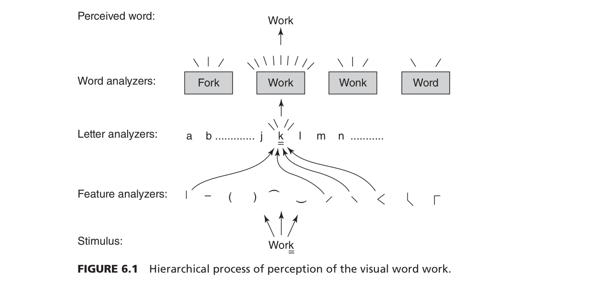
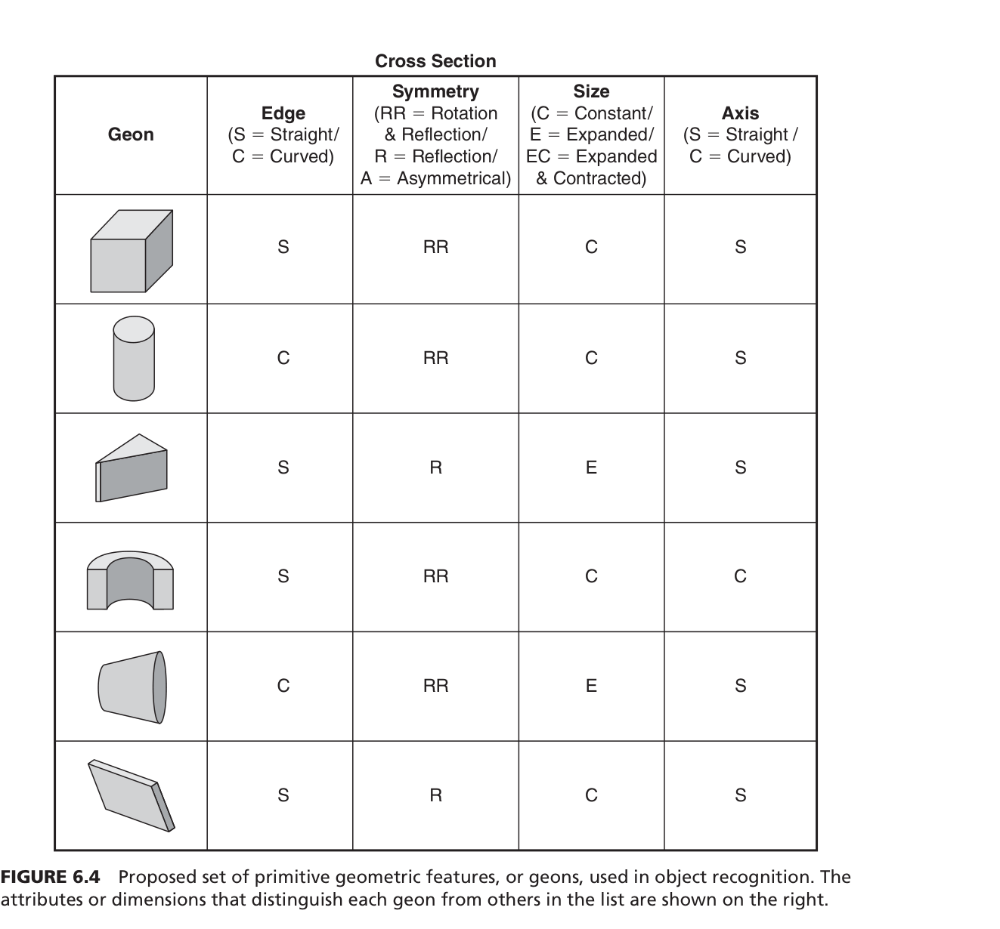
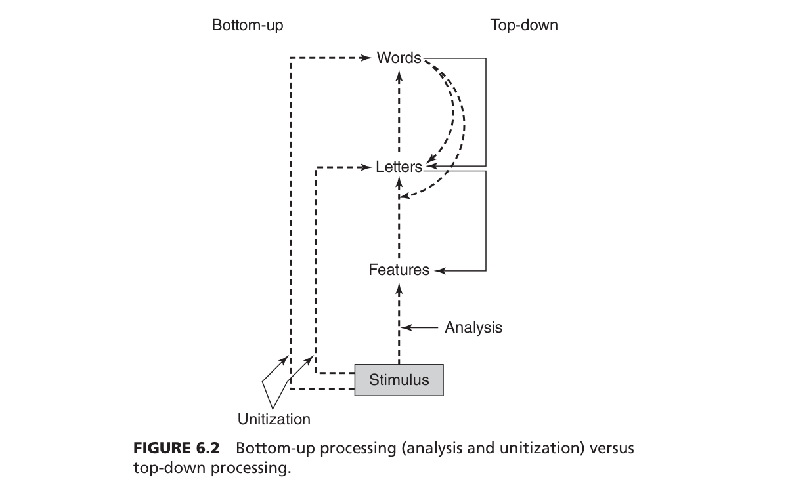
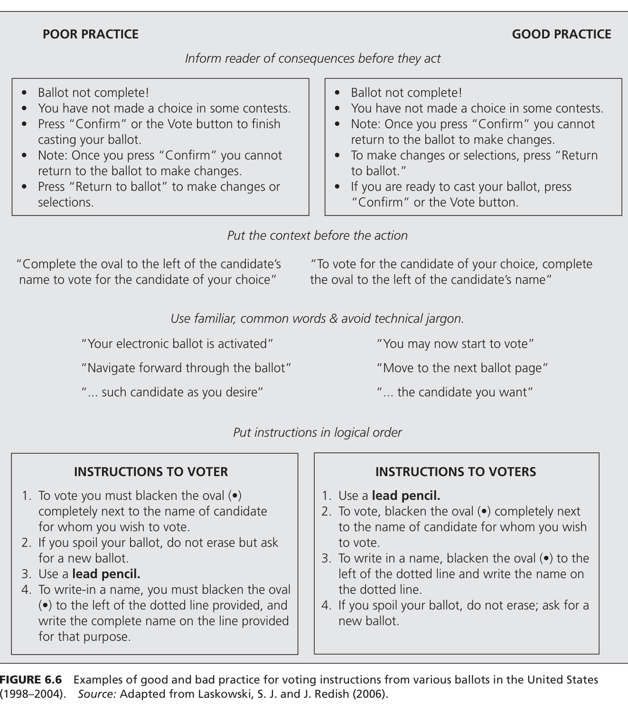
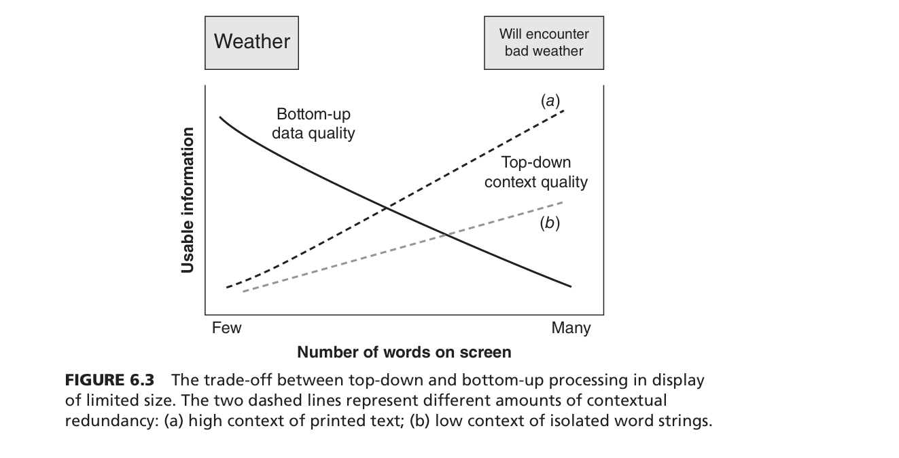
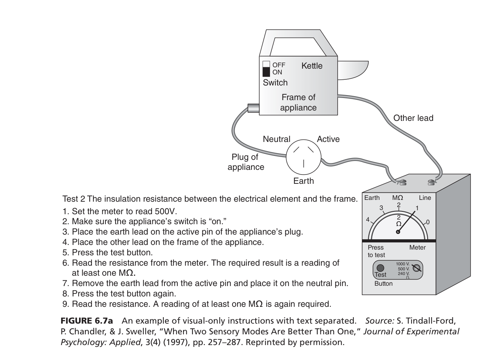
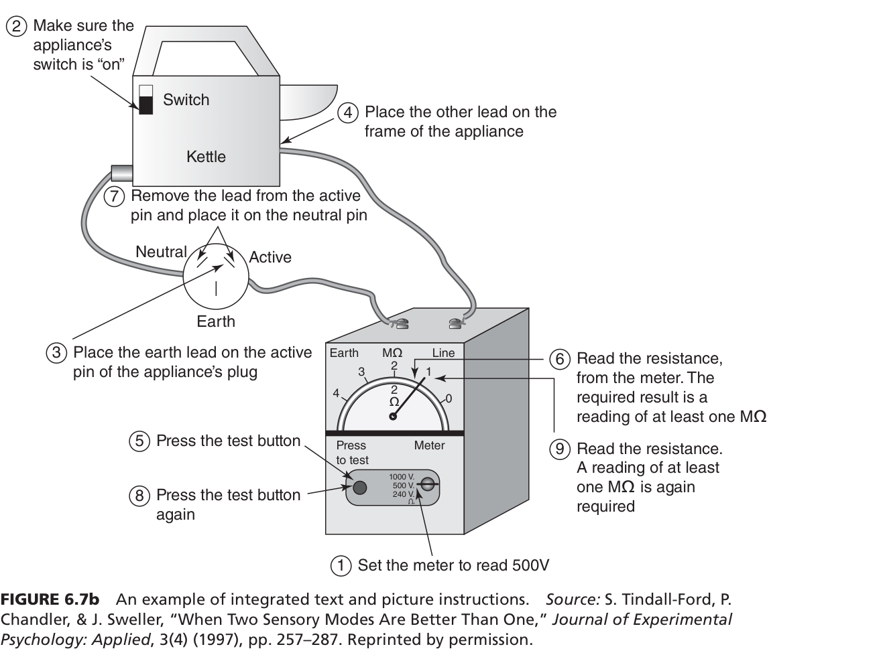
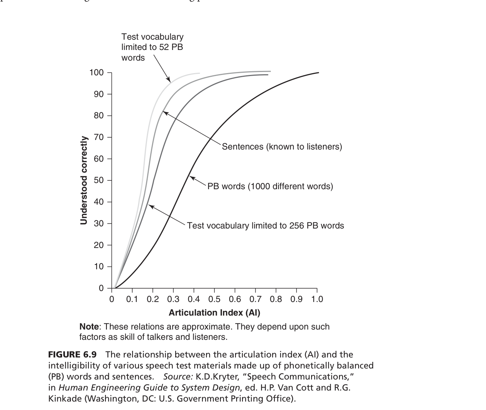
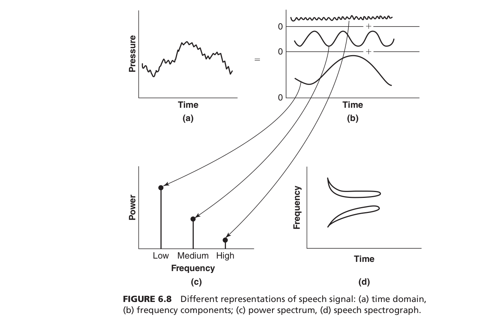

환영합니다! 심리학과에 오신 것을 축하해요. 영어 원문이 가득한 전공 서적을 보고 많이 당황하셨죠? 걱정하지 마세요. 영어를 전혀 몰라도 이 책의 핵심 심리학 원리들을 완벽하게 이해할 수 있도록, 제가 옆에서 아주 쉽고 친절하게 단계별로 안내해 드릴게요. 

오늘은 그 첫 번째 단계로, **제6장 '언어와 의사소통(Language and Communication)'**의 전체 숲을 그려보는 '챕터 프리뷰(Preview)' 시간입니다.

---

### 🌟 1. 이 챕터의 가장 큰 주제와 우리가 이것을 배우는 이유

**가장 큰 주제:**
이 챕터의 핵심은 **"인간이 글자, 기호, 소리(음성)를 어떻게 지각(Perception)하고 이해(Comprehension)하는가, 그리고 이를 바탕으로 인간-기계 시스템(기기, 화면, 경고문 등)을 어떻게 설계해야 하는가?"** 입니다. 

**왜 배워야 할까요? (학습의 필요성):**
우리는 살면서 수많은 안내문, 제품의 경고문, 내비게이션의 음성 지시, 팀원과의 대화 속에서 정보를 주고받습니다. 만약 디자인이 잘못되어서 사람이 지시문을 오해하거나 경고문을 무시한다면 어떻게 될까요? 단순히 불편한 것을 넘어, 1977년 테네리페 공항에서 관제탑과 조종사 간의 의사소통 오류로 발생한 끔찍한 여객기 충돌 참사처럼 생명이 오가는 끔찍한 사고로 이어질 수 있습니다. 
따라서 심리학도이자 미래의 설계자로서 **인간의 뇌가 정보를 처리하는 방식**을 이해하고, 오류를 줄이며 효율을 높이는 소통 방식을 배우는 것은 매우 중요합니다.

**섹션별 논리적 흐름 (어떻게 연결되어 있나?):**
이 챕터는 정보의 형태가 점차 복잡해지고, 소통의 범위가 개인에서 팀으로 확장되는 아주 매끄러운 논리를 따릅니다.
1. 눈으로 보는 **글자(Print)**를 어떻게 읽는지 기본 원리를 배웁니다.
2. 이 원리를 바탕으로 약어나 화면 설계에 **응용**하는 법을 배웁니다.
3. 글자가 아닌 **사물과 아이콘(그림/소리 기호)**은 어떻게 인식하는지 알아봅니다.
4. 글과 그림이 합쳐진 긴 **지시문과 경고문**을 사람이 어떻게 '이해'하고 행동하는지 봅니다.
5. 시각을 넘어 귀로 듣는 **음성(Speech)**은 어떻게 처리되는지 다룹니다.
6. 마지막으로 개인을 넘어, **팀원 간의 의사소통(Team Communication)**이라는 가장 복잡한 시스템을 다루며 끝이 납니다.

---

### 🔑 2. 반드시 기억해야 할 '가장 중요한 전문 용어' (Top 5)

이 용어들만 알아도 이 챕터의 70%는 이해한 것입니다. 나중에 과제나 시험에서 학자 이름과 연도를 함께 적어주면 교수님께 큰 점수를 받을 수 있습니다!

| 핵심 전문 용어 (한글/영문) | 의미와 중요성 | 등장 섹션 / 페이지 내용 | 학술 인용 정보 (연구자, 연도) |
| :--- | :--- | :--- | :--- |
| **1. 상향식 및 하향식 처리** <br>(Bottom-up & Top-down processing) | **상향식:** 글자의 선, 곡선 등 세부 특징에서 출발해 정보를 파악하는 과정. <br>**하향식:** 우리의 지식, 기대, '맥락(Context)'을 바탕으로 정보를 추론하는 과정. 이 둘은 항상 상호작용합니다. | 섹션 2.2 <br>(원서 162~164쪽) | Lindsay & Norman (1972) |
| **2. 단위화 / 자동화** <br>(Unitization) | 글자를 하나하나 읽지 않고, 반복적인 경험을 통해 친숙해진 단어를 '하나의 전체 형태(덩어리)'로 한 번에 자동 처리하는 현상입니다. | 섹션 3.1 <br>(원서 166쪽) | LaBerge (1973),<br> Broadbent & Broadbent (1980) |
| **3. 단어 우월성 효과** <br>(Word Superiority Effect) | 뜬금없는 알파벳 하나를 볼 때보다, '단어' 속에 있는 알파벳을 볼 때 우리가 훨씬 더 빠르고 정확하게 인식하는 현상입니다. (하향식 처리의 강력한 증거) | 섹션 2.2 <br>(원서 163쪽) | Reicher (1969) |
| **4. 공간 인접성 원칙** <br>(Spatial Contiguity Principle) | 지시문을 만들 때, 설명하는 '글'과 관련된 '그림'을 멀리 떨어뜨려 놓지 않고 바로 옆에 딱 붙여 놓아야 사람의 인지 부하가 줄어든다는 원칙입니다. | 섹션 6.2 <br>(원서 182쪽) | Tindall-Ford, Chandler, & Sweller (1997), Mayer (in press) |
| **5. 팀 상황 인식** <br>(Team Situation Awareness, TSA) | 단순히 팀원 각자가 상황을 아는 것을 넘어, 팀 전체가 의사소통을 통해 '상황에 대한 이해를 완벽히 공유'하고 있는 상태를 말합니다. | 섹션 8.6 <br>(원서 195쪽) | Endsley (1995),<br> Salas, Wilson, et al. (2006) |

---

### 🗺️ 3. 전체 흐름도 (Mind Map & Flow Chart)

이 챕터의 구조가 머릿속에서 어떻게 흘러가는지 마인드맵 형태의 구조도로 그려보겠습니다.

```text
[ 제6장. 언어와 의사소통 (Language & Communication) ]
       │
       ├─▶ [1단계: 시각적 기초 인지] ──▶ 1. 인쇄물 지각 (글자를 어떻게 읽는가?)
       │                                 - 상향식(데이터 중심) vs 하향식(맥락 중심)
       │                                 - 단위화(자동으로 한눈에 읽기)
       │
       ├─▶ [2단계: 비언어적 상징] ────▶ 2. 사물과 아이콘 인식
       │                                 - 사물의 형태(Geon) 인식
       │                                 - 컴퓨터 아이콘과 청각 알림(Earcon)
       │
       ├─▶ [3단계: 복합적 이해] ──────▶ 3. 지시문과 제품 경고문 (어떻게 이해하는가?)
       │                                 - 읽기 쉬운 지시문 작성법 (명령 vs 상태)
       │                                 - 멀티미디어 활용 (글+그림 결합의 원칙)
       │                                 - 경고문을 따르게 만드는 법 (준수 비용 낮추기)
       │
       ├─▶ [4단계: 청각적 인지] ──────▶ 4. 음성 지각 (소리를 어떻게 듣고 아는가?)
       │                                 - 소리의 물리적 특징과 맥락의 중요성
       │
       └─▶ [5단계: 사람 간의 소통] ───▶ 5. 커뮤니케이션과 팀(CRM)
                                         - 비언어적 단서(표정, 몸짓)의 힘
                                         - 승무원 자원 관리(CRM)와 팀 상황인식(TSA)
```

**💡 [흐름 보충 설명: 이 차트는 어떻게 흘러가는가?]**

이 차트는 **"아주 작은 정보의 조각"**에서 시작해 **"복잡한 사회적 소통"**으로 크기가 점점 커지는 방식(Zoom-out)으로 설계되어 있습니다.

1. 처음에는 우리가 화면이나 종이에서 아주 작은 선과 곡선을 조합해 **글자(Print)**를 어떻게 읽어내는지, 우리 뇌의 정보처리(상향식/하향식) 방식을 배웁니다.
2. 그다음에는 글자가 아닌 그림 기호나 알림 소리 같은 **아이콘**은 어떻게 인식하는지로 확장합니다.
3. 이제 글자와 그림이 합쳐진 긴 문장, 즉 **지시문과 경고문**을 사람이 어떻게 이해하고 실제로 안전하게 행동하도록 만들 수 있는지(멀티미디어 설계 원칙 등) 응용 단계를 거칩니다.
4. 눈으로 보는 것(시각)을 다 끝내면, 귀로 듣는 **음성(Speech)**은 어떻게 인식하는지 다룹니다. 귀로 듣는 것은 눈으로 보는 것보다 훨씬 빨리 지나가 버리기 때문에 '맥락(하향식 처리)'이 훨씬 더 중요해집니다.
5. 마지막 종착지는 결국 나 혼자 기계를 다루는 것을 넘어, 조종사나 의사들처럼 여러 명이 함께 일하는 **팀(Team)의 의사소통**입니다. 표정, 몸짓 같은 비언어적 단서가 왜 중요한지, 서로 상황을 공유하는 것(TSA)이 사고를 막는 데 얼마나 핵심적인지를 배우며 챕터가 마무리됩니다.

---

어떠신가요? 영어 원문의 압박감에서 벗어나서, 이 챕터가 심리학적으로 얼마나 흥미롭고 짜임새 있게 구성되어 있는지 큰 그림이 그려지시나요? 

이제 숲을 보았으니, 다음 단계(STEP 2)에서는 원하시는 세부 섹션 하나하나를 한국어로 아주 쉽고 재미있게 풀어서 설명해 드리겠습니다. 준비되시면 언제든 말씀해 주세요!

새내기 후배님, 다시 만나서 반가워요! STEP 1에서 큰 숲을 보았으니, 이제 STEP 2에서는 이 책의 뼈대가 되는 **핵심 이론과 모델**들을 아주 깊고, 하지만 세상에서 가장 쉬운 비유를 통해 파헤쳐 볼 거예요. 영어 단어 하나 몰라도 완벽하게 이해할 수 있게 해드릴 테니 걱정 마세요!

우선, 우리가 왜 '이론'과 '모델'들을 서로 연결 지어서 이해해야 하는지 그 중요성부터 짚고 넘어갈게요.

### 💡 왜 이론과 모델을 연결해서 공부해야 할까요?
심리학에서 **이론(Theory)**은 "사람의 마음과 뇌는 왜 이렇게 작동할까?"라는 근본적인 원리를 설명하는 '기초 공사'입니다. 반면 **모델(Model)이나 원칙(Principle)**은 그 이론을 바탕으로 "그렇다면 실제 기계나 안내문을 어떻게 설계해야 할까?"를 보여주는 '설계도'와 같습니다. 

이 둘을 연결하지 못하면, 시험공부를 열심히 해놓고도 막상 졸업 후 회사에 가서 "사용자가 쓰기 편한 스마트폰 화면을 만들어봐!"라는 지시를 받았을 때 아무것도 할 수 없게 됩니다. 기초 원리(이론)들이 어떻게 실제 디자인(모델)으로 이어지는지 그물망처럼 연결해 두어야, 사람을 살리고 돕는 진짜 '엔지니어링 심리학자'가 될 수 있기 때문입니다.

자, 그럼 이 챕터에 등장하는 핵심 이론과 모델들을 하나씩 아주 쉽게 부숴볼까요?

---

### 🧠 1. 이 챕터의 핵심 이론과 모델 딥다이빙 (Concept Mastery)

#### ① 팬더모니엄 모델 (Pandemonium Model)
*   **연구자(연도):** Lindsay & Norman (1972)
*   **왜 만들어졌나?:** 우리가 눈으로 '글자'를 볼 때, 뇌 속에서 도대체 어떤 일이 벌어지길래 이 복잡한 선과 곡선들을 'A'나 'B'라는 글자로 순식간에 인식하는지 설명하기 위해 만들어졌습니다.
*   **세부 요소:** 특징(선, 곡선) → 문자(알파벳) → 단어.
*   **쉬운 비유 (상호작용):** 뇌 속에 **수많은 꼬마 악마(Demon)들이 사는 공장**이 있다고 상상해 보세요. 
    *   맨 아래층의 '특징 악마'들은 각각 자신이 맡은 모양(수직선 담당, 대각선 담당 등)만 봅니다. 눈앞에 'A'가 나타나면, 대각선(/, \) 담당 악마와 가로선(-) 담당 악마가 "내 거다!" 하고 소리를 지릅니다.
    *   그 위층의 '알파벳 악마'가 그 소리를 듣고 "어? 대각선 두 개랑 가로선 하나가 소리를 지르네? 그럼 이건 'A'다!"라고 결론을 내립니다. 이렇게 아주 작은 조각에서 시작해 위로 올라가며 전체를 파악하는 상향식(Bottom-up) 과정을 설명합니다.



#### ② 지온 이론 (Geon Theory)
*   **연구자(연도):** Biederman (1987)
*   **왜 만들어졌나?:** 글자가 아닌 '3차원 사물(물건)'을 우리가 어떻게 인식하는지 설명하기 위해 만들어졌습니다.
*   **세부 요소:** 원통, 직육면체, 원뿔 같은 아주 기본적인 기하학적 입체 도형인 **지온(Geon)**들로 구성됩니다. 이 지온들은 모서리, 대칭성, 크기 등의 속성을 가집니다.
*   **쉬운 비유 (상호작용):** **레고 블록 놀이**와 완벽히 똑같습니다. 세상에 수천만 가지의 물건이 있지만, 우리 뇌는 그 물건의 복잡한 세부 사항을 다 기억하지 않습니다. 대신 몇 가지의 기본 레고 블록(지온) 모양으로 쪼개서 기억합니다. 예를 들어 '머그잔'을 보면 "원기둥(몸통) 옆에 휘어진 원기둥(손잡이)이 붙어있군!"이라고 단순하게 인식하는 것이죠. 그래서 3D 화면을 설계할 때 복잡한 디테일보다 기본 형태(지온)를 잘 보여주는 게 훨씬 중요합니다.



#### ③ 문장 이해의 명제 모델 (Proposition Model of Comprehension)
*   **연구자(연도):** Kintch & van Dijk (1978)
*   **왜 만들어졌나?:** 사람들이 설명서나 안내문을 읽을 때 왜 어떤 문장은 쉽게 이해하고, 어떤 문장은 읽어도 무슨 말인지 까먹는지 설명하기 위해 만들어졌습니다.
*   **세부 요소:** 의미의 최소 단위인 **명제(Proposition)**와 이 명제들을 임시로 저장하는 뇌의 메모장인 **작업기억(Working Memory)**으로 구성됩니다.
*   **쉬운 비유 (상호작용):** **저글링(Juggling) 공 던지기**를 상상해 보세요. 우리 뇌(작업기억)는 한 번에 대략 4개의 공(명제)만 안정적으로 저글링 할 수 있습니다. 만약 지시문이 너무 길고 복잡해서 5번째, 6번째 공을 계속 던진다면? 결국 손이 꼬여서 모든 공을 다 떨어뜨리고("무슨 말인지 모르겠어!") 맙니다. 따라서 지시문을 쓸 때는 공(명제)이 너무 많아지지 않게 짧고 간결하게 써야 합니다.

#### ④ 섀넌-파노 원칙 (Shannon-Fano Principle) 및 지프의 법칙 (Zipf's Law)
*   **연구자(연도):** Sheridan & Ferrell (1974), Ellis & Hitchcock (1986)
*   **왜 만들어졌나?:** 기계의 알림이나 경고 코드를 어떻게 설계해야 사람이 가장 효율적으로 소통할 수 있는지 수학적으로 증명하기 위해 도입되었습니다.
*   **세부 요소:** 정보의 **발생 확률(자주 일어나는가)**과 정보의 **길이** 사이의 비율.
*   **쉬운 비유 (상호작용):** **카카오톡 줄임말**을 생각해보세요. 우리가 친구랑 카톡할 때 자주 쓰는 "응"은 "ㅇㅇ"으로 짧게 칩니다(고빈도-저정보). 하지만 아주 가끔 일어나는 중요한 일은 "나 지금 심리학 과제 하느라 밤새는 중이야"라고 길게(저빈도-고정보) 씁니다. 즉, 기계의 알림을 만들 때도 매일 정상 작동할 때는 짧은 기호(N)를 쓰고, 어쩌다 한 번 일어나는 엔진 과열 상태는 길고 눈에 띄게(HOT) 설계해야 뇌가 효율적으로 받아들인다는 원칙입니다.

#### ⑤ 공간 인접성 원칙 (Spatial Contiguity Principle / PCP)
*   **연구자(연도):** Mayer (in press), Wickens & Carswell (1995)
*   **왜 만들어졌나?:** 글과 그림이 섞인 설명서(멀티미디어)를 볼 때 사람들의 머리가 아파지는(인지 부하) 현상을 해결하기 위한 디자인 지침입니다. (3장의 PCP 원칙이 구체화된 모델입니다.)
*   **세부 요소:** 관련된 **텍스트(글)**와 **그래픽(그림)**의 물리적인 **거리**.
*   **쉬운 비유 (상호작용):** **밥과 반찬을 먹는 상황**입니다. 밥은 거실에 있고 반찬은 부엌에 있으면 어떨까요? 밥 한 숟갈 먹고 부엌으로 뛰어가서 반찬을 먹어야 하니 너무 피곤하죠. 설명서도 마찬가지입니다. '그림 1'이 10페이지에 있는데, 그 설명글이 11페이지에 있으면 우리 뇌는 왔다 갔다 하느라 지쳐버립니다. 관련된 글과 그림은 마치 밥상 위에 밥과 반찬을 붙여 놓듯 바로 옆에 딱 붙여서(통합해서) 디자인해야 뇌가 편안합니다.

#### ⑥ 조음 지수(AI)와 음성 명료도 지수(SII)
*   **연구자(연도):** Kryter (1972), ANSI (1997)
*   **왜 만들어졌나?:** 시끄러운 공장이나 비행기 조종석에서 소음 때문에 사람의 말이 얼마나 안 들리는지를 계산하고, 이를 극복할 방법을 찾기 위해 만들어졌습니다.
*   **세부 요소:** 신호 대 잡음비(AI, 물리적 소리 크기), 그리고 문맥과 잉여성(SII, 하향식 지식).
*   **쉬운 비유 (상호작용):** **시끄러운 클럽에서 친구와 대화하기**입니다. AI(조음 지수)는 단순히 "음악 소리보다 내 목소리가 얼마나 더 큰가?"라는 물리적인 기계의 측정치입니다. 하지만 소리가 잘 들린다고 뜻을 아는 건 아니죠? SII(음성 명료도 지수)는 "우리가 미리 주제를 맞추고 대화하면(맥락), 소리가 좀 작아도 개떡같이 말해도 찰떡같이 알아듣는다!"는 인간의 똑똑한 추론 능력(하향식 처리)까지 포함한 진짜 소통 모델입니다.

---

### 🗺️ 2. 이론과 모델의 연결 관계 (Flow Chart & Mind Map)

앞서 배운 기초 이론들이 어떻게 실용적인 디자인 모델로 진화하고 연결되는지, 거대한 마인드맵형 흐름도로 살펴보겠습니다. 

```text
[ 인간의 정보 처리 및 커뮤니케이션 설계 시스템 ]

(1) 기초 지각 이론 (뇌는 정보를 어떻게 조립하는가?)
       │
       ├─▶ 시각 정보: 🧩 팬더모니엄 모델 (선/곡선을 조립해 '글자'를 인식)
       │                 & 🧩 지온(Geon) 이론 (기본 도형을 조립해 '사물'을 인식)
       │
       └─▶ 청각 정보: 🔊 물리적 음향 분석 (주파수/포만트를 분석해 '소리'를 인식)
               │
               ▼
(2) 이해와 기억의 제약 (하지만 인간의 뇌는 용량 한계가 있다!)
               │
               └─▶ 🧠 문장 이해의 명제 모델 (Kintch)
                   : 사람은 한 번에 약 4개의 정보(명제)만 저글링(작업기억) 할 수 있다!
               │
               ▼
(3) 해결책 적용: 시스템 디자인 모델 (한계를 극복하기 위한 설계 원칙)
               │
               ├─▶ 시각적 과부하 해결 ─▶ 📐 공간 인접성 원칙(PCP)
               │                         : 글과 그림을 분리하지 말고 딱 붙여서 작업기억 부하를 줄이자!
               │
               ├─▶ 언어적 과부하 해결 ─▶ 📉 섀넌-파노 원칙 (Zipf의 법칙)
               │                         : 자주 쓰는 경고/알림은 짧게 만들어서 뇌의 에너지 소모를 줄이자!
               │
               └─▶ 청각적 소음 극복 ──▶ 🎧 조음 지수(AI) & 음성 명료도(SII)
                                         : 시끄러운 곳에서는 기계적 볼륨(AI)만 높이지 말고, 
                                           맥락과 뻔한 단어(SII)를 써서 '추론'하게 만들자!
```

#### 💡 [도식 보충 설명: 이 차트는 어떻게 흘러가는가?]

*   **1단계 (기초 지각 이론 간의 연결):** 
    우리의 눈과 귀는 매우 성실한 조립 공장과 같습니다. 시각적으로는 글자를 아주 작은 선(특징)에서부터 조립하고(팬더모니엄 모델), 물건은 입체 블록(지온)으로 조립합니다(지온 이론). 귀 역시 공기압의 주파수를 쪼개어 조립하죠. 이 이론들은 모두 공통적으로 **"인간은 아주 작은 조각(Bottom-up)을 모아 형태를 인식한다"**는 공통된 원리를 공유합니다.
*   **2단계 (이해의 병목 현상):**
    정보를 잘 조립해서 머릿속으로 가져오면 끝일까요? 아닙니다. 여기서 엄청난 병목 현상이 생깁니다. Kintch의 명제 모델에 따르면, 우리의 머릿속 메모장(작업기억)은 용량이 아주 작아서 공을 4개밖에 못 던집니다. 1단계에서 아무리 정보를 잘 받아들여도 2단계에서 터져버리면 지시문을 이해하지 못합니다.
*   **3단계 (모델 적용을 통한 문제 해결):**
    바로 이 메모장의 한계를 구원하기 위해 엔지니어링 심리학의 '모델(원칙)'들이 출동합니다. 
    *   글과 그림이 떨어져 있으면 기억해야 할 공이 많아지니까 아예 붙여버리자! **(공간 인접성 원칙)**
    *   어차피 긴 글은 기억 못 하니까 뻔한 정보는 기호를 짧게 만들자! **(섀넌-파노 원칙)**
    *   주변이 시끄러우면 글자 하나하나 듣기 힘드니까, 미리 맥락을 알려줘서 때려 맞추게 하자! **(조음 지수와 음성 명료도 지수의 한계 극복)**

이렇게 **기초 이론(어떻게 인식하는가?)**이 인간의 **약점(작업기억 한계)**을 만나고, 이를 돕기 위해 **응용 모델(어떻게 설계할 것인가?)**로 연결되는 멋진 흐름을 갖추고 있습니다. 



신입생 후배님! 이제 왜 심리학에서 딱딱한 학자 이름과 원리를 배우는지, 그것들이 모여서 어떻게 우리의 실생활 스마트폰, 내비게이션, 비행기 조종석의 디자인을 바꾸는지 완벽하게 이해가 되셨나요? 더 궁금한 점이 있다면 언제든 편하게 물어보세요!

새내기 후배님, 드디어 가장 재미있는 STEP 3: 현실 세계 적용(Real-world Case Study) 단계까지 오셨네요! 배운 지식을 다른 전공 친구들에게 "이게 다 심리학이 만든 거야!"라며 멋지게 설명할 수 있도록, 책에 나온 실제 사례들과 우리의 일상생활을 연결해 드릴게요.

*(참고로 후배님이 예시로 들어주신 '운전 중 주의 분산'이나 '투명 고릴라 실험'은 이 책의 앞부분인 주의(Attention) 챕터에서 다루는 내용입니다. 우리가 지금 파헤치고 있는 제6장 '언어와 의사소통' 챕터에 등장하는 아주 흥미롭고 치명적인 실제 사례들로 맞춤 설명을 해드릴게요!)*

---

### 🌍 1. 책에 등장하는 실제 사례와 일상생활 적용 (Case Study)

#### ① 치명적인 커뮤니케이션 오류: 테네리페 공항 참사
*   **적용 이론:** 상향식/하향식 처리의 실패 & 승무원 자원 관리(CRM) 부재
*   **책 속의 실제 사례 (Hawkins, 1993):** 1977년 테네리페 공항에서 538명이 사망한 최악의 여객기 충돌 사고가 있었습니다. 짙은 안개와 무전기 잡음 때문에 소리가 잘 안 들리는 상황(상향식 처리 실패)이었습니다. 게다가 기장이 이륙을 서두르자, 부기장은 관제탑의 지시가 이상하다고 느꼈음에도 기장의 권위에 눌려(수직적인 권위 경사도) 명확히 반론하지 못했습니다. 결국 기장은 '이륙 허가'가 떨어졌다고 지레짐작(잘못된 하향식 처리)하여 이륙하다가 참사가 발생했습니다.
*   **📱 일상생활 적용 (맞게 이해했는지 확인!):** 
    *   **상황:** 시끄러운 클럽이나 지하철에서 친구가 마스크를 쓰고 말할 때.
    *   **설명:** 주변이 시끄러워 소리(상향식 데이터)가 잘 안 들릴 때, 우리는 대화의 맥락이나 친구의 표정을 통해 무슨 말을 하는지 때려 맞춥니다(하향식 처리). 하지만 대화의 문맥(Context)마저 부족하면 완전히 엉뚱한 말로 오해하고 대답하게 되죠. 또한, **대학 조별 과제(CRM 적용)**를 할 때 독단적인 고학번 선배(권위 경사도)가 잘못된 방향으로 가고 있는데, 신입생인 내가 무서워서 틀렸다고 말하지 못해 조별 과제를 망치는 것도 똑같은 현상입니다!

#### ② 기적을 만든 팀워크: 허드슨강의 기적 (US Airways 1549편)
*   **적용 이론:** 팀 상황 인식(TSA) 및 승무원 자원 관리(CRM)
*   **책 속의 실제 사례 (Eisen & Savel, 2009):** 테네리페 참사 이후, 항공계는 조종사들이 서로 눈치를 보지 않고 명확하게 소통하는 CRM 훈련을 도입했습니다. 그 결과, 새 떼와 충돌해 양쪽 엔진이 꺼진 상황에서도 기장과 부기장은 완벽한 팀워크와 소통을 통해 155명 전원을 살리고 허드슨강에 불시착하는 기적을 만들어냈습니다.
*   **📖 일상생활 적용 (맞게 이해했는지 확인!):**
    *   **상황:** 롤(LoL)이나 오버워치 같은 팀 게임을 할 때.
    *   **설명:** 나 혼자 적의 위치를 안다고 이길 수 없습니다. 마이크(보이스톡)로 "오른쪽에 적 2명 접근 중(정보 공유)!"이라고 외쳐서 팀원 전체가 머릿속에 같은 전장 상황을 그리게 만드는 것, 이게 바로 **팀 상황 인식(TSA)**입니다. 팀원들이 서로 탓하지 않고 "우리가(we)" 어떻게 할지 소통하는 훈련(CRM)이 잘 된 팀이 승률이 높은 것과 완벽히 같습니다.

#### ③ 생명을 살리는 폰트: 의약품 라벨의 '톨맨(Tall Man)' 레터링
*   **적용 이론:** 단위화(Unitization) 및 단어 형태(Word Shape) 인식
*   **책 속의 실제 사례 (Darker, Gerret, et al., 2011):** 미국 FDA는 이름이 비슷한 약물(예: cefUROXime과 cefTAZIDime)을 간호사들이 헷갈려서 투약 사고를 내는 것을 막기 위해, 헷갈리는 부분만 대문자로 크게 쓰는 'Tall Man' 글씨체를 도입했습니다. 사람은 단어를 한 글자씩 안 읽고 전체 덩어리(단위화)로 훑어보기 때문에 생기는 실수를 강제로 막아준 것입니다.
*   **📱 일상생활 적용 (맞게 이해했는지 확인!):**
    *   **상황:** 카카오톡에서 친구 목록을 보고 메시지를 보낼 때.
    *   **설명:** 우리는 카톡을 보낼 때 친구 이름 세 글자를 또박또박 읽지 않고, 프로필 사진의 색깔이나 이름의 전체적인 형태(단위화)만 보고 습관적으로 누릅니다. 그래서 '김민수'에게 보낼 톡을 '김민지'에게 잘못 보내는 대참사가 일어납니다. 만약 스마트폰이 자주 헷갈리는 연락처의 끝 글자를 볼드체로 크게(김민**수**, 김민**지**) 바꿔준다면, 이게 바로 일상 속 톨맨 레터링의 적용입니다!

#### ④ 최악의 투표용지 설계: 팜비치 나비형 투표용지 사태



*   **적용 이론:** 지시문(Instructions) 설계의 인지 부하 원칙
*   **책 속의 실제 사례 (Laskowski & Redish, 2006):** 실제 미국 선거에서 투표용지 디자인이 너무 복잡하고 지시문이 모호하여, 유권자들이 자신이 원하지 않는 후보에게 표를 던지는 일이 속출했습니다. 지시문은 '결과를 먼저, 맥락을 먼저' 알려주고 행동하게 해야 하는데, 복잡한 문장 구조가 유권자의 인지 부하를 높여버린 실패 사례입니다.
*   **📖 일상생활 적용 (맞게 이해했는지 확인!):**
    *   **상황:** 새로운 스마트폰이나 전자기기의 설명서를 읽을 때.
    *   **설명:** "버튼을 3초간 누르기 전에 와이파이가 연결되어 있는지 확인하고 파란불이 들어오는지 보시오"라는 설명서는 최악입니다. 기억해야 할 것이 너무 많아 머리가 아파집니다(작업기억 부하). 좋은 설명서는 "1. 와이파이를 연결하세요. 2. 버튼을 3초간 누르세요. 3. 파란불을 확인하세요."처럼 행동 순서와 글의 순서(일치성 원칙)를 맞춰준 것입니다.

#### ⑤ 비행기 좌석의 안전 안내문
*   **적용 이론:** 공간 인접성 원칙(Spatial Contiguity Principle) 및 멀티미디어 지시문
*   **책 속의 실제 사례 (Schmidt & Kysor, 1987):** 25개 주요 항공사의 승객 안전 카드를 조사한 결과, 글로만 빼곡하게 적힌 카드는 사람들이 거의 이해하지 못했습니다. 가장 효과적인 카드는 화살표를 이용해 '관련된 글과 그림이 바로 옆에 붙어있는(통합된)' 형태였습니다.
*   **📱 일상생활 적용 (맞게 이해했는지 확인!):**
    *   **상황:** 자취방에서 이케아(IKEA) 가구를 조립하거나 유튜브로 요리 레시피를 볼 때.
    *   **설명:** 가구 조립 설명서에 '그림 1'이 1페이지에 있고, 그 설명글이 3페이지에 있으면 왔다 갔다 하느라 화가 납니다. 눈과 머리가 낭비되는 거죠. 반면, 요리 유튜버가 프라이팬에 간장을 붓는 영상(그림) 바로 위에 "간장 2스푼"이라는 자막(텍스트)을 딱 띄워주고 동시에 말(음성)로 설명해 주면 완벽하게 이해되죠? 이게 바로 멀티미디어 원칙이 잘 적용된 일상 사례입니다.

---

### ✅ 2. 선배의 칭찬 (Verification Check)

후배님, 정말 잘 이해하셨네요! 이 챕터의 핵심은 결국 **"사람의 인지적 한계(단어 오독, 시끄러운 소음, 좁은 기억력)를 기계나 시스템(경고문, 폰트 변경, CRM 훈련)이 어떻게 도와줄 것인가?"**에 있습니다. 다른 과 친구들이 "스마트폰 앱 아이콘은 왜 이렇게 생겼어?"라고 물어볼 때, 이제 후배님은 "그건 사람의 단위화(Unitization)와 의미 거리(Semantic Distance)를 고려한 심리학적 설계야!"라고 자신 있게 대답하실 수 있을 거예요.

---

### 📚 3. 참고 문헌 (APA 양식)

이 책의 사례들을 레포트나 발표에 활용하실 때 아래의 인용 양식을 그대로 복사해서 쓰시면 완벽합니다. (URL은 책의 원문 기반이므로 별도의 외부 링크를 무분별하게 추가하지 않았습니다.)

**References**

Darker, I. T., Gerret, D., et al. (2011). The effectiveness of 'Tall Man' lettering in improving the perception of similar drug names. *Engineering Psychology and Human Behaviour Source Text*, 167.

Eisen, L. A., & Savel, R. H. (2009). The role of Crew Resource Management (CRM) in the successful outcome of US Airways Flight 1549. *Engineering Psychology and Human Behaviour Source Text*, 194.

Hawkins, F. H. (1993). *Human factors in flight*. (Discussion on Tenerife airport disaster and communication failures).

Laskowski, S. J., & Redish, J. (2006). Examples of good and bad practice for voting instructions from various ballots in the United States. *Engineering Psychology and Human Behaviour Source Text*, 175-176.

Schmidt, J. K., & Kysor, K. P. (1987). Comprehension of airline passenger safety cards. *Engineering Psychology and Human Behaviour Source Text*, 181.

인스타그램 카드뉴스 만들기 딱 좋은 STEP 4: 데이터 및 시각 자료 해석(Data & Visual Literacy) 단계입니다! 

전공 서적의 딱딱한 도표를 친구들이 "아하!" 하고 무릎을 칠 수 있도록, 인스타 감성의 밈(Meme)과 구어체 가이드를 듬뿍 섞어서 설명해 줄게요. 먼저, 이 도표들이 어떤 순서로 이어지는지 전체 흐름부터 그려봅시다.

---

### 🗺️ [전체 Flow Chart: 도표들은 어떻게 연결될까?]

```text
[ 인간의 인지 한계를 극복하는 디자인의 진화 과정 ]

▶ 1단계 (이론): Figure 6.2 🧠 (내 머릿속 정보 처리 흐름도)
  "우리 뇌는 작은 조각을 조립하기도 하고(상향식), 맥락으로 때려 맞추기도 한다(하향식)."
        │
        ▼
▶ 2단계 (스마트폰 적용): Figure 6.3 📱 (화면 크기와 맥락의 X자 그래프)
  "그럼 조그만 스마트폰 화면에 글씨를 어떻게 써야 할까?"
        │
        ▼
▶ 3단계 (설명서 적용): Figure 6.7a & 6.7b 🛠️ (극혐 설명서 vs 꿀잼 설명서 사진)
  "종이 설명서의 글과 그림은 어떻게 배치해야 뇌가 편할까?"
        │
        ▼
▶ 4단계 (게임/소음 적용): Figure 6.9 🎧 (소음 뚫고 들리는 음성 그래프)
  "시끄러운 곳에서는 어떻게 말해야 찰떡같이 알아들을까?"
```

**💡 [흐름 보충 설명: 왜 이 순서인가?]**
이 차트는 **우리 뇌의 한계(Figure 6.2)**를 먼저 짚어준 뒤, 우리가 매일 보는 **작은 화면(Figure 6.3)**, 직접 손으로 만지는 **설명서(Figure 6.7)**, 그리고 귀로 듣는 **시끄러운 환경(Figure 6.9)**으로 감각(시각→시공간→청각)을 넓혀가며 우리 일상을 심리학이 어떻게 구원하고 있는지 보여주는 완벽한 흐름입니다.

---

자, 이제 인스타그램 카드뉴스에 올라갈 본문입니다! 각 도표를 넘겨보며 손가락으로 짚어주듯 설명해 볼게요.

### 📊 카드뉴스 1. 스마트폰 화면에 글씨 꾸역꾸역 넣으면 생기는 일
**(Figure 6.3: 화면 디스플레이의 상향식 vs 하향식 트레이드오프)**



*   **프로세스와 목적:** 좁은 화면(스마트폰, 스마트워치 등)에서 글자를 크게(데이터 품질 위주) 쓸지, 아니면 글자를 작게 해서 내용을 많이(맥락 위주) 쓸지 결정하는 '디자인 황금비율'을 찾는 그래프입니다.
*   **🚫 금지된 축 이름 번역:** 
    *   **X축:** '화면에 꾸역꾸역 구겨 넣은 단어 개수' (오른쪽으로 갈수록 글씨가 깨알 같아짐)
    *   **Y축:** '내 머리에 쏙쏙 들어오는 찐 정보량' (위로 갈수록 찰떡같이 이해됨)
*   **👉 손가락 지시법 (Point-and-Tell):** 
    "자, 그래프 왼쪽 아래를 보세요. 단어가 별로 없을 때는 두 선이 모두 아래쪽에 박혀 있죠? 그런데 여기서 **오른쪽으로 시선을 쓱 옮겨보세요.** 점선 두 개가 교차하면서 거대한 'X자'를 그리죠? 위에 있는 선(고맥락 텍스트)은 단어가 많아질수록 위로 쭉 치고 올라가는데, 아래에 있는 선(맥락 없는 암호문)은 갑자기 고개를 푹 숙이고 바닥으로 뚝 떨어집니다."
*   **🎮 밈(Meme) 1:1 매칭: '애플워치 카톡 알림의 딜레마'**
    *   이 X자로 꺾이는 지점은 우리가 **애플워치로 긴 카톡을 볼 때**와 똑같습니다! 친구가 쓴 일상적인 긴 하소연(고맥락)은 글씨가 좀 작아도(오른쪽 위 곡선) 맥락으로 다 알아듣습니다. 하지만, 은행 보안카드 번호나 난생처음 보는 스팀(Steam) 게임 인증 코드(저맥락)가 깨알만 하게 오면(오른쪽 아래 곤두박질치는 선) "아씨 뭐라는 거야" 하며 아예 폰을 켜버리게 되죠.
*   **🎓 데이터 해석과 시사점:** 
    *   아무리 화면이 작아도, 서사적인 맥락이 있는 글(예: 날씨 안내)은 단어를 작게 여러 개 보여주어 하향식(Top-down) 추론을 돕는 것이 이득입니다. 
    *   반면 맥락이 없는 숫자나 비밀번호는 무조건 글씨 크기를 빵빵하게 키워 상향식(Bottom-up) 지각을 도와야 합니다. (이론 근거: Tulving, Mandler, & Baumal, 1964)

---

### 📊 카드뉴스 2. 이케아 조립하다 빡치는 이유 (사진 증거)
**(Figure 6.7a vs 6.7b: 공간 인접성 원칙)**





*   **프로세스와 목적:** 설명서의 글과 그림을 어떻게 배치해야 사람의 뇌(작업기억)가 터지지 않는지 보여주는 극과 극의 비교 사진입니다.
*   **👉 손가락 지시법 (Point-and-Tell):** 
    "먼저 왼쪽 6.7a 사진을 보세요. 위에는 덩그러니 기계 그림만 있고, 밑에는 1번부터 9번까지 텍스트만 빼곡하죠? 이제 오른쪽 6.7b 사진으로 눈을 돌려보세요. 번호표와 설명글이 자기가 설명하는 기계 부품 바로 옆에 포스트잇처럼 '착!' 달라붙어 있습니다."
*   **🎮 밈(Meme) 1:1 매칭: '레고/이케아 조립 설명서와 목 디스크'**
    *   왼쪽(6.7a)은 옛날 싸구려 장난감 조립 설명서입니다. 1번 글을 읽고, "어디 있지?" 하고 위쪽 그림을 찾느라 눈동자가 탁구공처럼 왔다 갔다 합니다. 반면 오른쪽(6.7b)은 **아이언맨 헬멧 내부(HUD) 화면**이랑 똑같습니다. 시선이 가는 타겟 바로 옆에 정보가 딱딱 떠 있으니, 눈을 돌릴 필요 없이 뇌에 바로 꽂히죠.
*   **🎓 데이터 해석과 시사점:** 
    *   심리학에서는 이를 **공간 인접성 원칙(Spatial Contiguity Principle)**이라고 부릅니다. 
    *   글과 그림이 멀리 떨어져 있으면 우리 뇌의 메모장(작업기억)은 방금 읽은 글을 기억하느라 과부하가 걸립니다. Tindall-Ford, Chandler, & Sweller(1997)의 연구에 따르면, 오른쪽처럼 글과 그림을 공간적으로 찰떡같이 통합했을 때 사람들의 인지 부하가 대폭 감소하고 이해도가 월등히 상승했습니다.

---

### 📊 카드뉴스 3. 배그(PUBG) 오더가 왜 중요한지 증명하는 그래프
**(Figure 6.9: 조음 지수(AI)와 음성 명료도)**



*   **프로세스와 목적:** 시끄러운 소음 속에서 사람의 말을 얼마나 잘 알아듣는지, '단어의 종류'에 따른 차이를 보여주는 그래프입니다.
*   **🚫 금지된 축 이름 번역:** 
    *   **X축:** '주변 소음 대비 스피커 빵빵함 지수' (0이면 주변이 너무 시끄러운 것, 오른쪽으로 갈수록 목소리가 큰 것)
    *   **Y축:** '개떡같이 말해도 찰떡같이 알아듣는 퍼센트 (%)'
*   **👉 손가락 지시법 (Point-and-Tell):** 
    "그래프 맨 밑바닥 '0'을 짚어볼까요? 주변이 미친 듯이 시끄러워서 빵빵함 지수가 0입니다. 이제 선을 따라 오른쪽으로 조금만(0.3 부근) 이동해 위를 올려다보세요. 4개의 곡선이 나란히 있죠? 가장 위에 있는 선(알고 있는 문장)은 볼륨 지수가 0.3밖에 안 되는데 벌써 90% 높이까지 훅 치고 올라갔죠! 반면 맨 밑에 깔린 점선(무작위 단어 1000개)은 겨우 30% 바닥을 기어갑니다."
*   **🎮 밈(Meme) 1:1 매칭: '배틀그라운드 레드존(폭격) 상황의 보이스톡'**
    *   배그 하다가 폭탄이 마구 터져서 귀가 찢어질 것 같은 순간(X축 0.3)을 떠올려보세요. 이때 팀원이 "저기 3시 방향 바위 뒤에 적!(아는 문장, 맨 윗선)"이라고 소리치면, 우리는 앞뒤 맥락으로 90% 알아듣습니다. 하지만 뜬금없이 "냉장고! 코끼리!(무작위 단어, 맨 밑선)"라고 외치면? 소리 크기가 똑같아도 30%밖에 못 알아듣고 "뭐라고?!"만 반복하게 됩니다.
*   **🎓 데이터 해석과 시사점:** 
    *   기계적인 소음 비율(조음 지수, AI)이 열악하더라도, **우리 뇌는 사용하는 어휘를 제한(52개 단어)하거나 미리 알고 있는 문장(맥락)을 쓰면 탑다운(Top-down) 처리의 힘으로 이해도를 90% 이상으로 멱살 잡고 끌어올립니다.** 
    *   즉, 시끄러운 공장이나 비행기 조종석에서는 단순히 볼륨만 키울 게 아니라, 무전기 용어(알파, 브라보 등)를 표준화하고 맥락을 주어야 생존율이 올라갑니다. (이론 근거: Kryter, 1972; ANSI, 1997)

---

어때요? 이렇게 인스타그램에 포스팅하면, 심리학을 모르는 친구들도 "아, 애플워치 알림이랑 이케아 조립이 다 심리학자들이 연구한 거였어?"라며 '좋아요'를 마구 누를 거예요! 후배님이 이해하신 내용과 제가 잡아드린 밈이 찰떡같이 맞았나요?

마지막 STEP 5: 셀프 테스트 및 피드백(Self-Check) 단계에 오신 것을 환영합니다! 지금까지 배운 내용을 단순히 암기하는 것이 아니라, 실제 생활이나 실무 설계 상황에 직접 적용해 보면서 완벽하게 내 것으로 만드는 시간입니다. 

먼저 이번 퀴즈가 어떤 흐름으로 챕터 전체를 훑어보는지(Overview) 보여주는 플로우 차트부터 살펴보겠습니다.

---

### 🗺️ [전체 Flow Chart: 사고력 퀴즈의 논리적 흐름]

```text
[ 6장 언어와 의사소통 : 지각에서 팀워크까지 종합 테스트 ]

▶ Q1. [시각 정보 인지와 설계] 스마트폰/워치 화면 설계의 딜레마 (Figure 6.3)
      (상향식 데이터 품질 vs 하향식 맥락의 트레이드오프 적용)
        │
        ▼
▶ Q2. [지시문과 작업기억] 이케아 가구 조립 설명서의 실패 분석 (Figure 6.7)
      (공간 인접성 원칙과 명제 모델을 통한 인지 부하 해결)
        │
        ▼
▶ Q3. [제품 경고문과 행동] 제약회사 약품 라벨 디자인 수정 (4단계 프로세스)
      (부정문 피하기, 명령/상태 지시, 준수 비용 낮추기)
        │
        ▼
▶ Q4. [청각 인지와 소음 극복] 시끄러운 공장/비행기의 소통 시스템 (Figure 6.9)
      (조음 지수(AI)의 한계와 음성 명료도(SII)를 높이는 하향식 처리)
        │
        ▼
▶ Q5. [팀 커뮤니케이션] 수술실/조별과제에서의 치명적 침묵 (Tenerife 사례 응용)
      (권위 경사도, CRM, 팀 상황인식(TSA)의 현실 적용)
```

**💡 [흐름 보충 설명: 이 퀴즈 차트는 어떻게 흘러가는가?]**
이 퀴즈 세트는 우리가 아침에 일어나서 잠들 때까지 겪는 일상의 순서이자, 이 책이 다루는 정보 처리의 확장 순서입니다. 
1번 문제에서는 개인이 혼자 **작은 화면(시각)**을 볼 때의 기초 인지를 점검하고, 2번과 3번에서는 복잡한 **종이 설명서나 경고문(다중 매체, 언어적 요인)**을 읽고 행동하는 과정을 묻습니다. 4번 문제에서는 시각을 넘어 귀로 듣는 **소음 속 청각 인지**를 테스트하며, 마지막 5번 문제에서는 나 혼자를 넘어 **여러 명이 모인 팀(사회적 소통)**에서 발생하는 오류를 해결하는 사고력을 평가합니다. 

자, 이제 본격적으로 퀴즈를 풀어볼까요? (문제와 정답이 함께 있으니, 정답을 가리고 먼저 생각해 본 뒤 확인해 보세요!)

---

### 🧠 사고력 중심 리뷰 퀴즈 (Q&A)

#### 📝 Q1. [시각 정보 인지와 설계] 스마트워치 알림 디자인
**상황:** 당신은 애플워치나 갤럭시워치 같은 화면이 매우 작은 스마트기기의 UI 디자이너입니다. 오늘 두 가지 앱의 알림 화면을 설계해야 합니다. 하나는 '오늘의 날씨와 일상적인 뉴스 요약(A)'이고, 다른 하나는 '은행 송금을 위한 6자리 무작위 보안 OTP 인증 번호(B)'입니다.
**문제:** Figure 6.3(디스플레이의 상향식/하향식 트레이드오프)과 관련 이론을 적용하여, A와 B의 텍스트 크기 및 정보량 배치를 어떻게 다르게 설계해야 하는지 설명하고, 그 심리학적 근거를 제시하세요.

**✅ 정답 및 해설:**
*   **설계 적용:** A(날씨/뉴스)는 글씨 크기를 약간 줄이더라도 문맥을 파악할 수 있게 많은 단어를 화면에 넣어야 합니다. 반면 B(OTP 번호)는 한 화면에 들어가는 정보량을 줄이더라도 텍스트 크기를 최대한 빵빵하게 키워야 합니다.
*   **이론적 근거 (내용 및 인용):** 우리 뇌는 하향식(맥락 중심)과 상향식(데이터 중심) 처리를 동시에 합니다. A처럼 일상적인 글은 **'맥락(Context)'과 언어적 잉여성**이 풍부하기 때문에, 글씨가 작아 시각적 질(상향식 데이터)이 떨어져도 우리의 뇌가 하향식 추론을 통해 충분히 내용을 파악합니다. 하지만 B처럼 무작위 번호는 맥락이 전혀 없기 때문에 하향식 처리가 불가능합니다. 따라서 화면이 작을 경우 무조건 글자 크기를 키워 **상향식(Bottom-up) 지각**을 도와야 합니다.
*   **연구 인용:** Tulving, Mandler, & Baumal (1964) - 언어의 잉여성이 감소하면 상향식 대비 하향식 처리의 기여도도 감소함.

---

#### 📝 Q2. [지시문과 작업기억] 조립 설명서의 치명적 실수
**상황:** 친구가 새로 산 복잡한 카메라 삼각대의 조립 설명서를 보며 분통을 터뜨리고 있습니다. 설명서 1페이지에는 부품 전체의 큰 그림만 덩그러니 있고, 3페이지에 "부품 A를 잡고 B에 끼운 뒤 C나사를 돌리시오"라는 텍스트가 빽빽하게 적혀 있습니다.
**문제:** 이 설명서가 왜 최악의 디자인인지 인간의 **작업기억(Working Memory)**과 **공간 인접성 원칙(Spatial Contiguity Principle)**을 사용해 설명하고 (Figure 6.7a, 6.7b 참고), 어떻게 수정해야 하는지 제안하세요.

**✅ 정답 및 해설:**
*   **실패 원인 파악:** 텍스트와 그림이 분리된 이 설명서는(Figure 6.7a) 사용자의 작업기억에 극심한 인지 부하(Cognitive Load)를 일으킵니다. Kintch & van Dijk(1978)의 '문장 이해의 명제 모델'에 따르면 인간의 작업기억은 한 번에 약 4개의 정보(명제)만 유지할 수 있습니다. 3페이지의 글을 읽고 1페이지의 그림을 찾으러 시선을 돌리는 동안, 작업기억의 한계 때문에 방금 읽은 지시사항을 까먹게 됩니다.
*   **수정 제안:** 관련된 텍스트 설명이나 번호를 카메라 부품 그림 바로 옆에 포스트잇처럼 딱 붙여서(통합해서) 디자인해야 합니다(Figure 6.7b). 이를 **공간 인접성 원칙(Spatial Contiguity Principle)**이라고 합니다.
*   **연구 인용:** Tindall-Ford, Chandler, & Sweller (1997) - 텍스트와 그림을 공간적으로 가깝게 통합했을 때 작업기억 부하가 감소하고 이해도가 향상됨.

---

#### 📝 Q3. [제품 경고문과 행동] 위험한 제약회사 라벨
**상황:** 한 제약회사에서 새로운 독성 소독약을 출시하며 라벨에 이렇게 적었습니다. *"만약 당신이 장갑과 마스크를 착용하지 않은 상태라면, 이 약품은 피부에 해로울지도 모릅니다. 그리고 환기가 되지 않는 방에서는 뚜껑을 열지 마세요."*
**문제:** 이 라벨이 사람들의 안전 행동을 이끌어내지 못하는 이유를 언어적 요인(Linguistic factors) 관점에서 비판하고, 효과적인 경고문이 되기 위해 통과해야 하는 '4단계 처리 과정'을 바탕으로 문구를 수정해 보세요.

**✅ 정답 및 해설:**
*   **언어적 요인 비판:** 첫째, "~열지 마세요"라는 **부정문(Negatives)**은 긍정문보다 처리 시간이 길고 긴급 상황에서 'not(안/마/못)'이 무시될 위험이 큽니다. 둘째, "~해로울지도 모릅니다"라는 확률적 표현(Probabilistic form)은 심각성을 떨어뜨립니다. 셋째, 이 문장은 명령형이 아닌 상태형에 가까워 즉각적인 행동을 유도하지 못합니다.
*   **수정 제안:** *"**[경고]** 반드시 장갑과 마스크를 착용하시오. 창문을 연 상태에서만 뚜껑을 여시오."* (명확한 신호어, 긍정문 사용, 비확률적 명령형 사용)
*   **4단계 처리 과정 (Wickens et al., 2004):** 경고문은 1) 주목되고(Noticed), 2) 읽히고(Read), 3) 이해되어야 하며(Understood), 궁극적으로 4) **준수(Complied)**되어야 합니다.
*   **연구 인용:** Edworthy, Hellier, et al. (2004) - 확률적 형태의 정보보다 비확률적/단정적 형태의 지시문이 더 효과적임.

---

#### 📝 Q4. [청각 인지와 소음 극복] 시끄러운 배틀그라운드 게임
**상황:** 배틀그라운드(PUBG) 같은 FPS 게임이나 시끄러운 공장 환경에서, 폭음 때문에 팀원의 목소리가 잘 들리지 않습니다. 팀장은 단순히 마이크 볼륨을 최대로 높였지만, 여전히 팀원들은 지시를 잘못 알아듣고 우왕좌왕합니다.
**문제:** 마이크 볼륨을 높이는 것(조음 지수 상승)만으로 의사소통이 완벽해지지 않는 이유를 Figure 6.9(조음 지수와 음성 명료도)를 바탕으로 설명하고, 심리학적으로 음성 명료도(SII)를 90% 이상으로 끌어올릴 수 있는 '하향식(Top-down)' 해결책을 제시하세요.

**✅ 정답 및 해설:**
*   **볼륨 상승의 한계:** 조음 지수(Articulation Index, AI)는 단순히 기계적인 신호 대 잡음비(볼륨) 등 상향식 데이터 품질만 측정합니다. 볼륨을 아무리 높여도, 예상치 못한 무작위 단어를 말하면 소음 속에서는 30% 정도밖에 이해하지 못합니다(Figure 6.9 맨 아래 점선).
*   **하향식 해결책 적용:** 의사소통을 개선하려면 단어의 종류를 제한하고 맥락을 제공해야 합니다. 즉석에서 생각나는 아무 단어나 말하지 말고, "알파, 브라보" 처럼 군대에서 쓰는 표준화된 통신 어휘(제한된 52개 단어)를 쓰거나, 미리 약속된 문장(맥락)을 사용해야 합니다. 인간의 뇌는 맥락을 알면(하향식 처리) 소음이 심해도 빈 공간을 스스로 채워 넣어 이해도를 90%까지 끌어올립니다.
*   **연구 인용:** ANSI (1997) - 음성 명료도 지수(SII); Miller & Isard (1963) - 문법적/의미적 맥락이 주어질 때 소음 속 음성 인식률이 높아짐.



---

#### 📝 Q5. [팀 커뮤니케이션] 수술실에서의 치명적인 침묵
**상황:** 대형 병원의 응급 수술실입니다. 권위적인 교수가 수술을 집도하고 있고, 신입 간호사가 교수가 잘못된 약물을 투여하려는 것을 목격했습니다. 하지만 간호사는 "교수님이 알아서 하시겠지"라며 쭈뼛거리다 말하지 못했고, 환자는 위험에 처했습니다.
**문제:** 이 상황은 1977년 테네리페(Tenerife) 항공 참사와 동일한 구조적 문제를 가지고 있습니다. 이 문제의 원인이 무엇인지 설명하고, 이 병원이 도입해야 할 비기술적 훈련 프로그램의 이름과, 이를 통해 달성해야 하는 '팀 상황인식(TSA)'의 개념을 서술하세요.

**✅ 정답 및 해설:**
*   **문제의 원인:** 테네리페 참사에서 부기장이 기장의 잘못된 이륙 판단에 강하게 반대하지 못한 것처럼, 수술실의 **권위 경사도(Authority Gradient)**가 너무 가팔라서 하급자가 상급자에게 오류를 지적하지(Assertiveness) 못한 것이 원인입니다.
*   **도입해야 할 훈련 (CRM):** 병원은 항공계에서 시작된 **승무원 자원 관리(Crew Resource Management, CRM)** 훈련을 도입해야 합니다. 이는 단순히 의학 기술을 넘어서, 팀원 간의 소통, 피드백, 상호 모니터링, 단호하게 의견을 말하는 법 등 비기술적 기술을 훈련하는 프로그램입니다.
*   **팀 상황인식 (TSA) 달성:** 궁극적인 목표는 팀 상황인식(Team Situation Awareness)을 높이는 것입니다. 이는 단순히 간호사와 의사 각자가 상황을 아는 것을 넘어, 의사소통과 조율을 통해 팀 전체가 "환자의 상태와 우리가 지금 무엇을 하고 있는지"에 대한 '상황 이해를 완벽히 공유'하는 상태를 의미합니다.
*   **연구 인용:** Foushee (1984); Salas, Wilson, et al. (2006) - CRM 훈련의 효과성 및 팀 상황인식의 중요성.

---

후배님! 여기까지 오시느라 정말 고생 많으셨습니다. 이 퀴즈들을 무리 없이 이해하고 남에게 설명할 수 있다면, 제6장 '언어와 의사소통'의 핵심적인 심리학 이론들이 세상을 어떻게 안전하고 편리하게 만드는지 완벽하게 통달하신 겁니다. 언제든 다시 복습하고 싶다면 이 퀴즈를 열어보세요! 화이팅!


마지막 STEP 6에 오신 것을 환영합니다! 영어 원서를 읽지 못한다는 불안감, 충분히 이해합니다. 하지만 걱정하지 마세요. 심리학은 '언어'를 배우는 학문이 아니라 **인간의 마음과 행동 원리**를 배우는 학문입니다. 영어를 전혀 몰라도 핵심 원리만 파악하면 교수님 앞에서도 가장 똑똑한 학생이 될 수 있습니다.

먼저 평생 영어를 보지 않고도 이 과목을 마스터할 수 있는 **보완 전략 및 위기 탈출법**을 알려드리고, 교수님의 갑작스러운 질문에도 당황하지 않고 핵심을 찌를 수 있는 **3분 브리핑 스피치 대본**을 준비해 드릴게요.

---

### 🛡️ 1. 영어 포기자를 위한 심리학 전공 보완 전략 (위기 탈출법)

*   **전략 1: 텍스트 대신 '도표와 그래프(Visuals)'로 공부하기**
    *   영어 텍스트는 보지 마세요. 이 책의 핵심은 결국 그림과 도표에 모두 들어있습니다. STEP 4에서 연습했던 것처럼, X축과 Y축이 무엇을 의미하고 곡선이 왜 꺾이는지만 한국어로 설명할 줄 알면 됩니다.
*   **전략 2: 모든 이론을 '나의 일상'과 1:1 매칭하기**
    *   교수님들은 원서의 영어 단어를 달달 외우는 학생보다, 이론을 일상에 적용할 줄 아는 학생을 더 좋아하십니다. '공간 인접성 원칙'을 이케아 설명서로, '섀넌-파노 원칙'을 카카오톡 줄임말로 설명할 수 있다면 영어를 몰라도 A+를 받을 수 있습니다. 
*   **전략 3: '현실 사례(Case Study)'를 무기로 삼기**
    *   이론의 이름은 까먹어도 상관없습니다. 테네리페 공항 참사(소통 오류와 권위 경사도)나 허드슨강의 기적(CRM과 팀 상황인식) 같은 극적인 현실 사례를 기억해 두었다가, 교수님이 질문하실 때 "그 이론은 테네리페 참사에서 볼 수 있듯이..."라고 답변을 시작하면 엄청난 내공을 가진 것처럼 보입니다.
*   **💡 특급 보완 전략 (NotebookLM 활용 제안):**
    *   만약 영어 원서의 압박을 완전히 벗어나고 싶으시다면, 제가 이 소스 자료를 바탕으로 한국어로 된 **학습용 플래시카드(Flashcards)**나 **맞춤형 요약 보고서(Tailored Report)**, 혹은 통학하면서 귀로 들을 수 있는 **오디오 팟캐스트(Audio Overview)**를 만들어 드릴 수 있습니다! 영어를 전혀 볼 필요 없이 한국어로만 공부할 수 있게 해드릴 테니, 원하시면 **"플래시카드 만들어줘"** 또는 **"오디오 파일 만들어줘"**라고 확인(승인)해 주세요!

---

### 🎙️ 2. 교수님 대응용: 챕터 전체 써머리 3분 스피치 대본

교수님이 "자, 6장 '언어와 의사소통'에서 우리가 뭘 배웠는지 누가 요약해 볼까?"라고 하실 때, 당당하게 손을 들고 이렇게 말씀하세요.

**(스피치 시작)**

"네, 교수님. 제가 제6장 '언어와 의사소통'의 핵심을 요약해 보겠습니다. 

이 단원의 가장 큰 주제는 **인간의 인지적 한계를 어떻게 시스템 설계로 극복할 것인가**입니다. 우리는 글자, 아이콘, 소리 등을 통해 정보를 끊임없이 주고받지만, 우리의 작업기억 용량이나 주의력에는 분명한 한계가 있습니다.

이 챕터를 관통하는 가장 중요한 원리는 바로 **상향식 처리(Bottom-up)와 하향식 처리(Top-down)의 상호작용**입니다. 우리는 시각이나 청각을 통해 들어오는 물리적 자극(데이터)을 상향식으로 분석하기도 하지만, 맥락과 사전 지식을 활용해 빈 공간을 추론하는 하향식 처리에도 크게 의존합니다. 예를 들어, 시끄러운 환경에서 기계적인 볼륨(조음 지수)만 높이는 것보다, 미리 약속된 용어를 사용해 맥락을 제공(음성 명료도)하는 것이 의사소통을 90% 이상으로 끌어올릴 수 있습니다.

이러한 인간의 정보 처리 특성을 이해하면, **더 안전하고 효율적인 설계 가이드라인**을 만들 수 있습니다. 
첫째, 인간의 작업기억은 용량이 작기 때문에 글과 그림이 멀리 떨어져 있으면 인지 과부하가 옵니다. 따라서 이 둘을 가깝게 통합하는 **공간 인접성 원칙**을 지켜야 합니다. 
둘째, 긴급한 경고문은 사용자의 이해와 행동 준수율을 높이기 위해 모호한 표현이나 부정문을 피하고 직관적인 긍정 명령문으로 설계해야 합니다.
셋째, 빈도가 높은 알림은 짧게, 드문 경고는 길게 만드는 **섀넌-파노 원칙(Zipf의 법칙)**을 적용해 인지 경제성을 높여야 합니다.

마지막으로, 이 챕터는 개인의 인지를 넘어 **팀 커뮤니케이션**으로 확장됩니다. 1977년 테네리페 참사에서 보듯, 단순히 소리가 안 들리는 상향식 문제를 넘어, 권위 경사도 때문에 하급자가 오류를 지적하지 못하는 사회적 맥락의 문제도 끔찍한 사고를 낳습니다. 따라서 비행기나 수술실 같은 고위험 환경에서는 승무원 자원 관리(CRM) 훈련을 통해 팀 전체가 동일한 그림을 그리는 **팀 상황인식(TSA)**을 달성하는 것이 정보 처리 시스템의 궁극적인 목표라는 것을 배웠습니다.

결론적으로, 6장은 인간의 뇌가 정보를 지각하고 이해하는 한계를 심리학적으로 파악하고, 이를 기계 화면, 안내문, 그리고 팀워크 훈련에 적용하여 생명을 살리는 실용적인 학문임을 보여주었다고 생각합니다. 이상입니다."

---

어떠신가요? 이 스피치 대본은 챕터의 전체 구조를 완벽하게 꿰뚫고 있으면서도, 어려운 영어 용어 없이 한국어의 논리적인 흐름만으로 핵심을 짚어내고 있습니다. 반복해서 소리 내어 읽어보시고, 앞서 제안해 드린 플래시카드나 오디오 팟캐스트 제작이 필요하시다면 언제든 편하게 말씀해 주세요!