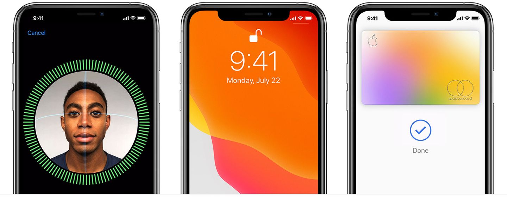
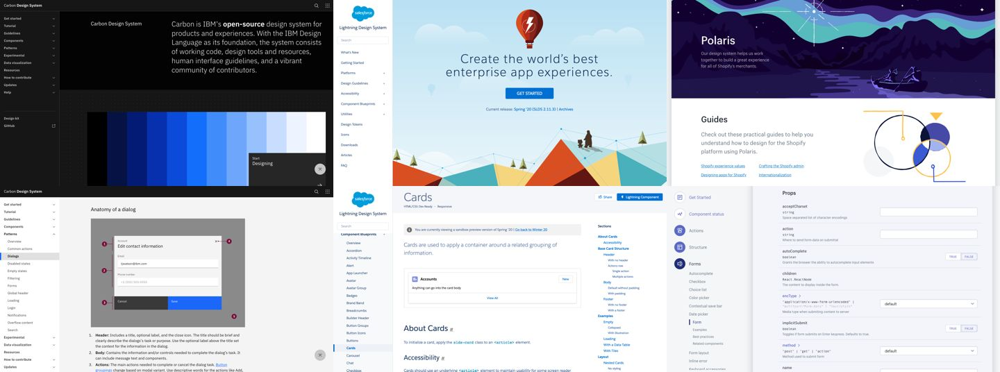

심리학과 새내기님, 환영합니다! 영어 원서라 막막하셨겠지만 걱정하지 마세요. 심리학의 관점과 연결해서 모든 내용을 이해하기 쉽도록 한글로 차근차근 풀어서 설명해 드릴게요. 자, 첫 번째 단계인 '챕터 프리뷰'부터 시작해 볼까요?

---

### 🌟 STEP 1: 챕터 프리뷰 (Preview)

#### 1. 이 챕터의 가장 큰 주제와 우리가 이것을 배워야 하는 이유
이 5장의 핵심 주제는 **"포스텔의 법칙(Postel's Law)"**입니다. 이 법칙을 한 문장으로 요약하면 **"자신이 하는 일(출력)은 엄격하게 하고, 남에게서 받아들이는 것(입력)은 너그럽게 하라"**는 것입니다.

**심리학도인 우리가 이 법칙을 왜 배워야 할까요?** 
우리가 사용하는 디지털 기기나 앱을 디자인하는 것은 결국 '인간의 경험'을 디자인하는 것이기 때문입니다. 인간은 기계와 달리 일관적이지도 않고, 쉽게 산만해지며, 감정적이고 실수도 많이 합니다. 기계가 인간의 이런 불완전한 심리와 행동을 찰떡같이 알아듣고 유연하게 대처하려면 심리학적인 이해가 필수적입니다. 이 챕터를 통해 우리는 어떻게 시스템이 사람의 다양한 행동(너그러운 입력)을 포용하면서도, 모두에게 안정적인 결과(엄격한 출력)를 제공할 수 있는지 그 원리를 배울 수 있습니다.

#### 2. 하위 섹션들의 논리적인 흐름과 필요성
이 챕터는 우리가 포스텔의 법칙을 완벽히 이해할 수 있도록 다음과 같은 논리적 흐름으로 구성되어 있습니다.

*   **개요 (Overview):** 인간과 컴퓨터의 소통 방식이 어떻게 다른지 심리적 특성을 바탕으로 설명하고, 이 간극을 메우기 위해 왜 '포스텔의 법칙'이 필요한지 도입부를 엽니다.
*   **기원 (Origins):** 이 법칙이 원래는 컴퓨터 네트워크의 데이터를 주고받는 규칙에서 유래되었음을 밝힙니다. 공학에서 시작된 이 원칙이 어떻게 사람의 경험을 디자인하는 데까지 확장되었는지 역사적 배경을 알려줍니다.
*   **사례 (Examples):** 추상적인 원칙을 이해하기 쉽게, 우리가 매일 쓰는 인터넷 폼(로그인 창 등), 안면 인식(Face ID), 반응형 웹사이트 등 실제 사례를 통해 구체적으로 증명합니다.
*   **핵심 고려사항: 디자인 탄력성 (Key Consideration: Design Resiliency):** 사람들의 입력이 다양해질수록 오류가 날 확률도 높아지기 때문에, 언어의 길이나 글자 크기 변화 같은 돌발 변수까지 미리 예측하고 설계해야 한다는 심화된 관점을 제시합니다.
*   **결론 (Conclusion):** 결과적으로 이 법칙이 기계와 인간 사이의 격차를 좁혀주고, 더 '인간적인' 경험을 보장한다는 내용으로 챕터를 마무리합니다.

---

#### 3. 🧠 반드시 기억해야 할 '가장 중요한 전문 용어' (핵심 개념 4가지)

공부하시면서 아래 4가지 용어는 꼭 기억해 두세요! 학술적인 출처와 함께 정리했습니다.

1.  **포스텔의 법칙 (Postel’s Law) / 견고함의 원칙 (The Robustness Principle)**
    *   **출처/연구자:** Jon Postel (1981년)
    *   **등장 페이지(Source):** Source,,
    *   **의미:** 출력은 보수적으로, 입력은 관대하게 받아들이라는 원칙입니다. 초기 인터넷망(TCP)이 안정적으로 통신할 수 있게 만든 핵심 공학 원리입니다.
2.  **반응형 웹 디자인 (Responsive Web Design)**
    *   **출처/연구자:** Ethan Marcotte (2010년)
    *   **등장 페이지(Source):** Source,,
    *   **의미:** 유동적인 그리드나 유연한 이미지를 사용해, 사용자가 스마트폰을 쓰든 커다란 TV를 쓰든 화면 크기에 맞춰 유연하게 반응하도록 웹을 만드는 방식입니다.
3.  **점진적 향상 (Progressive Enhancement)**
    *   **출처/연구자:** Steve Champeon & Nick Finck (2003년, SXSW 발표)
    *   **등장 페이지(Source):** Source,
    *   **의미:** 모든 사람에게 기본적인 콘텐츠는 동일하게 제공하되, 사용자의 기기 성능이나 인터넷 속도가 좋으면 더 높은 수준의 디자인이나 기능(예: 음성 인식 검색)을 덧붙여주는 전략입니다.
4.  **결정 피로 (Decision Fatigue)**
    *   **등장 페이지(Source):** Source
    *   **의미:** *(심리학과 학생에게 아주 중요한 개념!)* 사람들에게 너무 많은 정보를 입력하라고 요구하면 인지적 에너지가 소모되어 결정의 질이 떨어지고, 결국 행동을 포기하게 되는 심리적 현상을 말합니다.

---

#### 4. 🗺️ 마인드맵 형태의 Flow Chart & 보충 설명

아래의 도식화된 마인드맵을 머릿속에 그려보세요. 전체 내용이 어떻게 연결되는지 한눈에 보일 겁니다.

```text
[인간의 심리와 행동] (감정적, 실수 잦음, 다양한 환경)
       │
       ▼
[포스텔의 법칙 (Postel's Law)] ── 기원: Jon Postel의 인터넷(TCP) 통신 규약
       │
       ├─▶ (1) 입력은 관대하게 (Liberal Input) : 인간의 불완전함 수용
       │      - 사례: Face ID (비밀번호 대신 얼굴로 쉽게)
       │      - 사례: 다양한 화면 크기를 수용하는 '반응형 웹 디자인'
       │
       ├─▶ (2) 출력은 보수적으로 (Conservative Output) : 누구에게나 안정적 제공
       │      - 사례: 폼 입력 최소화로 '결정 피로' 방지
       │      - 사례: 모두에게 기본 기능을 보장하는 '점진적 향상'
       │
       ▼
[디자인 탄력성 (Design Resiliency)]
       │      - 돌발 변수(다양한 언어 번역 시 글자 수 증가, 폰트 크기 확대 등)에 대비
       │
       ▼
[최종 목표: 훌륭한 인간 경험 (Good Human Experience)]
       - 기계와 인간의 소통 격차 해소
```

**💡 [쉬운 보충 설명] 이 차트는 어떻게 흘러가나요?**
교수님과 학생의 관계를 떠올려보세요! 깐깐하지만 좋은 교수님(시스템)은 과제(입력)를 제출받을 때 HWP, Word, PDF, 심지어 수기 작성까지 학생들의 다양한 상황을 '관대하게' 다 받아줍니다(Liberal Input). 하지만 교수님이 학생들에게 내어주는 강의 자료나 채점 기준(출력)은 누가 봐도 오해가 없도록 아주 '보수적이고 엄격하고 명확하게' 제공하죠(Conservative Output). 
컴퓨터 시스템도 마찬가지입니다. 사용자가 화면을 키우든, 마우스 대신 목소리로 검색을 하든 다 받아주되(관대한 입력), 결과물은 누구에게나 깨지지 않고 완벽하게 보여주어야(보수적 출력) 한다는 것이 이 챕터 전체를 관통하는 흐름입니다!

---

어떠신가요? 챕터의 전체적인 큰 그림이 머릿속에 들어오셨나요? 준비가 되셨다면 다음 스텝인 '세부 내용 파고들기(STEP 2)'로 넘어가서 각 사례를 더 깊게 알아볼까요?

질문해주신 'SEEV, SSTS, PCP' 같은 모델들은 아쉽게도 현재 우리가 보고 있는 5장(Chapter 5. Postel's Law) 자료에는 등장하지 않습니다,,,,,,,,,,,,,,,,,,. 대신 이 책의 5장에서는 **인간-컴퓨터 상호작용(HCI)과 UX 심리학의 핵심이 되는 하나의 거대한 '이론(법칙)'과, 이를 현실에서 구현하기 위해 만들어진 실무적인 '모델(디자인 전략)'들**을 깊이 있게 다루고 있습니다,,. 

따라서 이 5장에 등장하는 진짜 핵심 이론과 모델들을 바탕으로 'STEP 2: 핵심 개념 딥다이빙'을 시작하겠습니다! 아무것도 모른다고 생각하고 아주 쉬운 비유를 들어 설명해 드릴게요.

---

### 💡 시작하기 전에: 왜 '이론'과 '모델'을 연결해서 이해해야 할까요?
심리학과 학생으로서 우리는 "왜(Why)"와 "어떻게(How)"를 연결하는 훈련이 필요합니다. 
*   **이론(Theory):** 인간의 심리와 행동이 '왜' 그런지 설명하는 근본적인 원칙입니다. (예: 사람은 복잡한 걸 싫어해!)
*   **모델(Model):** 그 이론을 바탕으로 현실의 문제를 '어떻게' 해결할지 만든 구체적인 틀입니다. (예: 그러니까 버튼을 하나만 만들자!)

이 둘을 연결해야만, 단순히 화면을 예쁘게 꾸미는 것을 넘어 **"사람의 심리를 정확히 이해하고 배려하는 진짜 쓸모 있는 시스템"**을 설계할 수 있기 때문에 이 연결성을 이해하는 것이 무척 중요합니다,.

---

### 📚 1. 핵심 이론 (Theories) 딥다이빙

#### ① 포스텔의 법칙 (Postel’s Law) / 견고함의 원칙
*   **연구자 및 연도:** 존 포스텔 (Jon Postel), 1981년,.
*   **1) 왜 만들어졌나?** 초기 인터넷 망(TCP)을 만들 때, 컴퓨터끼리 데이터를 주고받다 작은 오류만 생겨도 통신이 끊기는 문제를 해결하기 위해 만들어졌습니다.
*   **2) 세부 요소:** 
    *   **관대한 입력 (Liberal Input):** 남(사용자)이 주는 정보나 행동은 형태가 다양하고 실수가 있어도 유연하게 다 받아준다,.
    *   **보수적 출력 (Conservative Output):** 내(시스템)가 남에게 주는 결과물이나 작동은 누가 봐도 오해가 없도록 아주 엄격하고 안정적으로 내보낸다,.
*   **3) 상호작용 (쉬운 비유):** **외국인 친구와의 대화**를 떠올려보세요. 외국인 친구가 서툰 한국어로 "나 밥, 어제, 먹었다"라고 뒤죽박죽 말해도(관대한 입력 수용), 찰떡같이 알아듣고 "아, 어제 밥을 먹었다고? 난 오늘 피자 먹을 거야"라고 완벽하고 정확한 문장으로 대답해 주는 것(보수적 출력 제공)과 같습니다,,.

#### ② 결정 피로 (Decision Fatigue)
*   **연구자 및 연도:** (본문 내 특정 연도 명시 없음, 보편적 심리 현상으로 소개).
*   **1) 왜 만들어졌나?** 사용자에게 너무 많은 정보를 요구하면 왜 그들이 도중에 포기하는지 설명하기 위해 도입되었습니다.
*   **2) 세부 요소:** 과도한 요구 (입력 필드 증가) ➡️ 인지적 에너지 소모 ➡️ 의사결정의 질 하락 및 포기.
*   **3) 상호작용 (쉬운 비유):** **무거운 백팩을 메고 뛰는 마라톤**입니다. 가입 화면에서 이름, 주소, 전화번호, 취미까지 너무 많은 걸 물어보면(가방에 돌덩이를 계속 넣으면), 사용자는 뇌의 에너지가 방전되어 결국 "아, 안 해!" 하고 화면을 꺼버립니다.

---

### 🛠️ 2. 핵심 모델 및 전략 (Models & Strategies) 딥다이빙

#### ① 반응형 웹 디자인 (Responsive Web Design)
*   **연구자 및 연도:** 이선 마코트 (Ethan Marcotte), 2010년,.
*   **1) 왜 만들어졌나?** 사람들이 컴퓨터뿐만 아니라 스마트폰, 태블릿 등 다양한 크기의 화면으로 인터넷을 쓰기 시작하면서, 기기마다 웹사이트를 따로 만드는 것이 불가능해졌기 때문입니다.
*   **2) 세부 요소:** 유동적 그리드(Fluid grids), 유연한 이미지(Flexible images), 미디어 쿼리(Media queries).
*   **3) 상호작용 (쉬운 비유):** **물(Water)**과 같습니다. 물은 둥근 컵에 부으면 둥가 되고, 네모난 컵에 부으면 네모가 되죠? 반응형 웹도 똑같이 사용자가 어떤 기기(형태)를 쓰든 그 화면 크기에 맞춰 내용이 물처럼 자연스럽게 흘러가며 배치됩니다,.

#### ② 점진적 향상 (Progressive Enhancement)
*   **연구자 및 연도:** 스티브 챔피언 & 닉 핑크 (Steve Champeon & Nick Finck), 2003년.
*   **1) 왜 만들어졌나?** 기기가 후지거나 인터넷이 느린 사람들도 '차별 없이' 핵심 콘텐츠를 이용할 수 있게 보장하기 위해 만들어졌습니다.
*   **2) 세부 요소:** 
    *   **기본 뼈대:** 모두에게 제공되는 필수 기능/콘텐츠.
    *   **향상된 레이어:** 좋은 기기/빠른 인터넷을 가진 사람에게만 추가로 덧붙여주는 화려한 디자인이나 첨단 기능(예: 음성 인식 검색),.
*   **3) 상호작용 (쉬운 비유):** **케이크 만들기**입니다. 일단 누구나 먹을 수 있는 '기본 빵(기본 기능)'을 탄탄하게 굽습니다. 그 후, 소화력이 좋은 사람(최신 기기)에게는 빵 위에 생크림도 바르고 딸기도 얹어서(향상된 기능) 더 맛있게 줍니다,. 빵조차 못 먹는 사람이 없게 하는 것이 핵심입니다.

---

### 🔗 3. 이론과 모델의 연결성 (Mind Map Flow Chart)

이론(왜 그래야 하는가?)이 바탕이 되어 구체적인 모델(어떻게 할 것인가?)로 발전합니다.

```text
[심리적 배경] 인간은 실수하고 변덕스러움, 기기 환경도 제각각임
       │
       ▼
【 핵심 이론 1: 포스텔의 법칙 】 (입력은 관대하게, 출력은 엄격하게)
       │
       ├─▶ (결합) 【 핵심 이론 2: 결정 피로 】 방지
       │          "입력을 관대하게 받는다는 건, 사용자에게 입력을 최소한으로 요구해서 
       │           뇌의 피로를 덜어준다는 뜻이야!" 
       │           (예: 복잡한 비밀번호 대신 Face ID 사용,)
       │
       ▼ (이 법칙을 현실 디자인으로 어떻게 구현할까?)
       │
【 모델 1: 반응형 웹 디자인 】 (시각적/형태적 유연성),
       │      "사용자가 스마트폰을 쓰든 TV를 쓰든 다 받아줄게(관대한 입력), 
       │       대신 화면은 안 깨지게 잘 보여줄게(엄격한 출력)."
       │
       ├─▶ (상호보완) 
       │
【 모델 2: 점진적 향상 】 (기능적/성능적 유연성),
              "구형 폰을 쓰든 음성 인식을 쓰든 다 받아줄게(관대한 입력),
               최소한 기본 기능은 누구에게나 확실히 작동하게 해줄게(엄격한 출력)."
```

**💡 [쉬운 보충 설명] 이 차트는 어떻게 흘러가나요?**
이 흐름도는 **"인간에 대한 이해 ➡️ 원칙의 수립 ➡️ 구체적 기술의 탄생"**이라는 순서로 흘러갑니다.
가장 위에는 '인간은 완벽하지 않다'는 심리학적 전제가 있습니다. 이를 해결하기 위해 포스텔이 '입력은 관대하게, 출력은 깐깐하게 하라'는 법칙을 세웠죠. 이 법칙을 잘 지키면 사람들의 '결정 피로'를 줄여줄 수 있습니다.
그리고 이 '관대함과 깐깐함'을 인터넷 화면 크기에 적용한 기술이 **반응형 웹**이고, 기능의 수준(인터넷 속도나 기기 성능)에 적용한 기술이 **점진적 향상**입니다,. 결국 이 모든 모델들은 "인간의 짐을 기계가 대신 짊어져서 편안한 경험을 주자"는 포스텔의 법칙을 실현하기 위한 도구들인 셈입니다.

---

이제 이 챕터에 등장하는 주요 이론과 모델, 그리고 그 관계까지 완벽하게 파악하셨습니다! 혹시 이 내용들을 시험공부나 복습을 위해 암기하기 쉽게 '플래시카드'로 만들어 드릴까요?

타 과 친구에게 심리학과 UX 디자인의 매력을 보여줄 수 있는 아주 좋은 단계입니다! 

설명에 앞서 한 가지 짚고 넘어가자면, 질문자님이 언급해주신 '운전 중 주의 분산, 고릴라 실험, 항공기 계기판' 등은 인지심리학이나 인간공학에서 매우 유명한 사례가 맞습니다. 하지만 **우리가 지금 집중해서 보고 있는 5장 텍스트에는 그 사례들 대신, 현대인들이 매일 사용하는 '디지털 환경'에 포스텔의 법칙을 적용한 사례들이 등장합니다**. 

따라서 책에 실제 등장하는 사례들을 바탕으로 다른 과 친구에게 설명하기 좋게 정리해 드리고, 일상생활의 새로운 사례도 연결해 보겠습니다.

---

### 🌟 STEP 3: 현실 세계 적용 (Real-world Case Study)

#### 1. 책 속에 등장한 실제 사례와 이론의 연결 (친구에게 설명할 때 활용하세요!)

포스텔의 법칙(**"입력은 관대하게, 출력은 보수적(엄격)으로"**)이 실제 디지털 디자인에서 어떻게 쓰이는지 보여주는 4가지 핵심 사례입니다.

*   **사례 1: 애플 Face ID와 폼(Form) 입력 최소화**
    *   **이론 적용:** 컴퓨터와 인간은 소통 방식이 다릅니다. 사람에게 너무 많은 정보(아이디, 비밀번호 등)를 타이핑하라고 요구하면 '결정 피로(Decision fatigue)'가 와서 포기하게 됩니다.
    *   **해결책:** 애플의 Face ID는 복잡한 비밀번호 입력 대신 사용자의 '얼굴 인식'이라는 아주 **관대하고 쉬운 입력(Liberal Input)**을 받아들여 기기의 잠금을 해제합니다. 정보를 요구하는 방식을 최소화하여 인간의 인지적 에너지를 아껴주는 훌륭한 예시입니다,.
*   **사례 2: 반응형 웹 디자인 (Responsive Web Design)**
    *   **연구자:** Ethan Marcotte (2010년).
    *   **이론 적용:** 사람들은 스마트폰, 태블릿, 거대한 TV 등 제각각의 기기로 웹에 접속합니다. 
    *   **해결책:** 사용자가 어떤 크기의 화면으로 접속하든 다 받아주고(**관대한 입력**), 물 흐르듯 화면 구성을 유연하게 바꿔서 글씨나 이미지가 깨지지 않는 완벽한 화면을 보여줍니다(**보수적/안정적 출력**),.
*   **사례 3: 점진적 향상 (Progressive Enhancement)과 음성 검색**
    *   **연구자:** Steve Champeon & Nick Finck (2003년).
    *   **이론 적용:** 구형 기기를 쓰거나 인터넷이 느린 사람도 소외되어서는 안 됩니다.
    *   **해결책:** 모두에게 똑같이 작동하는 '기본 검색창'을 먼저 제공하여 핵심 기능을 보장합니다(**엄격한 출력**). 그리고 마이크 기능이 있는 최신 스마트폰 사용자에게는 '음성 인식' 버튼을 추가로 띄워주어 더 편한 방식(**관대한 입력**)을 허용합니다. 
*   **사례 4: 디자인 탄력성 - 아마존(Amazon)의 폰트 크기 조절**
    *   **이론 적용:** 사람마다 시력이 달라서 스마트폰의 기본 글자 크기를 엄청 크게 설정해두는 경우가 있습니다. 또는 영어(짧음)를 이탈리아어(길어짐)로 번역할 때 글자 수가 최대 300%까지 늘어나기도 합니다.
    *   **해결책:** 사용자가 폰트를 마음대로 키우는 돌발 상황(**관대한 입력**)을 수용하면서도, 화면이 망가지지 않게 아마존은 폰트가 커지면 중요도가 낮은 메뉴판 링크들을 깔끔하게 숨겨버립니다(**안정적 출력**),.

---

#### 2. 일상생활 적용 (새로운 사례로 이해도 체크!)

질문자님이 일상생활에서 포스텔의 법칙을 어떻게 적용할 수 있을지 아주 잘 접근하셨습니다. 이해하신 방향이 맞는지 아래의 새로운 비유를 통해 확인해 보세요.

*   **스마트폰 사용 사례: 지도 앱의 '오타 검색'**
    *   **상황:** 길을 걸으면서(주의 분산 상태) 지도 앱에 "강남역 맛집"을 쳐야 하는데, 오타가 나서 "ㄱㅏㅇ남역 맛지"라고 쳤습니다.
    *   **이론 연결:** 깐깐한 시스템이라면 "검색 결과가 없습니다"라고 하겠지만, 포스텔의 법칙이 적용된 지도 앱은 오타를 **관대하게 수용(Liberal Input)**합니다. 그리고 찰떡같이 알아듣고 지도 위에 강남역 근처의 식당 리스트와 별점을 아주 **깔끔하고 정확한 인터페이스로 출력(Conservative Output)**해 줍니다.
*   **공부/팀플 할 때의 소통 사례: 조장의 자료 취합**
    *   **상황:** 다른 과 친구들과 교양 조별 과제를 합니다. 조장인 내가 자료를 모아야 합니다.
    *   **이론 연결:** 팀원들에게 "무조건 글씨체는 맑은 고딕, 11포인트, PDF 파일로 밤 10시까지 내!"라고 하면 팀원들은 **결정 피로**를 느낍니다. 대신 "카톡이든 한글 파일이든 편한 방법으로 아이디어만 던져줘!"라며 **입력을 관대하게** 받습니다. 그리고 조장인 내가 그것을 일관된 양식의 깔끔한 PPT로 정리해서 교수님께 제출(**보수적이고 엄격한 출력**)합니다. 이것이 바로 인간을 배려하는 포스텔의 법칙입니다!

---

#### 3. APA 양식 참고문헌 (References)

본문에 인용된 핵심 연구자 및 학술 정보의 APA 양식입니다. 타 과 친구에게 전문성을 뽐낼 때 활용해 보세요.

*   Postel, J. (1981). *RFC 793: Transmission control protocol*. RFC Editor. https://www.rfc-editor.org/rfc/rfc793
*   Marcotte, E. (2010, May 25). *Responsive web design*. A List Apart. https://alistapart.com/article/responsive-web-design

*(참고: 애플 Face ID나 점진적 향상(Champeon & Finck)에 대한 부분은 책 본문에서 일반 사례로 언급되었으나, 서지 정보 목록(Reference list)에는 해당 두 문헌의 URL만 공식 수록되어 있습니다.)*

---

다른 전공 친구에게 설명할 때 시각적인 자료가 있으면 훨씬 더 설득력이 있을 텐데, 이 내용들을 바탕으로 친구에게 바로 보여줄 수 있는 **발표용 슬라이드 덱(Slide deck)**을 만들어 드릴까요?

인스타그램에 올리기 딱 좋은 '카드뉴스' 스타일로, 심리학과 친구들이 "아하!" 하고 무릎을 칠 수 있게 완벽하게 시각 자료들을 해설해 드릴게요. 책에 나오는 전통적인 꺾은선 그래프는 아니지만, 책에 등장하는 UI(사용자 인터페이스) 도표들을 하나의 '심리 변화 그래프'처럼 해석해서 아주 쉽고 재밌게 풀어보겠습니다.

---

### 📱 STEP 4: 인스타 업로드용 시각 자료 완벽 해설 (Data & Visual Literacy)

친구들에게 **"포스텔의 법칙(입력은 관대하게, 출력은 깐깐하게)"**이 우리 일상에 어떻게 녹아있는지 도표(Figure) 순서대로 설명해 보세요!

#### 🖼️ 1. Figure 5-1: 애플 Face ID 아이콘



*   **프로세스와 목적:** 폼(Form) 입력을 최소화하여 사용자의 인지적 노력을 줄이는 '관대한 입력(Liberal Input)'의 대표 사례입니다.
*   **👉 손가락 지시법 (Point-and-Tell):** 
    "1. 먼저 화면 한가운데를 보세요. 네모난 미소 짓는 얼굴 아이콘이 떡하니 있죠? 2. 예전 같았으면 이 자리에 '비밀번호를 입력하세요'라는 빈칸이 평평하게 깔려 있었을 텐데, 이제는 얼굴만 들이밀면 문이 철컥! 하고 수직으로 확 꺾여서 열립니다. 3. 이게 바로 복잡한 입력을 없애버린 겁니다."
*   **📊 일상어 X, Y축 & 심리 법칙:**
    *   **X축:** '비밀번호 치기 싫은 귀찮음 지수'
    *   **Y축:** '내 폰이 1초 만에 열리는 쾌감 지수'
    *   **심리 법칙:** **결정 피로(Decision Fatigue)**. 기계가 정보를 너무 많이 요구하면 뇌가 지쳐버리는 현상을 방지합니다.
*   **🎮 밈(Meme) 1:1 매칭:** **아이언맨 헬멧(HUD)** 상황. 토니 스타크가 암호를 타자로 치지 않아도, 자비스가 얼굴만 보고 "Welcome, Sir" 하며 헬멧을 알아서 열어주는 완전 자동화의 순간입니다.
*   **인용 정보:** (Apple, 2020).

#### 🖼️ 2. Figure 5-2: 다양한 기기에 맞춰진 반응형 웹 디자인


*   **프로세스와 목적:** 사용자가 어떤 기기를 쓰든 화면이 깨지지 않고 완벽하게 보여주는 '엄격한 출력(Conservative Output)'의 사례입니다.
*   **👉 손가락 지시법 (Point-and-Tell):** 
    "1. 제일 뒤에 있는 거대한 TV 모니터부터 시선을 왼쪽 아래로 쭉 내려보세요. 2. 화면 크기가 데스크톱, 태블릿, 폰, 스마트워치까지 계단처럼 뚝뚝 떨어지죠? 3. 근데 파란색 테두리와 회색 네모(콘텐츠)는 밖으로 삐져나가지 않고 기기 안으로 쏙쏙 예쁘게 줄어들면서 꺾여 들어갑니다."
*   **📊 일상어 X, Y축 & 심리 법칙:**
    *   **X축:** '내가 들고 있는 기기 화면의 크기'
    *   **Y축:** '화면이 안 깨지고 찰떡같이 맞춰주는 편안함 지수'
    *   **심리 법칙:** 기기 환경이 변해도 사용자에게 일관된 통제감(Feel in control)을 주어 당황하지 않게 만드는 원리입니다.
*   **🎮 밈(Meme) 1:1 매칭:** **테트리스(Tetris) 게임**. 어떤 이상한 모양의 블록(기기)이 내려와도, 빈칸에 물 흐르듯이 딱 맞게 알아서 모양을 바꾸며 끼워 맞춰지는 마법 같은 상황입니다.
*   **데이터 & 인용 정보:** 이선 마코트(Ethan Marcotte)가 2010년에 제안한 '유동적 그리드와 유연한 이미지' 개념입니다.

#### 🖼️ 3. Figure 5-3: 점진적 향상 (검색창과 마이크)


*   **프로세스와 목적:** 기본 기능은 모두에게 주되, 좋은 기기를 쓴다면 추가 기능을 얹어주는 방식입니다.
*   **👉 손가락 지시법 (Point-and-Tell):** 
    "1. 먼저 왼쪽 검색창을 보세요. 그냥 평범한 회색 돋보기 선이 평평하게 있죠? 2. 이제 오른쪽 창으로 시선을 옮겨보세요. 갑자기 파란색 마이크 버튼이 뿅! 하고 동그랗게 튀어나왔죠? 3. 이게 바로 내 폰이 마이크를 지원하면, 시스템이 알아서 스펙을 업그레이드해 주는 뜻입니다."
*   **📊 일상어 X, Y축 & 심리 법칙:**
    *   **X축:** '내 폰의 삐까뻔쩍한 장비 성능'
    *   **Y축:** '내가 누릴 수 있는 꿀기능 개수'
    *   **심리 법칙:** 모두를 포용하는 '접근성(Accessibility)'의 심리학. 소외되는 사람 없이 기본 바탕은 깔아준다는 안정감을 줍니다.
*   **🎮 밈(Meme) 1:1 매칭:** **배틀그라운드(PUBG) 파밍 시스템**. 처음 맵에 떨어지면 다 같이 맨주먹과 기본 총(왼쪽 검색창)으로 시작하지만, 좋은 장비를 줍자마자 내 총에 8배율 스코프(오른쪽 마이크 버튼)가 찰칵! 하고 자동 장착되는 순간과 똑같습니다.
*   **데이터 & 인용 정보:** 스티브 챔피언 & 닉 핑크(Steve Champeon & Nick Finck, 2003)의 "Inclusive Web Design For the Future" 발표 내용.

#### 🖼️ 4. Figure 5-5 & 5-6: 텍스트 팽창과 아마존의 폰트 사이즈 대응


*   **프로세스와 목적:** 돌발 변수(글자가 길어지거나 폰트가 커짐)가 생겨도 디자인이 망가지지 않게 하는 '디자인 탄력성(Design Resiliency)'입니다.
*   **👉 손가락 지시법 (Point-and-Tell):** 
    "1. 왼쪽 아래 도표(Figure 5-5)의 'Views(비율 1)'를 보세요. 단어가 짧아서 선이 평평하죠? 2. 그런데 오른쪽 이탈리아어 'Visualizzazioni(비율 3)'로 가니까 선이 갑자기 3배 위로 확 꺾여서 올라가죠? 3. 이 돌발 상황을 아마존(Figure 5-6)이 어떻게 해결했나 볼까요? 위쪽 바깥을 보세요. 메뉴가 바글바글하죠? 4. 글씨가 확 커진 아래쪽 바를 보세요. 잔챙이 메뉴들이 알아서 방을 빼고 깔끔하게 싹 사라졌습니다!"
*   **📊 일상어 X, Y축 & 심리 법칙:**
    *   **X축:** '할머니 돋보기 폰트 크기 (또는 말이 많아지는 언어 종류)'
    *   **Y축:** '화면에 살아남은 엑기스 정보의 개수'
    *   **심리 법칙:** 사용자 통제권 보장. 사용자가 내 맘대로 폰트를 키워도(관대한 입력), 시스템이 당황하지 않고 중요도에 따라 메뉴를 숨겨서(엄격한 출력) 인지적 과부하를 막습니다.
*   **데이터 & 수치 인용:** 영어를 이탈리아어 같은 언어로 번역하면 글자 수가 **최대 300% (비율 1:3)까지 팽창**합니다. (Source: w3.org / Amazon, 2019).
*   **🎮 밈(Meme) 1:1 매칭:** **출근길 만원 지하철**. 덩치가 엄청나게 큰 사람(최대 300% 팽창한 텍스트나 커진 폰트)이 헉 하고 타면, 덜 중요한 내 백팩이나 잔짐들(아마존의 자잘한 메뉴들)은 알아서 시야 밖으로 밀려나 숨겨지는 상황입니다.

---

### 🗺️ 도표 흐름 총정리 플로우 차트 (텍스트 마인드맵)

```text
[시작: 인간은 귀찮은 걸 싫어함]
       │
       ▼
【도표 5-1: 애플 Face ID】 (입력의 유연함)
 💡 보충 설명: "귀찮은 타자 치지 마! 얼굴만 대면 통과시켜 줄게." 
 ➡️ (결과) 사용자 결정 피로 감소
       │
       ▼
【도표 5-2 & 5-3: 반응형 웹 & 점진적 향상】 (형태와 기능의 유연함)
 💡 보충 설명: "화면이 작아? 구형 폰이야? 다 받아줄게! 화면 안 깨지고, 기능 안 죽게 해줄게."
 ➡️ (결과) 기기 성능과 관계없이 모두에게 안정적인 출력 보장
       │
       ▼
【도표 5-5 & 5-6: 텍스트 팽창 & 아마존 폰트】 (디자인 탄력성)
 💡 보충 설명: "글자가 3배로 늘어나거나 할머니 폰트로 키웠어? 당황하지 않고 덜 중요한 메뉴만 뺄게!"
 ➡️ (결과) 예측 불가능한 돌발 상황(관대한 입력)에서도 끄떡없는 견고한 시스템 완성
```

**💡 [왜 이런 흐름으로 이어지나요? - 쉬운 보충 설명]**
이 차트는 **인간을 편안하게 만들기 위한 시스템의 눈물겨운 노력의 단계**입니다. 
처음엔 그저 암호를 안 치게 해주는 것(Face ID)으로 시작했지만, 사람들이 스마트폰, TV 등 너무 다양한 기기를 쓰니까 거기에 화면을 맞춰주는 법(반응형 웹)을 배웁니다. 나아가 기기 성능에 맞춰 마이크도 달아주죠(점진적 향상). 마지막으로 사람들이 글자를 엄청나게 키우거나 긴 언어를 쓰는 등 '돌발 행동'을 해도 화면이 터지지 않도록 방어하는 경지(아마존 사례)에 이르게 됩니다. 결국 이 모든 도표는 **기계가 깐깐하게 일할수록, 인간은 편해진다**는 포스텔의 법칙을 증명하는 흐름입니다!

이 내용을 캡처해서 인스타 스토리나 카드뉴스로 올리면, 타 전공 친구들도 심리학과 UI/UX의 찰떡궁합을 완벽하게 이해할 수 있을 거예요! 다음 스텝으로 넘어가 볼까요?

### 🎓 STEP 5: 셀프 테스트 및 피드백 (Self-Check)

지금까지 배운 5장의 핵심 내용을 스스로 점검해 볼 시간입니다! 단순한 암기를 넘어, 실제 심리학과 학생이 마주할 법한 상황에 이론을 적용해 보는 '사고력 중심 퀴즈'를 준비했습니다. 문제와 정답, 그리고 이론적 근거를 나란히 배치했으니 꼼꼼히 읽어보며 전체 내용을 오버뷰(Overview) 해보세요.

---

#### 🧠 사고력 중심 실전 퀴즈 (Q&A)

**문제 1. [이론 적용 & 결정 피로]**
심리학과 학회장인 당신은 신입생 가입 신청서를 온라인으로 만들었습니다. 처음에는 이름, 학번, 주민번호, 집 주소, 취미, MBTI, 지원 동기(500자)를 모두 필수 입력(타이핑)하도록 세팅했습니다. 그런데 조회수에 비해 실제 제출률이 너무 낮습니다. **이 현상을 설명할 수 있는 심리학적 개념은 무엇이며, '포스텔의 법칙(Figure 5-1 애플 Face ID 사례)'을 적용하여 이 폼을 어떻게 수정해야 할까요?**

*   **정답 및 해설:**
    *   **심리학적 원인:** 사람들에게 너무 많은 정보(필드)를 입력하라고 요구하면 인지적 에너지가 고갈되어 의사결정의 질이 떨어지고 결국 포기하게 되는 **결정 피로(Decision fatigue)** 현상 때문입니다.
    *   **해결책 (포스텔의 법칙 적용):** 포스텔의 법칙(Jon Postel, 1981) 중 **"입력은 관대하게(Liberal Input)"**를 적용해야 합니다. 애플이 비밀번호 타이핑 대신 얼굴 인식(Face ID)으로 입력을 최소화한 것(Figure 5-1)처럼, 가입 폼에서도 이름과 학번 등 '절대적으로 필요한 정보'만 요구해야 합니다. MBTI나 취미는 체크박스로 쉽게 고르게 하거나 나중에 받도록 폼 입력을 최소화하여 사용자의 부담을 덜어주어야 합니다.

**문제 2. [모델 이해 & 점진적 향상]**
심리테스트 웹사이트를 만들었습니다. 어떤 친구들은 최신형 아이패드로 접속하고, 어떤 친구들은 5년 전 구형 스마트폰으로 접속합니다. **'점진적 향상(Progressive Enhancement)' 전략과 Figure 5-3(검색창과 마이크 도표)의 원리를 적용한다면, 이 웹사이트를 어떻게 설계해야 모두를 만족시킬 수 있을까요?**

*   **정답 및 해설:**
    *   **설계 방법:** 스티브 챔피언과 닉 핑크(Steve Champeon & Nick Finck, 2003)가 제안한 '점진적 향상' 전략에 따라, **구형 기기를 쓰는 친구들도 심리테스트의 '핵심 문항(기본 콘텐츠)'은 완벽하게 읽고 풀 수 있도록 보장(보수적 출력)**해야 합니다. 
    *   **추가 기능 제공:** 그 후, 최신형 아이패드를 쓰는 친구들의 기기 성능을 시스템이 감지하면, Figure 5-3에서 평범한 검색창에 '음성 인식 마이크 버튼'이 추가로 나타났던 것처럼, 화려한 애니메이션 결과 화면이나 음성 답변 기능 같은 '향상된 기능'을 덧붙여 주면 됩니다. 핵심은 성능이 낮다고 해서 콘텐츠 자체에서 소외되는 사람이 없게 만드는 것입니다.

**문제 3. [데이터 해석 & 디자인 탄력성]**
당신이 만든 심리학 논문 요약 사이트가 인기를 얻어 '영어'와 '이탈리아어'로 번역 서비스를 제공하게 되었습니다. 또, 노안이 오신 교수님들을 위해 '글자 크기 확대' 기능도 넣었습니다. **Figure 5-5(텍스트 팽창)와 Figure 5-6(아마존 메뉴)의 데이터를 근거로, 이 사이트가 망가지지 않으려면 어떤 개념을 고려하여 디자인해야 할까요?**

*   **정답 및 해설:**
    *   **고려해야 할 개념:** 예상치 못한 돌발 입력(변수)에도 시스템이 안정적으로 작동하도록 대비하는 **디자인 탄력성(Design Resiliency)**입니다.
    *   **데이터 근거 및 해결책:** Figure 5-5에 따르면, 짧고 압축적인 영어를 이탈리아어로 번역하면 글자 수가 최대 **300%(비율 1:3)**까지 팽창할 수 있습니다 (Source: w3.org). 교수님들이 글자 크기를 최대로 키우는 것 또한 관대하게 수용(Liberal Input)해야 합니다. 따라서 화면 밖으로 글자가 튀어나가는 것을 막기 위해, 아마존(Amazon, 2019)이 폰트가 커졌을 때 덜 중요한 부가 메뉴들을 깔끔하게 숨겨버린 것(Figure 5-6)처럼, 우리 사이트도 화면 공간이 부족해지면 중요도가 낮은 카테고리 링크를 자동으로 숨기도록 탄력적으로 설계해야 합니다.

---

#### 🗺️ 챕터 전체 흐름 오버뷰 (Text Flow Chart)

이 챕터가 어떻게 시작해서 어떤 결론으로 끝나는지 머릿속에 큰 그림을 그려보세요.

```text
[문제 인식: 인간과 기계의 차이]
인간은 감정적이고 실수하며 쉽게 피로해짐 ↔ 기계(시스템)는 논리적임
       │
       ▼
[해결 원칙: 포스텔의 법칙 (Postel's Law)]
"입력(사용자 행동)은 관대하게 수용하고, 출력(시스템 결과)은 보수적/안정적으로 제공하라"
       │
       ├─▶ 전략 1: 폼(Form) 입력 최소화 (결정 피로 방지 / Face ID)
       ├─▶ 전략 2: 반응형 웹 디자인 (모든 화면 크기 수용)
       └─▶ 전략 3: 점진적 향상 (모든 기기 성능/접근성 포용)
       │
       ▼
[심화 적용: 디자인 탄력성 (Design Resiliency)]
사용자의 다양한 요구(예: 300% 텍스트 팽창, 폰트 확대 등)라는 
최악의 변수까지 미리 예측하고 설계하여 시스템의 붕괴를 막음
       │
       ▼
[최종 목표: 훌륭한 인간 경험 (Good Human Experience)]
시스템이 사용자의 짐(부담)을 대신 짊어짐으로써, 
더 직관적이고 통제감 있는 '인간 중심의 경험'을 완성함
```

**💡 [흐름도 보충 설명]**
이 차트는 **"문제를 어떻게 인간적으로 해결할 것인가?"**에 대한 완벽한 서사입니다. 
출발점은 '인간은 기계가 아니다'라는 심리학적 통찰입니다. 이 불완전한 인간을 돕기 위해 공학에서 쓰이던 '포스텔의 법칙'을 가져옵니다. 이 법칙은 단순히 철학에 머물지 않고 '반응형 웹, 점진적 향상' 같은 구체적인 디자인 모델로 발전합니다. 하지만 현실은 더 가혹하죠? 사람들이 언어를 바꾸고 글자를 마구 키우는 돌발 상황에서도 끄떡없는 '탄력성'까지 갖춰야 비로소 시스템이 완성됩니다. 결국 기계가 보이지 않는 곳에서 까다롭게 방어해 줄수록(보수적 출력), 인간은 더 편안하고 자유롭게 행동(관대한 입력)할 수 있다는 훌륭한 결론으로 이어지는 흐름입니다.

---

지금까지의 과정으로 이 챕터의 핵심은 모두 마스터하셨습니다! 혹시 오늘 공부한 퀴즈 내용들을 나중에 핸드폰으로 쉽게 복습할 수 있도록 **플래시카드(Flashcards)나 공식 퀴즈(Quiz) 형태의 자료로 만들어 드릴까요?**

영어 원서를 읽지 못했다는 불안감, 충분히 이해합니다. 하지만 심리학과 UX 디자인의 핵심은 '영어를 얼마나 잘하느냐'가 아니라 **인간의 마음과 행동을 얼마나 깊이 이해하느냐**에 있습니다. 영어를 평생 하지 않으셔도 이 분야의 전문가가 될 수 있는 완벽한 보완 전략과, 교수님 앞에서도 당당할 수 있는 3분 스피치 대본을 준비했습니다!

---

### 🛡️ STEP 6: 보완 전략 및 위기 탈출법 (불안감 해소 솔루션)

영어를 몰라도 이 책의 지식을 완벽하게 내 것으로 만드는 3가지 전략입니다.

1.  **시각 자료(UI/UX 화면) 중심의 패턴 학습:** 
    책에 등장하는 애플 Face ID, 반응형 웹, 아마존 메뉴 화면 등은 전 세계 공통 언어입니다. 영어 텍스트에 집착하지 말고, 평소에 사용하는 한국어 앱이나 웹사이트에서 "어? 여기도 내 실수를 관대하게 받아주네?"하며 '포스텔의 법칙'이 적용된 패턴을 캡처하고 수집하세요. 일상 속 사례 수집이 최고의 복습입니다.
2.  **심리학적 '원인과 결과'에만 집중하기:**
    공학적인 영어 용어(TCP 프로토콜, CSS 등)는 과감히 넘기세요. 대신 **"인간은 왜 피로를 느끼는가?(원인) -> 시스템이 어떻게 짐을 덜어주었는가?(결과)"**라는 심리학적 흐름만 한국어로 정리해 두면, 원서를 통째로 읽은 학생보다 훨씬 더 깊은 통찰력을 가질 수 있습니다.
3.  **번역된 핵심 키워드로 국내 자료 탐색:**
    제가 알려드린 핵심 한국어 키워드(포스텔의 법칙, 반응형 웹, 점진적 향상, 결정 피로)를 활용해 국내 심리학 블로그나 브런치(Brunch) 같은 한글 아티클을 읽어보세요. 영어 원서의 내용이 한국 실무자들의 언어로 아주 쉽게 풀려있어 지식을 확장하기 좋습니다.

---

### 🎤 교수님 대응용: 핵심 요약 3분 스피치 브리핑

교수님이 "5장 포스텔의 법칙에 대해 설명해 보게"라고 하셨을 때, 당황하지 않고 핵심만 찌를 수 있는 브리핑 대본입니다. 자연스럽게 말하듯 연습해 보세요!

**(도입: 0분 ~ 1분)**
"교수님, 5장의 핵심 주제인 '포스텔의 법칙'에 대해 브리핑하겠습니다. 이 법칙은 초기 인터넷 통신 규약에서 유래한 원칙으로, 한마디로 **자신이 출력하는 것은 엄격하게, 남에게서 입력받는 것은 너그럽게 하라**는 뜻입니다. 
저희 심리학도가 이 법칙을 알아야 하는 이유는 인간의 특성 때문입니다. 인간은 기계와 달리 늘 일관적이지 않고, 쉽게 산만해지며, 실수도 잦습니다. 따라서 인간과 기계 사이의 소통 격차를 줄이려면, 시스템이 인간의 불완전함을 포용해 주어야 합니다."

**(본론: 1분 ~ 2분)**
"구체적인 적용 사례를 두 가지 측면에서 설명해 드리겠습니다.
첫째, **너그러운 입력**입니다. 사용자에게 너무 많은 폼(Form) 입력을 요구하면 인지적 에너지가 고갈되는 '결정 피로'가 발생합니다. 이를 막기 위해 애플은 복잡한 비밀번호 타이핑 대신, Face ID라는 아주 관대한 방식으로 입력을 수용하여 사용자의 부담을 없앴습니다.
둘째, **엄격한 출력**입니다. 사용자가 스마트폰을 쓰든 커다란 TV를 쓰든, 시스템은 '반응형 웹 디자인'을 통해 누구에게나 깨지지 않고 완벽하게 작동하는 화면을 안정적으로 제공해야 합니다."

**(결론 및 심화: 2분 ~ 3분)**
"나아가 훌륭한 디자인은 '디자인 탄력성'까지 갖춰야 합니다. 예를 들어 영어를 이탈리아어로 번역할 때 글자 수가 최대 300%까지 늘어나거나, 시력이 안 좋은 사용자가 폰트를 엄청나게 키우는 돌발 상황이 발생할 수 있습니다. 이때 아마존은 화면이 망가지는 대신, 덜 중요한 메뉴를 스스로 숨겨버림으로써 시스템을 굳건하게 유지합니다.
결론적으로 포스텔의 법칙은, **사용자가 짊어져야 할 부담을 시스템이 대신 떠안음으로써 가장 '인간 중심적인 경험'을 보장하는 위대한 심리학적 설계 원칙**이라고 생각합니다. 이상입니다!"

---

이 스피치 대본만 완벽히 숙지하셔도 5장에 대한 이해도는 100점 만점일 것입니다! 

### 보고서


[개념 해설서] 포스텔의 법칙: 인간과 시스템을 잇는 유연함의 미학

1. 서론: 포스텔의 법칙이란 무엇인가?

디지털 제품의 성패는 시스템이 얼마나 논리적인가가 아니라, 얼마나 인간의 불완전함을 포용하는가에 달려 있습니다. 이를 관통하는 가장 강력한 디자인 철학이 바로 **포스텔의 법칙(Postel's Law)**입니다.

"자신이 하는 일은 엄격하게, 남에게서 받는 것은 관대하게(Be conservative in what you do, be liberal in what you accept from others)."

현대 UX 디자인에서 이 법칙은 **"복잡함의 무게를 사용자로부터 시스템으로 전가하여, 기계적인 논리가 아닌 인간적인 경험을 구축하는 핵심 원리"**로 정의됩니다. 이 문서를 통해 여러분은 단순한 인터페이스 설계를 넘어, 변화무쌍한 환경과 사용자의 실수 속에서도 무너지지 않는 '강건한 시스템'을 구축하는 건축가적 통찰을 얻게 될 것입니다.


--------------------------------------------------------------------------------


2. 탄생의 배경: 인터넷의 뿌리에서 찾은 강건함

포스텔의 법칙은 본래 디자인 원칙이 아닌, 초기 인터넷의 근간을 설계한 컴퓨터 과학자 **존 포스텔(Jon Postel)**이 제안한 네트워크 프로토콜의 **강건함의 원칙(Robustness Principle)**에서 유래했습니다.

* 데이터의 외교적 프로토콜: 존 포스텔은 TCP(전송 제어 프로토콜) 사양을 정의하며, 서로 다른 시스템들이 안정적으로 소통하기 위한 일종의 '외교적 태도'를 제안했습니다.
* 송신 프로그램(Conservative): 데이터를 보낼 때는 정해진 규격과 사양을 엄격히 준수하여 타 시스템에 혼란을 주지 않아야 합니다.
* 수신 프로그램(Liberal): 데이터를 받을 때는 규격에서 조금 벗어난 비정형 입력이라도, 그 의미가 파악 가능하다면 최대한 수용하고 해석(Parsing)해야 합니다.

이 철학은 오늘날 웹의 표준인 HTML과 CSS가 지배적인 위치를 차지하게 된 원동력이기도 합니다. 이들은 '느슨한 에러 처리'를 기본으로 합니다. 브라우저는 작성자의 사소한 오타나 지원하지 않는 코드를 만났을 때 시스템을 중단시키는 대신, 이해할 수 없는 부분만 조용히 무시하고 다음으로 넘어갑니다. 이러한 유연함이 없었다면 초기 웹은 지금처럼 거대한 생태계를 형성하지 못했을 것입니다.


--------------------------------------------------------------------------------


3. 포스텔의 법칙 이분법적 분석

디자인 아키텍트의 관점에서 이 법칙은 '신뢰의 출력'과 '수용의 입력'이라는 두 기둥으로 분석할 수 있습니다.

| 구분 | "자신에게는 엄격하게" (Conservative) | "남에게는 관대하게" (Liberal) |
|------|---------------------------------------|--------------------------------|
| 디자인 관점의 의미 | 시스템 출력의 신뢰성 및 접근성 확보 | 다양한 사용자 입력의 수용 및 허용 |
| 구체적 목표 | 모든 기기와 환경에서 작동하는 결과물 제공 | 인간의 실수와 다양한 입력 방식을 포용 |
| 결정적인 이점 | 신뢰성: 환경에 상관없이 항상 작동한다는 믿음 제공 | 심리적 안녕: 시스템이 사용자를 이해하고 배려한다는 체감 |

* 보수적 출력의 가치: 시스템은 어떤 상황에서도 깨지지 않는 견고한 인터페이스를 보장함으로써 사용자에게 서비스에 대한 무한한 신뢰를 줍니다.
* 관대한 입력의 가치: 사용자가 기계의 언어에 맞추도록 강요하지 않음으로써, 사용자는 제어권을 유지하고 있다는 심리적 편안함을 얻습니다.


--------------------------------------------------------------------------------


4. 왜 포스텔의 법칙인가? 인간과 컴퓨터의 간극

컴퓨터는 엄격한 논리와 일관성을 기반으로 작동하지만, 인간은 본질적으로 그 반대 지점에 서 있습니다. 디자인의 진정한 역할은 '기계의 경직된 논리'와 '인간의 혼란스러운 현실' 사이의 간극을 메우는 것입니다.

인류의 혼란스러운 현실(The Chaotic Reality of Humanity)

시스템은 사용자가 다음과 같은 본성을 가진 존재임을 설계 단계부터 인정해야 합니다.

1. 일관성 부족: 동일한 상황에서도 기분에 따라, 혹은 상황에 따라 다르게 행동합니다.
2. 주의 산만: 끊임없이 외부 자극에 노출되며 작업의 맥락을 놓치기 쉽습니다.
3. 오류 발생 가능성: 의도와 상관없이 사소한 실수를 빈번하게 저지르는 것이 인간의 기본값입니다.
4. 감정적 동기: 논리적 효율성보다는 현재의 감정과 편리함에 따라 움직입니다.

사용자는 기술이 자신을 직관적으로 이해해 주기를 기대하며, 과도한 정보 입력을 요구받을 때 본능적인 거부감을 느낍니다. 포스텔의 법칙을 적용한다는 것은 시스템이 이 모든 Ambiguity(모호함)의 무게를 기꺼이 감내하겠다는 아키텍처적 결단입니다.


--------------------------------------------------------------------------------


5. 실전 사례로 보는 포스텔의 법칙

① 입력 폼과 결정 피로의 해소

시스템은 사용자에게 최소한의 정보만 요구하여 인지적 부하를 낮춰야 합니다.

* 요구하는 필드가 늘어날수록 사용자는 **결정 피로(Decision Fatigue)**에 빠지며 이탈률은 급격히 상승합니다.
* Face ID의 미학: 이는 관대한 수용의 정점입니다. 사용자가 아이디와 비밀번호를 기억하고 입력하는 수고(엄격한 요구)를 하는 대신, 시스템이 생체 데이터를 **능동적으로 번역(Translation)**하여 인증 요건을 충족시킵니다. 시스템이 번거로운 절차를 대신 수행함으로써 사용자의 노력은 제로에 가까워집니다.

② 반응형 웹 디자인(Responsive Design)

에단 마콧(Ethan Marcotte)이 제안한 이 방식은 '보수적인 출력'의 전형입니다.

* 유동형 그리드와 미디어 쿼리를 통해 스마트워치부터 대형 TV까지, 어떠한 화면 크기에서도 레이아웃이 무너지지 않고 최적화된 결과물을 제공함으로써 환경의 다양성을 관대하게 포용합니다.

③ 점진적 향상(Progressive Enhancement) vs 우아한 퇴보(Graceful Degradation)

시스템의 회복 탄력성을 확보하기 위해 두 개념의 차이를 명확히 이해해야 합니다.

* 우아한 퇴보(GD): 최신 기능이 다 갖춰진 환경을 기준으로 설계한 후, 구형 환경에서 기능을 하나씩 제거하거나 대체 기능을 제공하는 방식입니다.
* 점진적 향상(PE): 모든 사용자가 접근 가능한 '핵심 콘텐츠'를 기초석으로 삼고, 기술 환경이 허락할 때 기능을 층층이 쌓아 올리는 방식입니다.
* 검색창 사례: 텍스트 검색(핵심)을 기본으로 제공하되, 음성 인식이 지원되는 환경에서만 '마이크 아이콘'을 추가합니다. 이는 기본 기능을 해치지 않으면서도 다양한 입력 방식을 관대하게 수용하는 PE의 전형입니다.


--------------------------------------------------------------------------------


6. 디자인 회복 탄력성(Resiliency)과 고려 사항

진정한 마스터 아키텍트는 예기치 못한 변수에도 무너지지 않는 시스템을 설계합니다.

* 국제화와 텍스트의 확장: 영어로 설계된 레이아웃은 이탈리아어로 번역될 때 최대 300%까지 확장될 수 있습니다. 또한, 왼쪽에서 오른쪽(LTR)뿐만 아니라 오른쪽에서 왼쪽(RTL), 심지어 수직 방향의 **텍스트 방향성(Text Orientation)**까지 고려해야 합니다. 레이아웃은 이러한 변동성을 '관대하게' 수용할 수 있을 만큼 유연해야 합니다.
* 사용자 제어권과 접근성(Amazon 사례): 사용자는 가독성을 위해 폰트 크기를 키울 권리가 있습니다. **아마존(Amazon)**은 폰트 크기가 커질 때, 시스템이 이를 수용하면서도 출력을 보호하기 위해 중요도가 낮은 링크를 명시적으로 제거하고 핵심 메뉴를 재구성합니다. 이는 사용자의 설정을 존중하면서도 인터페이스의 신뢰성을 유지하는 고차원적인 '보수적 출력'입니다.
* 디자인 시스템의 철학: 훌륭한 디자인 시스템은 내부적으로는 팀원들의 다양한 의견과 코드, 비판(관대한 입력)을 폭넓게 수용합니다. 하지만 그 결과물인 가이드라인과 패턴은 극도로 명확하고 엄격(엄격한 출력)해야 합니다. 이 불균형의 조화가 조직의 확장성을 가능하게 합니다.




--------------------------------------------------------------------------------


7. 결론: 인간적인 경험을 향한 디자인 이정표

포스텔의 법칙은 결국 **"기술의 복잡함과 입력의 부담을 사용자로부터 시스템으로 전가하는 것"**입니다. 시스템의 규모와 복잡성이 커질수록 이 원칙은 단순한 '가이드'를 넘어, 시스템의 생존을 결정짓는 '아키텍처적 적응성'의 척도가 됩니다.

시스템의 회복 탄력성(Resilience)은 우연히 만들어지지 않습니다. 그것은 디자이너와 개발자가 사용자의 불완전함을 예측하고, 그 Ambiguity의 무게를 시스템이 대신 짊어지기로 선택했을 때 비로소 완성됩니다.

마스터의 조언: 사용자의 실수를 시스템의 에러로 치부하지 마십시오. 사용자의 다양성을 시스템의 가능성으로 전환하는 설계자가 되십시오. 유연함은 나약함이 아니라, 가장 견고한 시스템이 가지는 최고의 미덕입니다.
